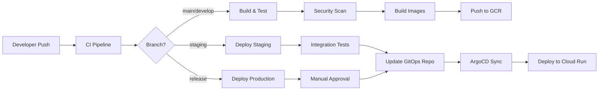

# GitOps CI/CD Pipeline Guide

## Overview

This repository implements a comprehensive GitOps workflow using GitHub Actions, Google Cloud Run, and ArgoCD for continuous integration and deployment.

## Pipeline Architecture



## Workflows

### 1. CI Pipeline (`ci.yml`)

- **Trigger**: Push to main/develop, Pull requests
- **Jobs**:
  - Unit tests, linting, type checking
  - Security scanning with Trivy
  - Docker image building for all environments
  - Caching for faster builds

### 2. Development Deployment (`deploy-dev.yml`)

- **Trigger**: Push to develop branch
- **Actions**: Auto-deploy to Cloud Run dev environment
- **Features**: Allow unauthenticated access for testing

### 3. Staging Deployment (`deploy-staging.yml`)

- **Trigger**: Push to staging branch
- **Actions**: Run integration tests, deploy to staging
- **Validation**: Health check post-deployment

### 4. Production Deployment (`deploy-prod.yml`)

- **Trigger**: GitHub release publication
- **Actions**: Deploy to production with GitOps update
- **Protection**: Environment approval required

### 5. Rollback (`rollback.yml`)

- **Trigger**: Manual workflow dispatch
- **Features**: Rollback any environment to specific version
- **GitOps**: Updates manifests for production rollbacks

### 6. Environment Promotion (`promote.yml`)

- **Trigger**: Manual workflow dispatch
- **Features**: Promote builds between environments
- **Validation**: Source image verification

### 7. GitOps Sync (`gitops-sync.yml`)

- **Trigger**: Every 15 minutes or manual
- **Actions**: Sync ArgoCD applications, validate deployments
- **Monitoring**: Health checks for all environments

### 8. Performance Monitoring (`performance-monitoring.yml`)

- **Trigger**: Every 6 hours or manual
- **Features**: Lighthouse CI, Load testing with k6
- **Storage**: Results archived to Cloud Storage

## Required Secrets

Configure these in GitHub Settings → Secrets:

```yaml
GCP_PROJECT_ID: your-gcp-project-id
GCP_SA_KEY: Service account JSON key
GITHUB_TOKEN: GitHub personal access token
ARGOCD_SERVER: ArgoCD server URL
ARGOCD_PASSWORD: ArgoCD admin password
```

## Environment Configuration

### Development

- Branch: `develop`
- Auto-deploy: Yes
- Approval: No
- URL: Auto-generated Cloud Run URL

### Staging

- Branch: `staging`
- Auto-deploy: Yes
- Approval: No
- Integration Tests: Required

### Production

- Branch: `main` (via releases)
- Auto-deploy: No
- Approval: Required
- URL: https://warehouse.ai-industries.com

## GitOps Repository Structure

```
warehouse-gitops/
├── base/
│   ├── deployment.yaml
│   ├── service.yaml
│   ├── configmap.yaml
│   └── kustomization.yaml
├── overlays/
│   ├── dev/
│   ├── staging/
│   └── prod/
└── apps/
    ├── dev-app.yaml
    ├── staging-app.yaml
    └── prod-app.yaml
```

## Deployment Process

1. **Code Push**: Developer pushes to feature branch
2. **CI Pipeline**: Tests, security scan, build images
3. **PR Review**: Code review and approval
4. **Merge**: Merge to main/develop
5. **Build**: Docker images built and pushed to GCR
6. **GitOps Update**: Update image tags in GitOps repo
7. **ArgoCD Sync**: Detect changes and sync
8. **Deploy**: Update Cloud Run services
9. **Validate**: Health checks and monitoring

## Rollback Procedure

```bash
# Via GitHub Actions UI
1. Go to Actions → Rollback Deployment
2. Click "Run workflow"
3. Select environment and version
4. Confirm rollback

# Via CLI
gh workflow run rollback.yml \
  -f environment=prod \
  -f version=abc123def
```

## Monitoring and Alerts

- **Lighthouse CI**: Performance metrics every 6 hours
- **Health Checks**: Continuous monitoring via GitOps sync
- **Load Testing**: On-demand via workflow dispatch
- **Metrics Storage**: Google Cloud Storage bucket

## Best Practices

1. **Branch Protection**: Enable for main, staging branches
2. **Environment Secrets**: Use GitHub environments
3. **Image Tagging**: Use commit SHA for traceability
4. **GitOps Commits**: Automated with CI bot
5. **Rollback Testing**: Regular rollback drills

## Troubleshooting

### Build Failures

```bash
# Check workflow logs
gh run list --workflow=ci.yml
gh run view <run-id>

# Re-run failed jobs
gh run rerun <run-id>
```

### Deployment Issues

```bash
# Check Cloud Run logs
gcloud run services logs read warehouse-prod \
  --region=us-central1 \
  --limit=100

# Check ArgoCD sync status
argocd app get warehouse-prod
argocd app sync warehouse-prod
```

### Image Issues

```bash
# List available images
gcloud container images list-tags \
  gcr.io/$PROJECT_ID/warehouse-prod

# Verify image exists
gcloud container images describe \
  gcr.io/$PROJECT_ID/warehouse-prod:$TAG
```

## Security Considerations

1. **Service Account**: Minimal required permissions
2. **Secret Rotation**: Rotate keys every 90 days
3. **Image Scanning**: Trivy scans on every build
4. **HTTPS Only**: Enforced via Cloud Run
5. **Environment Isolation**: Separate projects/namespaces

## Cost Optimization

1. **Build Cache**: GitHub Actions cache
2. **Image Cleanup**: Retention policies on GCR
3. **Resource Limits**: Right-sized for each environment
4. **Auto-scaling**: Cloud Run scales to zero

## Future Enhancements

- [ ] Blue-green deployments
- [ ] Canary releases with traffic splitting
- [ ] Automated performance regression tests
- [ ] Cost tracking and budgets
- [ ] Multi-region deployments
