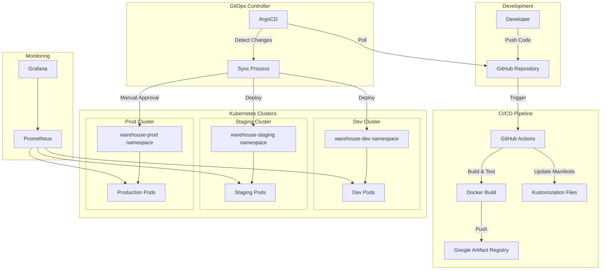

# GitOps Architecture Overview

## Architecture Diagram



## GitOps Flow

### 1. Development Workflow

```
Developer → GitHub → CI/CD → Container Registry → GitOps Repo → ArgoCD → Kubernetes
```

### 2. Environment Promotion

```
Dev Branch → Dev Environment (Auto)
    ↓
Staging Branch → Staging Environment (Auto)
    ↓
Version Tag → Production PR → Manual Review → Production Environment
```

## Key Components

### GitHub Repository Structure

```
warehouse-network/
├── apps/                    # Application source code
│   └── web/                # Frontend application
├── .github/                 # GitHub Actions workflows
│   └── workflows/
│       ├── gitops-dev.yml
│       ├── gitops-staging.yml
│       └── gitops-prod.yml
├── .gitops/                 # GitOps configurations
│   ├── base/               # Base Kubernetes manifests
│   ├── overlays/           # Environment-specific configs
│   └── argocd/             # ArgoCD applications
└── docker/                 # Dockerfile per environment
    ├── dev/
    ├── staging/
    └── prod/
```

### ArgoCD Application Hierarchy

```
app-of-apps (Parent)
├── warehouse-dev
├── warehouse-staging
└── warehouse-prod
```

### Container Image Strategy

- **Development**: `dev-<commit-sha>`, `dev-latest`
- **Staging**: `staging-<commit-sha>`, `staging-latest`
- **Production**: `v<semver>`, `prod-latest`

## Security & Compliance

### Image Security

1. **Build-time scanning** with Trivy
2. **Registry scanning** in Google Artifact Registry
3. **Runtime policies** in Kubernetes

### GitOps Security

1. **Branch protection** for main/staging branches
2. **PR reviews** required for production
3. **RBAC** in ArgoCD for environment access
4. **Signed commits** verification

### Secret Management

```yaml
# Secrets are managed via:
- Google Secret Manager
- Kubernetes Secrets (encrypted at rest)
- ArgoCD Vault Plugin (optional)
```

## Deployment Strategies

### Development

- **Strategy**: Recreate
- **Auto-sync**: Enabled
- **Rollback**: Automatic on failure

### Staging

- **Strategy**: Rolling Update
- **Auto-sync**: Enabled
- **Rollback**: Manual intervention

### Production

- **Strategy**: Blue-Green or Canary
- **Auto-sync**: Disabled
- **Rollback**: Immediate via ArgoCD

## Monitoring & Observability

### Metrics

- Application metrics via Prometheus
- ArgoCD metrics for sync status
- Cluster metrics via GKE monitoring

### Alerts

- Deployment failures
- Sync out-of-date > 5 minutes
- Application health degraded
- Resource limits exceeded

### Dashboards

1. **Deployment Dashboard**: Sync status, deployment frequency
2. **Application Dashboard**: Health, performance, errors
3. **Cost Dashboard**: Resource utilization, cost per environment

## Disaster Recovery

### Backup Strategy

1. **Git Repository**: Source of truth, backed up
2. **Container Images**: Retained in GAR with lifecycle policies
3. **Kubernetes Resources**: Velero backups daily
4. **Database**: Automated backups with point-in-time recovery

### Recovery Procedures

1. **Application Recovery**: Revert Git commit, ArgoCD auto-syncs
2. **Cluster Recovery**: Restore from Velero backup
3. **Complete Disaster**: Rebuild from Git + restore data

## Best Practices

### Git Workflow

1. Feature branches → Dev
2. Dev → Staging via PR
3. Staging → Prod via version tag
4. Hotfixes → Direct to prod with tag

### Manifest Management

1. Use Kustomize for DRY principles
2. Separate base and overlays
3. Environment-specific configs in overlays
4. Secrets via Secret Manager integration

### ArgoCD Configuration

1. App-of-apps pattern for scalability
2. Project isolation per team/app
3. RBAC aligned with team structure
4. Automated pruning for cleanup

## Scaling Considerations

### Horizontal Scaling

- HPA configured per environment
- Dev: 1 replica (no HPA)
- Staging: 2-5 replicas
- Prod: 3-20 replicas

### Multi-Region

- Regional clusters per environment
- Global load balancer for production
- Cross-region replication for DR

### Multi-Tenancy

- Namespace isolation
- Network policies
- Resource quotas
- Pod security policies
