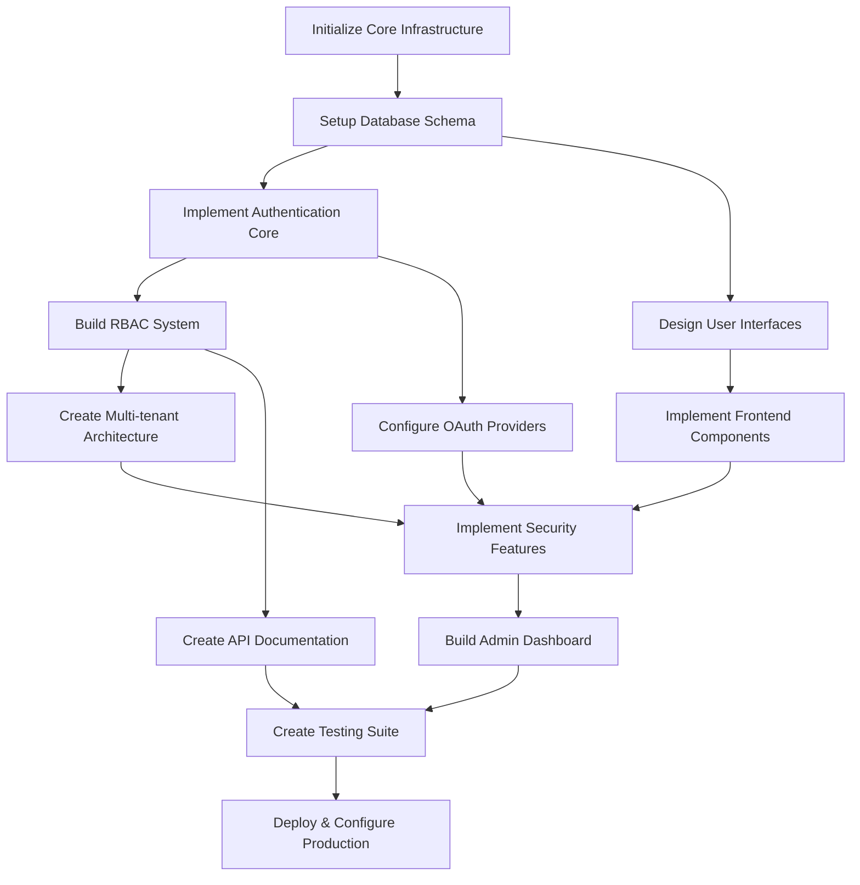

# Goal-Oriented Action Planning (GOAP) Strategy
## Authentication and SaaS Implementation for Skidspace Platform

---

## 🎯 GOAP Framework Overview

### Current State Analysis
```yaml
CurrentState:
  authentication_system: none
  user_management: basic_structure_only
  multi_tenant_support: not_implemented
  rbac_system: undefined
  database_schema: empty
  security_compliance: not_configured
  saas_architecture: not_designed
  deployment_ready: false
  testing_coverage: 0%
```

### Goal State Definition
```yaml
GoalState:
  authentication_system: fully_functional_jwt_passport
  user_management: role_based_hierarchical
  multi_tenant_support: tenant_isolated_complete
  rbac_system: hierarchical_permission_engine
  database_schema: production_ready_prisma
  security_compliance: soc2_gdpr_ready
  saas_architecture: scalable_multi_tenant
  deployment_ready: true
  testing_coverage: 95%+
```

---

## 🗺️ Action Dependency Graph



---

## 🚀 GOAP Action Sequences

### 🔧 **ACTION 1: Initialize Core Infrastructure**

**Goal**: Establish foundational project structure and dependencies
**Cost**: 5 effort points
**Duration**: 1-2 days

```yaml
Preconditions:
  - project_repository_exists: true
  - package_manager_configured: true
  - development_environment_ready: true

Effects:
  - core_packages_installed: true
  - typescript_configured: true
  - testing_framework_ready: true
  - linting_configured: true

Implementation:
  - Install core dependencies (Passport.js, JWT, Redis, Prisma)
  - Configure TypeScript with strict settings
  - Setup Jest testing framework
  - Configure ESLint and Prettier
  - Initialize environment variable management
```

**Dependencies**: None (Root action)
**Blocks**: A2, B1, C1, D1

---

### 🗄️ **ACTION 2: Setup Database Schema**

**Goal**: Create comprehensive multi-tenant database architecture
**Cost**: 8 effort points
**Duration**: 2-3 days

```yaml
Preconditions:
  - core_packages_installed: true
  - database_connection_available: true
  - prisma_initialized: true

Effects:
  - user_tables_created: true
  - tenant_isolation_implemented: true
  - rbac_tables_designed: true
  - audit_logging_schema_ready: true
  - indexes_optimized: true

Implementation:
  Tables:
    - organizations (tenants)
    - users (with tenant association)
    - roles (hierarchical structure)
    - permissions (granular access)
    - user_roles (many-to-many)
    - role_permissions (many-to-many)
    - sessions (Redis-backed)
    - audit_logs (compliance tracking)
    - oauth_accounts (external providers)
    - user_profiles (extended information)
```

**Dependencies**: A1
**Blocks**: A3, A4, A5

---

### 🔐 **ACTION 3: Implement Authentication Core**

**Goal**: Build JWT-based authentication with Passport.js strategies
**Cost**: 12 effort points
**Duration**: 3-4 days

```yaml
Preconditions:
  - database_schema_ready: true
  - jwt_library_installed: true
  - passport_configured: true
  - redis_connection_established: true

Effects:
  - jwt_token_system_functional: true
  - local_strategy_implemented: true
  - session_management_active: true
  - password_hashing_secure: true
  - token_refresh_mechanism_ready: true

Implementation:
  Core Components:
    - JWT token generation/validation (RS256)
    - Local authentication strategy (email/password)
    - Session store with Redis
    - Password hashing with bcrypt
    - Token refresh mechanism
    - Authentication middleware
    - Login/logout endpoints
    - Password reset flow
```

**Dependencies**: A2
**Blocks**: A4, C1, A6

---

### 👥 **ACTION 4: Build RBAC System**

**Goal**: Implement hierarchical role-based access control
**Cost**: 10 effort points
**Duration**: 3-4 days

```yaml
Preconditions:
  - authentication_core_ready: true
  - user_tables_populated: true
  - role_hierarchy_defined: true

Effects:
  - role_hierarchy_functional: true
  - permission_checking_active: true
  - middleware_protection_enabled: true
  - admin_role_management_ready: true

Implementation:
  Role Hierarchy:
    1. Super Admin (Platform control)
    2. Organization Admin (Tenant control)
    3. Warehouse Manager (Facility management)
    4. Business Manager (Company operations)
    5. Customer Support (Limited admin)
    6. End User (Basic access)

  Permission System:
    - Resource-based permissions
    - Action-based controls (CRUD)
    - Hierarchical inheritance
    - Tenant-scoped permissions
    - Dynamic permission checking
```

**Dependencies**: A3
**Blocks**: A5, A7

---

### 🏢 **ACTION 5: Create Multi-tenant Architecture**

**Goal**: Implement tenant isolation and organization management
**Cost**: 15 effort points
**Duration**: 4-5 days

```yaml
Preconditions:
  - rbac_system_functional: true
  - tenant_schema_ready: true
  - organization_model_defined: true

Effects:
  - tenant_isolation_complete: true
  - organization_management_ready: true
  - subdomain_routing_functional: true
  - tenant_specific_branding_supported: true
  - data_segregation_enforced: true

Implementation:
  Multi-tenant Features:
    - Organization registration flow
    - Tenant-specific database queries
    - Subdomain-based routing (org.skidspace.com)
    - Tenant-scoped authentication
    - Organization settings management
    - User invitation system
    - Billing integration preparation
    - Custom branding support
```

**Dependencies**: A4
**Blocks**: A6, A7

---

### 🛡️ **ACTION 6: Implement Security Features**

**Goal**: Add enterprise-grade security and compliance features
**Cost**: 12 effort points
**Duration**: 3-4 days

```yaml
Preconditions:
  - multi_tenant_architecture_ready: true
  - authentication_system_stable: true
  - audit_logging_schema_available: true

Effects:
  - mfa_support_enabled: true
  - rate_limiting_active: true
  - security_headers_configured: true
  - audit_logging_functional: true
  - compliance_features_ready: true

Implementation:
  Security Components:
    - Multi-factor authentication (TOTP, SMS)
    - Rate limiting per user/tenant
    - Security headers (CSRF, XSS protection)
    - Audit logging for all actions
    - Session management security
    - API key management
    - IP whitelisting support
    - Encryption at rest/transit
```

**Dependencies**: A5, C1
**Blocks**: A7, A8

---

### 🎨 **ACTION B1: Design User Interfaces**

**Goal**: Create comprehensive UI/UX design system
**Cost**: 8 effort points
**Duration**: 2-3 days

```yaml
Preconditions:
  - design_requirements_defined: true
  - user_personas_documented: true
  - wireframes_approved: true

Effects:
  - design_system_created: true
  - component_library_ready: true
  - responsive_layouts_designed: true
  - accessibility_standards_met: true

Implementation:
  Design Deliverables:
    - Authentication flow designs
    - Dashboard layouts for each user type
    - Organization management interfaces
    - User profile management
    - Admin control panels
    - Mobile-responsive designs
    - Dark/light theme support
```

**Dependencies**: A2
**Blocks**: B2

---

### 💻 **ACTION B2: Implement Frontend Components**

**Goal**: Build React-based authentication and admin interfaces
**Cost**: 18 effort points
**Duration**: 5-6 days

```yaml
Preconditions:
  - design_system_ready: true
  - authentication_api_available: true
  - component_library_installed: true

Effects:
  - auth_components_functional: true
  - admin_dashboards_ready: true
  - user_management_ui_complete: true
  - responsive_interfaces_working: true

Implementation:
  Frontend Components:
    - Login/Register forms with validation
    - Multi-factor authentication setup
    - Organization dashboard
    - User management interface
    - Role assignment tools
    - Settings and profile management
    - Admin control panels
    - Mobile-responsive layouts
```

**Dependencies**: B1, A3
**Blocks**: A8

---

### 🔗 **ACTION C1: Configure OAuth Providers**

**Goal**: Integrate external authentication providers
**Cost**: 6 effort points
**Duration**: 2 days

```yaml
Preconditions:
  - authentication_core_ready: true
  - oauth_credentials_available: true
  - passport_strategies_configured: true

Effects:
  - google_oauth_functional: true
  - microsoft_oauth_functional: true
  - saml_support_ready: true
  - social_login_options_available: true

Implementation:
  OAuth Integration:
    - Google OAuth 2.0 strategy
    - Microsoft Azure AD integration
    - GitHub OAuth (for developers)
    - SAML 2.0 for enterprise customers
    - Account linking functionality
    - Profile information synchronization
```

**Dependencies**: A3
**Blocks**: A6

---

### 🏗️ **ACTION A7: Build Admin Dashboard**

**Goal**: Create comprehensive super admin and organization admin interfaces
**Cost**: 15 effort points
**Duration**: 4-5 days

```yaml
Preconditions:
  - rbac_system_complete: true
  - security_features_implemented: true
  - frontend_components_ready: true

Effects:
  - super_admin_dashboard_functional: true
  - organization_admin_tools_ready: true
  - user_management_complete: true
  - analytics_dashboard_available: true

Implementation:
  Admin Features:
    - Super admin platform overview
    - Organization management tools
    - User role assignment interface
    - Analytics and reporting
    - System monitoring dashboard
    - Security audit interface
    - Billing management (preparation)
    - Support ticket management
```

**Dependencies**: A4, A5, A6, B2
**Blocks**: A8

---

### 📚 **ACTION D1: Create API Documentation**

**Goal**: Comprehensive API documentation with examples
**Cost**: 4 effort points
**Duration**: 1-2 days

```yaml
Preconditions:
  - api_endpoints_implemented: true
  - authentication_flows_stable: true
  - documentation_tools_available: true

Effects:
  - api_documentation_complete: true
  - integration_guides_ready: true
  - sdk_examples_available: true
  - developer_onboarding_streamlined: true

Implementation:
  Documentation:
    - OpenAPI/Swagger specification
    - Authentication flow diagrams
    - Integration examples
    - SDK documentation
    - Postman collection
    - Rate limiting documentation
```

**Dependencies**: A4
**Blocks**: A8

---

### 🧪 **ACTION A8: Create Testing Suite**

**Goal**: Comprehensive test coverage for all authentication features
**Cost**: 12 effort points
**Duration**: 3-4 days

```yaml
Preconditions:
  - all_features_implemented: true
  - testing_framework_configured: true
  - api_documentation_complete: true

Effects:
  - unit_tests_complete: true
  - integration_tests_functional: true
  - security_tests_passing: true
  - performance_tests_configured: true
  - test_coverage_above_95: true

Implementation:
  Testing Strategy:
    - Unit tests for all auth functions
    - Integration tests for API endpoints
    - Security penetration testing
    - Load testing for scalability
    - Browser automation tests
    - Database migration tests
    - OAuth provider testing
```

**Dependencies**: A7, B2, D1
**Blocks**: A9

---

### 🚀 **ACTION A9: Deploy & Configure Production**

**Goal**: Production-ready deployment with monitoring and security
**Cost**: 10 effort points
**Duration**: 2-3 days

```yaml
Preconditions:
  - testing_suite_passing: true
  - security_audit_complete: true
  - infrastructure_ready: true

Effects:
  - production_deployment_active: true
  - monitoring_configured: true
  - backup_systems_functional: true
  - ssl_certificates_installed: true
  - cdn_configured: true

Implementation:
  Production Setup:
    - Docker containerization
    - Kubernetes deployment
    - Redis cluster configuration
    - Database replication setup
    - SSL/TLS configuration
    - CDN setup for static assets
    - Monitoring and alerting
    - Backup and recovery procedures
```

**Dependencies**: A8
**Blocks**: None (Final action)

---

## 📊 Implementation Timeline & Resource Allocation

### **Phase 1: Foundation (Weeks 1-2)**
```yaml
Actions: [A1, A2, B1, D1]
Total Effort: 25 points
Resources: 2 backend developers, 1 frontend developer, 1 technical writer
Deliverables:
  - Core infrastructure setup
  - Database schema implemented
  - UI/UX designs completed
  - API documentation started
```

### **Phase 2: Core Authentication (Weeks 3-4)**
```yaml
Actions: [A3, C1, B2 (partial)]
Total Effort: 26 points
Resources: 2 backend developers, 2 frontend developers
Deliverables:
  - JWT authentication system
  - OAuth provider integration
  - Basic frontend components
```

### **Phase 3: Advanced Features (Weeks 5-6)**
```yaml
Actions: [A4, A5, B2 (completion)]
Total Effort: 43 points
Resources: 3 backend developers, 2 frontend developers
Deliverables:
  - RBAC system complete
  - Multi-tenant architecture
  - Frontend components finalized
```

### **Phase 4: Security & Admin (Weeks 7-8)**
```yaml
Actions: [A6, A7]
Total Effort: 27 points
Resources: 2 backend developers, 2 frontend developers, 1 security specialist
Deliverables:
  - Security features implemented
  - Admin dashboards complete
```

### **Phase 5: Testing & Deployment (Weeks 9-10)**
```yaml
Actions: [A8, A9]
Total Effort: 22 points
Resources: 2 QA engineers, 1 DevOps engineer, 1 backend developer
Deliverables:
  - Comprehensive testing suite
  - Production deployment ready
```

---

## 🎯 Success Metrics & KPIs

### **Technical Metrics**
- **Authentication Response Time**: < 50ms (p95)
- **Session Validation**: < 10ms (p95)
- **Test Coverage**: > 95%
- **Security Scan Score**: A+ rating
- **API Response Time**: < 100ms (p95)

### **Business Metrics**
- **User Onboarding Time**: < 5 minutes
- **Admin Task Efficiency**: 80% reduction in manual work
- **Security Incident Rate**: 0 authentication-related breaches
- **System Uptime**: 99.9%
- **Support Ticket Reduction**: 70% fewer auth-related tickets

### **User Experience Metrics**
- **Authentication Success Rate**: > 99%
- **Password Reset Completion**: > 90%
- **OAuth Login Success**: > 95%
- **Mobile Responsiveness**: 100% feature parity
- **Accessibility Compliance**: WCAG 2.1 AA

---

## 🔄 Risk Assessment & Mitigation

### **High-Risk Actions & Mitigation**

#### **A3: Authentication Core Implementation**
```yaml
Risk Level: HIGH
Potential Issues:
  - Security vulnerabilities in JWT implementation
  - Session hijacking possibilities
  - Weak password policies

Mitigation Strategies:
  - Security code review by external expert
  - Penetration testing before production
  - Implementation of OWASP guidelines
  - Regular security audits
```

#### **A5: Multi-tenant Architecture**
```yaml
Risk Level: HIGH
Potential Issues:
  - Data leakage between tenants
  - Performance impact of tenant isolation
  - Complex migration scenarios

Mitigation Strategies:
  - Automated tenant isolation testing
  - Performance benchmarking with realistic data
  - Database-level tenant separation
  - Comprehensive audit logging
```

#### **A8: Testing Suite Creation**
```yaml
Risk Level: MEDIUM
Potential Issues:
  - Insufficient test coverage
  - False positive security tests
  - Performance test environment mismatch

Mitigation Strategies:
  - Mandatory coverage thresholds (95%+)
  - Multiple testing environments
  - Production-like load testing
  - Continuous security scanning
```

---

## 🔗 Action Dependencies Matrix

| Action | Depends On | Blocks | Critical Path |
|--------|------------|---------|---------------|
| A1 | None | A2, B1, C1, D1 | ✅ |
| A2 | A1 | A3, A4, A5 | ✅ |
| A3 | A2 | A4, C1, A6 | ✅ |
| A4 | A3 | A5, A7 | ✅ |
| A5 | A4 | A6, A7 | ✅ |
| A6 | A5, C1 | A7, A8 | ✅ |
| A7 | A4, A5, A6, B2 | A8 | ✅ |
| A8 | A7, B2, D1 | A9 | ✅ |
| A9 | A8 | None | ✅ |
| B1 | A2 | B2 | |
| B2 | B1, A3 | A8 | |
| C1 | A3 | A6 | |
| D1 | A4 | A8 | |

**Critical Path**: A1 → A2 → A3 → A4 → A5 → A6 → A7 → A8 → A9
**Estimated Duration**: 10 weeks
**Total Effort**: 143 effort points

---

## 🚀 Quick Start Implementation Guide

### **Immediate Actions (Week 1)**
1. Execute Action A1 (Initialize Core Infrastructure)
2. Begin Action A2 (Database Schema Setup)
3. Start Action B1 (UI/UX Design) in parallel
4. Initiate Action D1 (API Documentation)

### **Development Environment Setup**
```bash
# Core infrastructure setup
npm init -y
npm install express passport passport-local passport-jwt
npm install bcrypt jsonwebtoken redis prisma
npm install @types/node @types/express typescript tsx

# Testing framework
npm install jest @testing-library/react @testing-library/jest-dom

# Frontend dependencies
npm install react next.js @headlessui/react tailwindcss

# Security packages
npm install helmet express-rate-limit cors
npm install @types/bcrypt @types/jsonwebtoken
```

### **Configuration Files Priority**
1. `tsconfig.json` - TypeScript configuration
2. `prisma/schema.prisma` - Database schema
3. `jest.config.js` - Testing configuration
4. `.env.example` - Environment variables template

---

## 📈 Continuous Improvement Strategy

### **Post-Launch Optimization**
- **Week 11-12**: Performance monitoring and optimization
- **Week 13-14**: Security audit and penetration testing
- **Week 15-16**: User feedback integration and UX improvements

### **Long-term Roadmap**
- **Q2 2026**: Advanced analytics and reporting
- **Q3 2026**: Enterprise SSO integration
- **Q4 2026**: Mobile app authentication
- **Q1 2027**: API marketplace and developer portal

---

**This GOAP strategy provides a comprehensive, goal-oriented approach to implementing the authentication and SaaS architecture for the Skidspace platform, with clear dependencies, risk mitigation, and success metrics.**