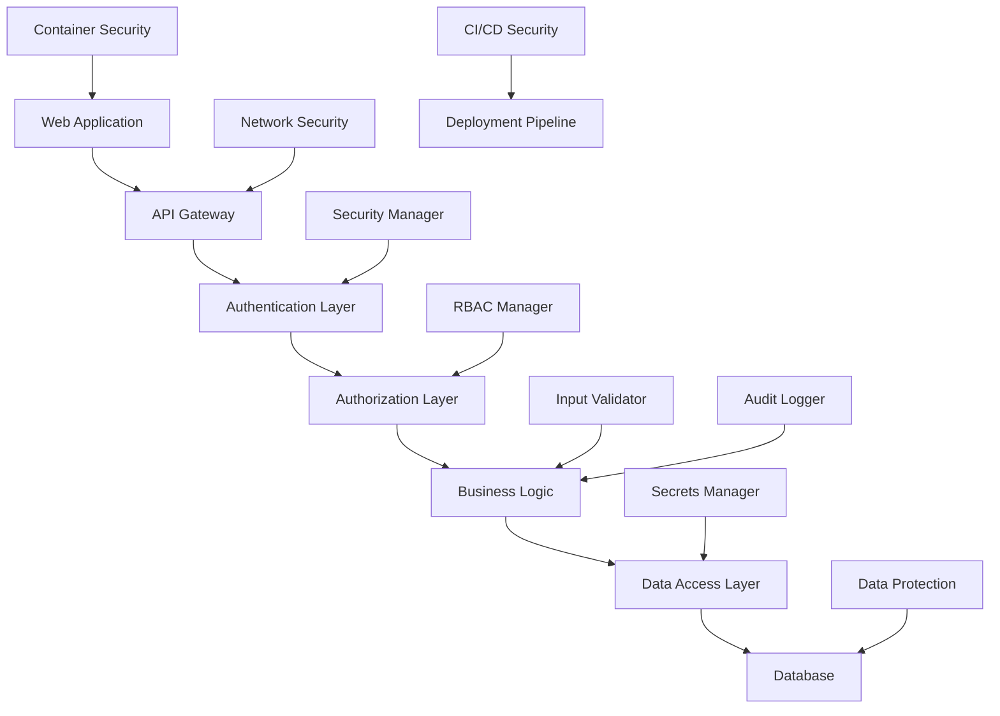

# 🛡️ Security Implementation Roadmap

**Project:** Warehouse Network Security Enhancement  
**Version:** 1.0  
**Date:** December 25, 2024

---

## 🎯 Overview

This roadmap outlines the implementation plan for addressing critical security gaps identified in the Claude implementation instructions. The goal is to transform the current implementation into an enterprise-grade, security-first platform.

---

## 📅 Implementation Timeline

### **Phase 1: Foundation Security (Week 1)**
**Priority:** CRITICAL  
**Goal:** Establish basic security infrastructure

#### **Day 1-2: Authentication Framework**
- [ ] Implement JWT-based authentication system
- [ ] Add OAuth2 integration for third-party providers
- [ ] Create session management system
- [ ] Implement MFA support

**Deliverables:**
- `SecurityManager` class with full authentication
- OAuth2 configuration templates
- Session middleware for Express/Next.js
- MFA setup interfaces

#### **Day 3-4: Secrets Management**
- [ ] Integrate HashiCorp Vault
- [ ] Implement encryption at rest
- [ ] Create key rotation mechanisms
- [ ] Add secret complexity validation

**Deliverables:**
- `SecretsManager` class
- Vault configuration templates
- Key management utilities
- Secret rotation automation

#### **Day 5-7: Input Validation**
- [ ] Create comprehensive input sanitization
- [ ] Implement SQL injection prevention
- [ ] Add XSS protection mechanisms
- [ ] Create file upload security

**Deliverables:**
- `InputValidator` class
- Sanitization middleware
- Schema validation tools
- File scanning utilities

### **Phase 2: Access Control & Monitoring (Week 2-3)**
**Priority:** HIGH  
**Goal:** Implement access control and audit capabilities

#### **Week 2: RBAC Implementation**
- [ ] Design role-based access control system
- [ ] Implement permission management
- [ ] Create user role assignment system
- [ ] Add privilege escalation detection

**Deliverables:**
- `RBACManager` class
- Role definition schemas
- Permission checking middleware
- Admin interfaces for role management

#### **Week 3: Audit & Compliance**
- [ ] Implement comprehensive audit logging
- [ ] Create compliance reporting
- [ ] Add real-time security monitoring
- [ ] Implement anomaly detection

**Deliverables:**
- `AuditLogger` class
- Compliance report generators
- Security alert system
- Anomaly detection algorithms

### **Phase 3: Infrastructure Security (Week 4-6)**
**Priority:** MEDIUM-HIGH  
**Goal:** Secure infrastructure and deployment pipeline

#### **Week 4: Network Security**
- [ ] Implement Kubernetes network policies
- [ ] Configure TLS/SSL management
- [ ] Add firewall rule automation
- [ ] Create VPN access controls

**Deliverables:**
- `NetworkSecurityManager` class
- Kubernetes security templates
- TLS certificate management
- Firewall automation scripts

#### **Week 5: Container Security**
- [ ] Harden Docker containers
- [ ] Implement image scanning
- [ ] Add runtime security monitoring
- [ ] Create secure base images

**Deliverables:**
- Hardened Dockerfile templates
- Image scanning pipeline
- Runtime security agents
- Distroless base images

#### **Week 6: Secure CI/CD**
- [ ] Implement supply chain security
- [ ] Add code signing capabilities
- [ ] Create deployment approval workflows
- [ ] Implement artifact verification

**Deliverables:**
- Secure GitHub Actions workflows
- Code signing pipeline
- Approval gate systems
- Artifact verification tools

### **Phase 4: Data Protection & Advanced Security (Week 7-8)**
**Priority:** MEDIUM  
**Goal:** Implement data protection and advanced security features

#### **Week 7: Data Protection**
- [ ] Implement PII encryption
- [ ] Create data anonymization tools
- [ ] Add GDPR compliance features
- [ ] Implement data retention policies

**Deliverables:**
- `DataProtectionManager` class
- PII encryption utilities
- GDPR compliance tools
- Data retention automation

#### **Week 8: Advanced Security**
- [ ] Implement SIEM integration
- [ ] Add threat intelligence feeds
- [ ] Create incident response automation
- [ ] Implement security orchestration

**Deliverables:**
- SIEM connectors
- Threat intelligence APIs
- Incident response playbooks
- Security orchestration platform

---

## 🏗️ Architecture Overview

### **Security Architecture Layers**



### **Security Components Integration**

```typescript
// Core Security Stack
export interface SecurityStack {
  authentication: SecurityManager;
  authorization: RBACManager;
  validation: InputValidator;
  secrets: SecretsManager;
  audit: AuditLogger;
  dataProtection: DataProtectionManager;
  vulnerability: VulnerabilityManager;
  network: NetworkSecurityManager;
}
```

---

## 🔧 Implementation Standards

### **Security Development Standards**

#### **1. Secure Coding Principles**
- **Input Validation:** Validate all inputs at boundaries
- **Output Encoding:** Encode all outputs to prevent XSS
- **Authentication:** Strong authentication for all access
- **Authorization:** Implement least privilege access
- **Session Management:** Secure session handling
- **Error Handling:** No sensitive information in errors
- **Logging:** Comprehensive security logging
- **Cryptography:** Use proven cryptographic libraries

#### **2. Code Review Requirements**
- **Security Review:** Mandatory for all code changes
- **Threat Modeling:** For new features and components
- **Static Analysis:** Automated SAST scanning
- **Dynamic Testing:** DAST for web applications
- **Dependency Scanning:** Check for known vulnerabilities
- **Compliance Check:** Ensure regulatory compliance

#### **3. Testing Requirements**
- **Unit Tests:** Security-focused unit tests (>95% coverage)
- **Integration Tests:** End-to-end security scenarios
- **Penetration Testing:** Quarterly professional pen tests
- **Vulnerability Scanning:** Daily automated scans
- **Security Regression:** Tests for known vulnerabilities

### **Infrastructure Security Standards**

#### **1. Container Security**
```dockerfile
# Security hardening requirements
FROM distroless/nodejs  # Minimal attack surface
USER non-root           # Non-root execution
COPY --chown=user:group # Proper file ownership
HEALTHCHECK             # Health monitoring
```

#### **2. Kubernetes Security**
```yaml
# Security policy requirements
apiVersion: v1
kind: Pod
spec:
  securityContext:
    runAsNonRoot: true
    runAsUser: 1000
    fsGroup: 2000
  containers:
  - securityContext:
      allowPrivilegeEscalation: false
      readOnlyRootFilesystem: true
      capabilities:
        drop:
        - ALL
```

#### **3. Network Security**
- **TLS 1.3:** Minimum encryption standard
- **Network Policies:** Kubernetes network segmentation
- **Firewall Rules:** Least privilege network access
- **VPN Access:** Secure remote access only

---

## 📊 Success Metrics

### **Security KPIs**

#### **Phase 1 Metrics**
- [ ] **Authentication Success Rate:** >99.9%
- [ ] **Session Hijacking Incidents:** 0
- [ ] **Credential Stuffing Blocks:** 100%
- [ ] **Secret Rotation Compliance:** 100%
- [ ] **Input Validation Blocks:** >1000/day

#### **Phase 2 Metrics**
- [ ] **Unauthorized Access Attempts:** 0 successful
- [ ] **Privilege Escalation Incidents:** 0
- [ ] **Audit Log Completeness:** 100%
- [ ] **Compliance Score:** >95%
- [ ] **Security Alert Response Time:** <5 minutes

#### **Phase 3 Metrics**
- [ ] **Container Vulnerabilities:** 0 Critical, <5 High
- [ ] **Network Policy Violations:** 0
- [ ] **TLS Certificate Compliance:** 100%
- [ ] **CI/CD Security Gate Failures:** 0
- [ ] **Deployment Approval Time:** <30 minutes

#### **Phase 4 Metrics**
- [ ] **PII Encryption Coverage:** 100%
- [ ] **GDPR Compliance Score:** 100%
- [ ] **Data Breach Incidents:** 0
- [ ] **Threat Detection Accuracy:** >95%
- [ ] **Incident Response Time:** <15 minutes

### **Compliance Targets**

#### **SOC 2 Type II**
- [ ] Control Environment
- [ ] Risk Assessment
- [ ] Control Activities
- [ ] Information & Communication
- [ ] Monitoring Activities

#### **GDPR Compliance**
- [ ] Data Protection Impact Assessments
- [ ] Privacy by Design Implementation
- [ ] Data Subject Rights Implementation
- [ ] Breach Notification Procedures
- [ ] Data Protection Officer Appointment

#### **OWASP Top 10 Mitigation**
- [ ] Injection Prevention
- [ ] Broken Authentication Prevention
- [ ] Sensitive Data Exposure Prevention
- [ ] XML External Entity Prevention
- [ ] Broken Access Control Prevention
- [ ] Security Misconfiguration Prevention
- [ ] Cross-Site Scripting Prevention
- [ ] Insecure Deserialization Prevention
- [ ] Known Vulnerability Management
- [ ] Insufficient Logging Prevention

---

## 🚨 Risk Mitigation

### **High-Risk Scenarios**

#### **1. Data Breach**
**Likelihood:** Medium  
**Impact:** Critical  
**Mitigation:**
- Implement data encryption at rest and in transit
- Add data access logging and monitoring
- Create incident response procedures
- Regular penetration testing

#### **2. Privilege Escalation**
**Likelihood:** Low  
**Impact:** High  
**Mitigation:**
- Implement strict RBAC controls
- Add privilege escalation monitoring
- Regular access reviews
- Principle of least privilege

#### **3. Supply Chain Attack**
**Likelihood:** Medium  
**Impact:** High  
**Mitigation:**
- Implement dependency scanning
- Add code signing requirements
- Create software bill of materials (SBOM)
- Vendor security assessments

#### **4. Container Escape**
**Likelihood:** Low  
**Impact:** High  
**Mitigation:**
- Use distroless container images
- Implement runtime security monitoring
- Add container network policies
- Regular container security scans

---

## 📋 Implementation Checklist

### **Phase 1: Foundation Security**
- [ ] SecurityManager implementation complete
- [ ] OAuth2 integration functional
- [ ] SecretsManager with Vault integration
- [ ] Input validation framework deployed
- [ ] Basic audit logging operational
- [ ] Security unit tests passing
- [ ] Documentation complete

### **Phase 2: Access Control**
- [ ] RBAC system fully implemented
- [ ] Permission checking middleware deployed
- [ ] Audit logging comprehensive
- [ ] Compliance reporting functional
- [ ] Real-time monitoring active
- [ ] Security integration tests passing
- [ ] Admin interfaces complete

### **Phase 3: Infrastructure Security**
- [ ] Network policies deployed
- [ ] TLS/SSL management automated
- [ ] Container security hardened
- [ ] CI/CD pipeline secured
- [ ] Image scanning integrated
- [ ] Security gates operational
- [ ] Infrastructure tests passing

### **Phase 4: Advanced Security**
- [ ] Data protection implemented
- [ ] GDPR compliance achieved
- [ ] SIEM integration complete
- [ ] Threat intelligence active
- [ ] Incident response automated
- [ ] End-to-end security tests passing
- [ ] Security certification achieved

---

## 🎯 Next Steps

1. **Review and Approve Roadmap** - Stakeholder sign-off
2. **Assign Security Team** - Dedicated security engineers
3. **Set up Development Environment** - Secure dev environment
4. **Begin Phase 1 Implementation** - Start with authentication
5. **Establish Security Metrics** - Monitoring and reporting
6. **Regular Security Reviews** - Weekly progress reviews
7. **Continuous Improvement** - Regular roadmap updates

This roadmap provides a comprehensive path to enterprise-grade security for the warehouse network platform.