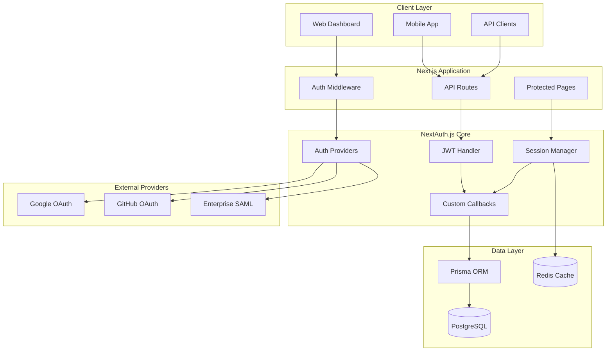

# ADR-0001: Authentication Provider Selection for Skidspace Platform

## Status
**Accepted** - Date: 2026-03-23

## Context
The Skidspace warehouse marketplace requires a robust, scalable authentication system to support multiple user types including warehouse partners, ebike businesses, customers, and super admins. The platform needs to handle different authentication methods, session management, and integration with existing business systems.

## Decision
**Selected: NextAuth.js v5 (Auth.js) as the primary authentication provider**

## Rationale

### Technical Requirements Analysis
- **Multi-tenant support**: Different business entities with isolated data
- **Role-based access control**: Complex permission hierarchies
- **Social login integration**: Google, GitHub, enterprise SSO
- **API authentication**: JWT tokens for mobile/API clients
- **Session management**: Secure, scalable session handling
- **Database flexibility**: Support for PostgreSQL with Prisma ORM

### Alternatives Considered

#### 1. Auth0 (SaaS Solution)
**Pros:**
- Enterprise-grade security
- Comprehensive features out-of-the-box
- Excellent documentation and support
- Built-in compliance (SOC2, GDPR)

**Cons:**
- **Cost**: $23/month per 1,000 users + overages
- **Vendor lock-in**: Dependency on external service
- **Customization limits**: Less flexibility for custom workflows
- **Data sovereignty**: User data stored on third-party servers

#### 2. AWS Cognito
**Pros:**
- AWS ecosystem integration
- Scalable infrastructure
- Pay-per-use pricing model
- Built-in MFA and security features

**Cons:**
- **Complexity**: Steep learning curve
- **AWS dependency**: Vendor lock-in to AWS
- **Limited customization**: UI/UX constraints
- **Documentation quality**: Often confusing or incomplete

#### 3. Custom Implementation
**Pros:**
- Complete control over features
- No vendor dependencies
- Tailored to exact requirements

**Cons:**
- **Security risks**: High probability of implementation flaws
- **Development time**: 3-6 months minimum
- **Maintenance burden**: Ongoing security updates required
- **Compliance complexity**: Manual implementation of standards

#### 4. Supabase Auth
**Pros:**
- Open source with hosted option
- PostgreSQL native integration
- Good developer experience
- Row Level Security (RLS) support

**Cons:**
- **Maturity**: Relatively new in enterprise space
- **Limited enterprise features**: Missing some advanced requirements
- **Documentation gaps**: Still evolving

### NextAuth.js v5 Advantages

#### 1. **Cost Effectiveness**
```typescript
// Self-hosted solution with no per-user costs
// Total cost: $0/month for authentication
// Only infrastructure costs for hosting
```

#### 2. **Deep Next.js Integration**
```typescript
// Native support for App Router and Server Components
import { auth } from "@/auth"

export default async function Dashboard() {
  const session = await auth()
  if (!session?.user) redirect("/login")

  return <DashboardContent user={session.user} />
}
```

#### 3. **Flexible Provider Configuration**
```typescript
// auth.ts
export const { handlers, auth, signIn, signOut } = NextAuth({
  providers: [
    Google({
      clientId: process.env.GOOGLE_CLIENT_ID,
      clientSecret: process.env.GOOGLE_CLIENT_SECRET,
    }),
    GitHub({
      clientId: process.env.GITHUB_CLIENT_ID,
      clientSecret: process.env.GITHUB_CLIENT_SECRET,
    }),
    CredentialsProvider({
      // Custom business login
      credentials: {
        email: { label: "Email", type: "email" },
        password: { label: "Password", type: "password" },
        businessId: { label: "Business ID", type: "text" }
      },
      async authorize(credentials) {
        // Custom validation logic
        return await validateBusinessUser(credentials)
      }
    })
  ],
  adapter: PrismaAdapter(prisma),
  session: { strategy: "jwt" },
  callbacks: {
    async jwt({ token, user, account }) {
      if (user) {
        token.role = user.role
        token.businessId = user.businessId
        token.permissions = await getUserPermissions(user.id)
      }
      return token
    },
    async session({ session, token }) {
      session.user.role = token.role
      session.user.businessId = token.businessId
      session.user.permissions = token.permissions
      return session
    }
  }
})
```

#### 4. **Database Integration**
```typescript
// Prisma adapter for seamless database integration
const prisma = new PrismaClient()

// Automatic table creation and management
// Built-in session management
// Support for custom user fields
```

## Implementation Architecture

### Authentication Flow


### Multi-Tenant Authentication Strategy
```typescript
// Tenant-aware authentication
export async function getTenantFromRequest(request: Request): Promise<Tenant> {
  const hostname = request.headers.get('host')
  const subdomain = hostname?.split('.')[0]

  if (subdomain && subdomain !== 'www') {
    // Subdomain-based tenant resolution
    return await prisma.tenant.findUnique({
      where: { subdomain }
    })
  }

  // Default to main platform
  return await prisma.tenant.findUnique({
    where: { isDefault: true }
  })
}

// Custom sign-in with tenant context
export async function tenantSignIn(
  provider: string,
  tenantId: string,
  options?: SignInOptions
) {
  return signIn(provider, {
    ...options,
    callbackUrl: `/${tenantId}/dashboard`
  })
}
```

## Security Considerations

### 1. **JWT Security**
```typescript
// Secure JWT configuration
export const authOptions = {
  jwt: {
    maxAge: 15 * 60, // 15 minutes
    encryption: true,
    secret: process.env.NEXTAUTH_SECRET,
    signingKey: process.env.JWT_SIGNING_KEY,
    encryptionKey: process.env.JWT_ENCRYPTION_KEY,
  },
  session: {
    maxAge: 30 * 24 * 60 * 60, // 30 days
    updateAge: 24 * 60 * 60, // 24 hours
  }
}
```

### 2. **CSRF Protection**
```typescript
// Built-in CSRF protection
export const authConfig = {
  useSecureCookies: process.env.NODE_ENV === 'production',
  cookies: {
    sessionToken: {
      name: 'skidspace.session-token',
      options: {
        httpOnly: true,
        sameSite: 'lax',
        path: '/',
        secure: process.env.NODE_ENV === 'production',
        domain: process.env.COOKIE_DOMAIN
      }
    }
  }
}
```

### 3. **Rate Limiting**
```typescript
// Authentication rate limiting
export const rateLimitConfig = {
  signIn: {
    attempts: 5,
    window: 900, // 15 minutes
    block: 3600 // 1 hour block
  },
  passwordReset: {
    attempts: 3,
    window: 3600, // 1 hour
    block: 86400 // 24 hour block
  }
}
```

## Migration Strategy

### Phase 1: Core Implementation (2 weeks)
- Set up NextAuth.js v5 with basic providers
- Implement JWT-based session management
- Create user and tenant database schema
- Basic role-based access control

### Phase 2: Multi-Tenant Support (1 week)
- Subdomain-based tenant resolution
- Tenant-isolated authentication flows
- Custom business user registration
- Admin tenant management

### Phase 3: Advanced Features (2 weeks)
- Enterprise SSO integration (SAML/OIDC)
- Advanced permission system
- Audit logging and security monitoring
- Mobile app JWT authentication

### Phase 4: Production Hardening (1 week)
- Security testing and penetration testing
- Performance optimization
- Monitoring and alerting
- Documentation and training

## Success Metrics

### Technical Metrics
- **Authentication latency**: < 100ms p95
- **Session validation**: < 10ms p95
- **Uptime**: 99.9% availability
- **Security**: Zero authentication-related vulnerabilities

### Business Metrics
- **User adoption**: 90%+ successful first-time login
- **Support tickets**: < 2% authentication-related issues
- **Development velocity**: 50% faster auth feature delivery
- **Cost savings**: $15,000+ annually vs Auth0

## Risk Mitigation

### Security Risks
- **Mitigation**: Regular security audits and dependency updates
- **Monitoring**: Real-time security event detection
- **Response**: Incident response plan for auth failures

### Technical Risks
- **Mitigation**: Comprehensive testing and staged rollouts
- **Monitoring**: Performance and error rate tracking
- **Backup**: Fallback authentication mechanisms

### Operational Risks
- **Mitigation**: Team training and documentation
- **Support**: 24/7 monitoring and alerting
- **Recovery**: Automated backup and restore procedures

## Future Considerations

### Potential Enhancements
1. **Passwordless Authentication**: WebAuthn/FIDO2 support
2. **Advanced MFA**: Biometric authentication
3. **Zero-Trust Architecture**: Enhanced security model
4. **AI-Powered Security**: Anomaly detection and fraud prevention

### Technology Evolution
- Monitor NextAuth.js roadmap and updates
- Evaluate new authentication standards and protocols
- Consider migration to newer solutions as they mature
- Maintain compatibility with evolving security requirements

## Conclusion

NextAuth.js v5 provides the optimal balance of features, security, cost-effectiveness, and developer experience for the Skidspace platform. The solution enables rapid development while maintaining enterprise-grade security and scalability requirements.

**Decision Confidence**: High (95%)
**Expected ROI**: $15,000+ annual savings with improved developer productivity
**Review Date**: 2027-03-23 (Annual review)