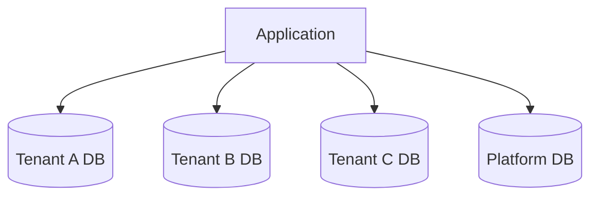
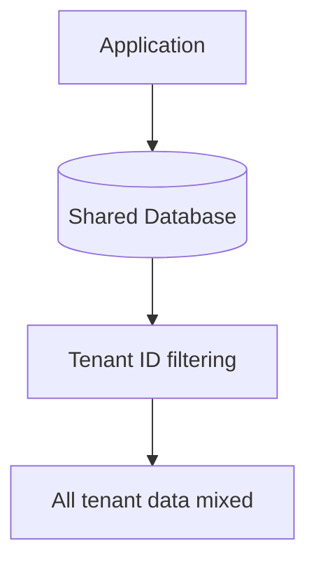
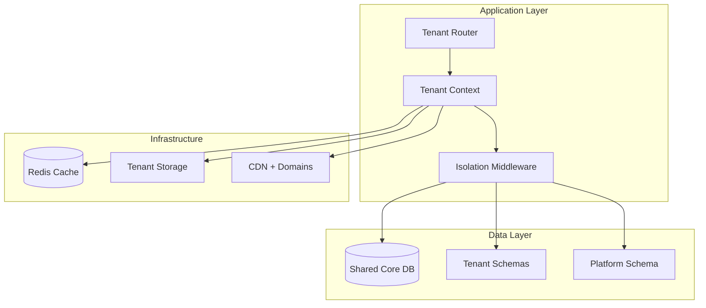

# ADR-0002: Multi-Tenant Architecture Pattern for Skidspace Platform

## Status
**Accepted** - Date: 2026-03-23

## Context
The Skidspace platform serves multiple distinct business entities: warehouse partners, ebike businesses, individual customers, and platform administrators. Each entity requires data isolation, custom branding, and specialized functionality while sharing core platform infrastructure.

## Decision
**Selected: Hybrid Multi-Tenant Architecture with Shared Database + Tenant Isolation**

## Rationale

### Business Requirements Analysis
- **Warehouse Partners**: Independent businesses with separate inventories, pricing, and customer bases
- **Ebike Businesses**: Distinct product catalogs, branding, and business processes
- **Platform Admin**: Oversight across all tenants with aggregated reporting
- **Customers**: Access to multiple warehouse/ebike businesses through unified experience
- **White-label Support**: Custom branding and domain configuration

### Architecture Pattern Comparison

#### 1. Single Tenant per Database (Rejected)


**Pros:**
- Perfect data isolation
- Independent scaling per tenant
- Simplified backup and recovery

**Cons:**
- **High operational overhead**: Multiple database instances
- **Increased costs**: $200+ per tenant monthly
- **Complex migrations**: Schema changes across all databases
- **Limited cross-tenant analytics**: Difficult data aggregation

#### 2. Shared Database + Shared Schema (Rejected)


**Pros:**
- Simple implementation
- Low operational overhead
- Easy cross-tenant analytics

**Cons:**
- **Security risks**: Tenant ID filtering failures expose all data
- **Performance issues**: Large tables with mixed tenant data
- **Limited customization**: Shared schema constraints

#### 3. Hybrid Multi-Tenant (Selected)


## Implementation Architecture

### 1. Database Schema Design

```sql
-- Platform-level shared tables
CREATE SCHEMA platform;

-- Platform configuration and cross-tenant data
CREATE TABLE platform.tenants (
    id UUID PRIMARY KEY DEFAULT gen_random_uuid(),
    name VARCHAR(255) NOT NULL,
    slug VARCHAR(100) UNIQUE NOT NULL,
    subdomain VARCHAR(100) UNIQUE,
    custom_domain VARCHAR(255),
    plan VARCHAR(50) NOT NULL DEFAULT 'standard',
    status VARCHAR(50) NOT NULL DEFAULT 'active',
    settings JSONB NOT NULL DEFAULT '{}',
    created_at TIMESTAMP DEFAULT CURRENT_TIMESTAMP,
    updated_at TIMESTAMP DEFAULT CURRENT_TIMESTAMP
);

CREATE TABLE platform.users (
    id UUID PRIMARY KEY DEFAULT gen_random_uuid(),
    email VARCHAR(255) UNIQUE NOT NULL,
    password_hash VARCHAR(255),
    global_role VARCHAR(50) DEFAULT 'user', -- platform_admin, user
    created_at TIMESTAMP DEFAULT CURRENT_TIMESTAMP,
    updated_at TIMESTAMP DEFAULT CURRENT_TIMESTAMP
);

CREATE TABLE platform.tenant_users (
    id UUID PRIMARY KEY DEFAULT gen_random_uuid(),
    tenant_id UUID NOT NULL REFERENCES platform.tenants(id),
    user_id UUID NOT NULL REFERENCES platform.users(id),
    role VARCHAR(50) NOT NULL, -- admin, manager, employee, customer
    permissions JSONB NOT NULL DEFAULT '{}',
    status VARCHAR(50) NOT NULL DEFAULT 'active',
    joined_at TIMESTAMP DEFAULT CURRENT_TIMESTAMP,

    UNIQUE(tenant_id, user_id)
);

-- Create tenant-specific schemas dynamically
CREATE OR REPLACE FUNCTION create_tenant_schema(tenant_slug VARCHAR)
RETURNS VOID AS $$
BEGIN
    EXECUTE format('CREATE SCHEMA IF NOT EXISTS tenant_%s', tenant_slug);

    -- Warehouses table
    EXECUTE format('
        CREATE TABLE tenant_%s.warehouses (
            id UUID PRIMARY KEY DEFAULT gen_random_uuid(),
            name VARCHAR(255) NOT NULL,
            address TEXT NOT NULL,
            capacity INTEGER NOT NULL,
            available_space INTEGER NOT NULL,
            pricing JSONB NOT NULL DEFAULT ''{}',
            features TEXT[] DEFAULT ''{}',
            status VARCHAR(50) DEFAULT ''active'',
            created_at TIMESTAMP DEFAULT CURRENT_TIMESTAMP,
            updated_at TIMESTAMP DEFAULT CURRENT_TIMESTAMP
        )', tenant_slug);

    -- Inventory table
    EXECUTE format('
        CREATE TABLE tenant_%s.inventory (
            id UUID PRIMARY KEY DEFAULT gen_random_uuid(),
            warehouse_id UUID NOT NULL REFERENCES tenant_%s.warehouses(id),
            sku VARCHAR(100) NOT NULL,
            product_name VARCHAR(255) NOT NULL,
            category VARCHAR(100),
            quantity INTEGER NOT NULL DEFAULT 0,
            reserved_quantity INTEGER NOT NULL DEFAULT 0,
            unit_price DECIMAL(10,2),
            metadata JSONB NOT NULL DEFAULT ''{}',
            created_at TIMESTAMP DEFAULT CURRENT_TIMESTAMP,
            updated_at TIMESTAMP DEFAULT CURRENT_TIMESTAMP,

            UNIQUE(warehouse_id, sku)
        )', tenant_slug, tenant_slug);

    -- Orders table
    EXECUTE format('
        CREATE TABLE tenant_%s.orders (
            id UUID PRIMARY KEY DEFAULT gen_random_uuid(),
            customer_email VARCHAR(255) NOT NULL,
            status VARCHAR(50) NOT NULL DEFAULT ''pending'',
            total_amount DECIMAL(10,2) NOT NULL,
            shipping_address JSONB NOT NULL,
            items JSONB NOT NULL DEFAULT ''[]'',
            metadata JSONB NOT NULL DEFAULT ''{}',
            created_at TIMESTAMP DEFAULT CURRENT_TIMESTAMP,
            updated_at TIMESTAMP DEFAULT CURRENT_TIMESTAMP
        )', tenant_slug);

    -- Row Level Security
    EXECUTE format('ALTER TABLE tenant_%s.warehouses ENABLE ROW LEVEL SECURITY', tenant_slug);
    EXECUTE format('ALTER TABLE tenant_%s.inventory ENABLE ROW LEVEL SECURITY', tenant_slug);
    EXECUTE format('ALTER TABLE tenant_%s.orders ENABLE ROW LEVEL SECURITY', tenant_slug);

END;
$$ LANGUAGE plpgsql;
```

### 2. Tenant Context Management

```typescript
// lib/tenant/context.ts
export interface TenantContext {
  id: string
  slug: string
  name: string
  subdomain?: string
  customDomain?: string
  schema: string
  settings: Record<string, any>
  plan: 'free' | 'standard' | 'premium' | 'enterprise'
}

// Tenant resolution middleware
export async function resolveTenantFromRequest(
  request: Request
): Promise<TenantContext | null> {
  const hostname = request.headers.get('host') || ''
  const url = new URL(request.url)

  // 1. Custom domain resolution
  const tenant = await prisma.tenant.findFirst({
    where: {
      OR: [
        { customDomain: hostname },
        { subdomain: hostname.split('.')[0] }
      ],
      status: 'active'
    }
  })

  if (!tenant) {
    return null
  }

  return {
    id: tenant.id,
    slug: tenant.slug,
    name: tenant.name,
    subdomain: tenant.subdomain,
    customDomain: tenant.customDomain,
    schema: `tenant_${tenant.slug}`,
    settings: tenant.settings,
    plan: tenant.plan
  }
}

// Prisma client with tenant context
export function createTenantPrisma(context: TenantContext) {
  return new PrismaClient({
    datasources: {
      db: {
        url: `${process.env.DATABASE_URL}?schema=${context.schema}`
      }
    }
  })
}
```

### 3. Next.js Implementation

```typescript
// middleware.ts
import { NextRequest, NextResponse } from 'next/server'
import { resolveTenantFromRequest } from '@/lib/tenant/context'

export async function middleware(request: NextRequest) {
  const tenant = await resolveTenantFromRequest(request)

  if (!tenant) {
    // Redirect to main platform or show tenant not found
    return NextResponse.redirect(new URL('/tenant-not-found', request.url))
  }

  // Add tenant context to headers
  const response = NextResponse.next()
  response.headers.set('x-tenant-id', tenant.id)
  response.headers.set('x-tenant-slug', tenant.slug)
  response.headers.set('x-tenant-schema', tenant.schema)

  return response
}

export const config = {
  matcher: [
    '/((?!api|_next/static|_next/image|favicon.ico).*)',
  ]
}

// app/layout.tsx
import { headers } from 'next/headers'
import { TenantProvider } from '@/components/tenant-provider'

export default async function RootLayout({
  children,
}: {
  children: React.ReactNode
}) {
  const headersList = headers()
  const tenantId = headersList.get('x-tenant-id')
  const tenantSlug = headersList.get('x-tenant-slug')

  const tenant = tenantId ? await getTenantById(tenantId) : null

  return (
    <html lang="en">
      <body>
        <TenantProvider tenant={tenant}>
          {children}
        </TenantProvider>
      </body>
    </html>
  )
}

// app/dashboard/page.tsx
import { useTenant } from '@/hooks/use-tenant'
import { createTenantPrisma } from '@/lib/tenant/context'

export default async function Dashboard() {
  const tenant = useTenant()
  const prisma = createTenantPrisma(tenant)

  const warehouses = await prisma.warehouses.findMany({
    where: { status: 'active' },
    include: {
      inventory: {
        take: 10,
        orderBy: { updatedAt: 'desc' }
      }
    }
  })

  return (
    <div>
      <h1>{tenant.name} Dashboard</h1>
      <WarehouseList warehouses={warehouses} />
    </div>
  )
}
```

### 4. API Route Implementation

```typescript
// app/api/warehouses/route.ts
import { NextRequest, NextResponse } from 'next/server'
import { auth } from '@/auth'
import { getTenantContext } from '@/lib/tenant/middleware'
import { createTenantPrisma } from '@/lib/tenant/context'

export async function GET(request: NextRequest) {
  try {
    const session = await auth()
    if (!session) {
      return NextResponse.json({ error: 'Unauthorized' }, { status: 401 })
    }

    const tenant = await getTenantContext(request)
    if (!tenant) {
      return NextResponse.json({ error: 'Tenant not found' }, { status: 404 })
    }

    // Verify user has access to this tenant
    const hasAccess = await verifyTenantAccess(session.user.id, tenant.id)
    if (!hasAccess) {
      return NextResponse.json({ error: 'Forbidden' }, { status: 403 })
    }

    const prisma = createTenantPrisma(tenant)
    const warehouses = await prisma.warehouses.findMany({
      where: { status: 'active' },
      include: {
        _count: {
          select: {
            inventory: true
          }
        }
      }
    })

    return NextResponse.json({ warehouses })

  } catch (error) {
    console.error('Error fetching warehouses:', error)
    return NextResponse.json(
      { error: 'Internal server error' },
      { status: 500 }
    )
  }
}

async function verifyTenantAccess(userId: string, tenantId: string): Promise<boolean> {
  const tenantUser = await prisma.tenantUsers.findUnique({
    where: {
      tenantId_userId: {
        tenantId,
        userId
      }
    }
  })

  return tenantUser?.status === 'active'
}
```

## Data Isolation Strategy

### 1. Schema-Level Isolation
```sql
-- Each tenant gets dedicated schema
-- tenant_warehouse_partner_123
-- tenant_ebike_business_456
-- tenant_platform_admin

-- Prevents cross-tenant data access at database level
-- Enables tenant-specific optimizations and indexing
-- Supports custom fields and tables per tenant
```

### 2. Row-Level Security (Defense in Depth)
```sql
-- Additional protection within shared tables
CREATE POLICY tenant_isolation ON platform.tenant_users
FOR ALL TO application_role
USING (tenant_id = current_setting('app.current_tenant')::UUID);

-- Prevent accidental cross-tenant access
CREATE OR REPLACE FUNCTION set_tenant_context(tenant_uuid UUID)
RETURNS VOID AS $$
BEGIN
    PERFORM set_config('app.current_tenant', tenant_uuid::TEXT, true);
END;
$$ LANGUAGE plpgsql;
```

### 3. Application-Level Guards
```typescript
// Tenant access verification
export async function withTenantAccess<T>(
  userId: string,
  tenantId: string,
  operation: (tenant: TenantContext) => Promise<T>,
  requiredPermissions: string[] = []
): Promise<T> {
  const tenantUser = await prisma.tenantUsers.findUnique({
    where: {
      tenantId_userId: { tenantId, userId }
    },
    include: {
      tenant: true
    }
  })

  if (!tenantUser || tenantUser.status !== 'active') {
    throw new Error('Access denied: Not a member of this tenant')
  }

  if (requiredPermissions.length > 0) {
    const hasPermissions = verifyPermissions(
      tenantUser.permissions,
      requiredPermissions
    )
    if (!hasPermissions) {
      throw new Error('Access denied: Insufficient permissions')
    }
  }

  const tenant: TenantContext = {
    id: tenantUser.tenant.id,
    slug: tenantUser.tenant.slug,
    name: tenantUser.tenant.name,
    subdomain: tenantUser.tenant.subdomain,
    customDomain: tenantUser.tenant.customDomain,
    schema: `tenant_${tenantUser.tenant.slug}`,
    settings: tenantUser.tenant.settings,
    plan: tenantUser.tenant.plan
  }

  return await operation(tenant)
}
```

## Performance Considerations

### 1. Connection Pooling Strategy
```typescript
// Tenant-aware connection pooling
class TenantConnectionPool {
  private pools = new Map<string, PrismaClient>()
  private maxConnections = 100

  getClient(tenantSchema: string): PrismaClient {
    if (!this.pools.has(tenantSchema)) {
      this.pools.set(tenantSchema, new PrismaClient({
        datasources: {
          db: {
            url: `${process.env.DATABASE_URL}?schema=${tenantSchema}&pool_size=10`
          }
        }
      }))
    }

    return this.pools.get(tenantSchema)!
  }

  async cleanup(): Promise<void> {
    for (const [schema, client] of this.pools) {
      await client.$disconnect()
      this.pools.delete(schema)
    }
  }
}

export const tenantPool = new TenantConnectionPool()
```

### 2. Caching Strategy
```typescript
// Tenant-scoped Redis caching
export class TenantCache {
  constructor(private redis: RedisClient, private tenant: TenantContext) {}

  private getKey(key: string): string {
    return `tenant:${this.tenant.id}:${key}`
  }

  async get<T>(key: string): Promise<T | null> {
    const value = await this.redis.get(this.getKey(key))
    return value ? JSON.parse(value) : null
  }

  async set(key: string, value: any, ttl: number = 3600): Promise<void> {
    await this.redis.setex(
      this.getKey(key),
      ttl,
      JSON.stringify(value)
    )
  }

  async invalidatePattern(pattern: string): Promise<void> {
    const keys = await this.redis.keys(this.getKey(pattern))
    if (keys.length > 0) {
      await this.redis.del(...keys)
    }
  }
}
```

### 3. Database Optimization
```sql
-- Tenant-specific indexes
CREATE INDEX CONCURRENTLY idx_warehouses_status
ON tenant_warehouse_partner_123.warehouses(status)
WHERE status = 'active';

-- Partitioning for large tables (orders, logs)
CREATE TABLE tenant_ebike_business_456.orders (
    id UUID NOT NULL,
    created_at TIMESTAMP NOT NULL,
    -- other columns
) PARTITION BY RANGE (created_at);

-- Monthly partitions
CREATE TABLE tenant_ebike_business_456.orders_2026_03
PARTITION OF tenant_ebike_business_456.orders
FOR VALUES FROM ('2026-03-01') TO ('2026-04-01');
```

## Migration and Scaling Strategy

### 1. Tenant Provisioning
```typescript
// Automated tenant creation
export async function provisionTenant(request: {
  name: string
  slug: string
  adminEmail: string
  plan: string
  settings?: Record<string, any>
}): Promise<TenantContext> {
  const tenant = await prisma.tenant.create({
    data: {
      name: request.name,
      slug: request.slug,
      subdomain: request.slug,
      plan: request.plan,
      settings: request.settings || {},
      status: 'active'
    }
  })

  // Create tenant schema and tables
  await prisma.$executeRaw`
    SELECT create_tenant_schema(${tenant.slug})
  `

  // Create admin user
  const adminUser = await createTenantAdmin(tenant.id, request.adminEmail)

  // Initialize default data
  await initializeTenantDefaults(tenant)

  return {
    id: tenant.id,
    slug: tenant.slug,
    name: tenant.name,
    subdomain: tenant.subdomain,
    customDomain: tenant.customDomain,
    schema: `tenant_${tenant.slug}`,
    settings: tenant.settings,
    plan: tenant.plan
  }
}
```

### 2. Schema Migration Strategy
```typescript
// Tenant schema migrations
export async function migrateTenantSchemas(
  migrationName: string,
  migrationSql: string
): Promise<void> {
  const tenants = await prisma.tenant.findMany({
    where: { status: 'active' }
  })

  for (const tenant of tenants) {
    try {
      console.log(`Migrating tenant: ${tenant.slug}`)

      // Apply migration to tenant schema
      await prisma.$executeRaw`
        SET search_path = ${`tenant_${tenant.slug}`};
        ${migrationSql}
      `

      // Record migration
      await prisma.tenantMigration.create({
        data: {
          tenantId: tenant.id,
          migrationName,
          appliedAt: new Date(),
          status: 'completed'
        }
      })

    } catch (error) {
      console.error(`Migration failed for tenant ${tenant.slug}:`, error)

      await prisma.tenantMigration.create({
        data: {
          tenantId: tenant.id,
          migrationName,
          appliedAt: new Date(),
          status: 'failed',
          error: error.message
        }
      })
    }
  }
}
```

## Security Implementation

### 1. Tenant Isolation Verification
```typescript
// Automated security testing
export async function verifyTenantIsolation(): Promise<boolean> {
  const tenants = await prisma.tenant.findMany({ take: 2 })
  if (tenants.length < 2) return true

  const [tenantA, tenantB] = tenants
  const prismaA = createTenantPrisma({
    schema: `tenant_${tenantA.slug}`
  } as TenantContext)

  // Try to access tenant B's data from tenant A's context
  try {
    await prismaA.$executeRaw`
      SELECT * FROM tenant_${tenantB.slug}.warehouses LIMIT 1
    `

    // If this succeeds, isolation is broken
    return false
  } catch (error) {
    // Expected: should fail with permission error
    return error.message.includes('permission denied')
  }
}
```

### 2. Audit Logging
```typescript
// Tenant-aware audit logging
export async function logTenantActivity(
  tenantId: string,
  userId: string,
  action: string,
  resource: string,
  metadata?: Record<string, any>
): Promise<void> {
  await prisma.auditLog.create({
    data: {
      tenantId,
      userId,
      action,
      resource,
      metadata: metadata || {},
      ipAddress: await getCurrentIP(),
      userAgent: await getCurrentUserAgent(),
      timestamp: new Date()
    }
  })
}
```

## Monitoring and Observability

### 1. Tenant Metrics
```typescript
// Tenant performance monitoring
export async function collectTenantMetrics(): Promise<void> {
  const tenants = await prisma.tenant.findMany({
    where: { status: 'active' }
  })

  for (const tenant of tenants) {
    const prisma = createTenantPrisma({
      schema: `tenant_${tenant.slug}`
    } as TenantContext)

    const metrics = await Promise.all([
      prisma.warehouses.count(),
      prisma.inventory.count(),
      prisma.orders.count({
        where: {
          createdAt: {
            gte: new Date(Date.now() - 24 * 60 * 60 * 1000) // Last 24h
          }
        }
      })
    ])

    await recordMetrics({
      tenantId: tenant.id,
      warehouseCount: metrics[0],
      inventoryItems: metrics[1],
      dailyOrders: metrics[2],
      timestamp: new Date()
    })
  }
}
```

## Cost Analysis

### Infrastructure Costs
| Component | Monthly Cost | Notes |
|-----------|-------------|--------|
| Database (PostgreSQL) | $200 | Shared instance, multiple schemas |
| Redis Cache | $50 | Tenant-scoped caching |
| Storage (S3) | $100 | Tenant-isolated buckets |
| CDN | $25 | Multi-domain support |
| **Total per 100 tenants** | **$375** | **$3.75 per tenant** |

### Operational Benefits
- **Development Efficiency**: Single codebase for all tenants
- **Maintenance**: Unified schema migrations and updates
- **Monitoring**: Centralized logging and metrics
- **Security**: Consistent security policies across tenants

## Future Considerations

### Horizontal Scaling Options
1. **Database Sharding**: Split tenants across multiple databases
2. **Geographic Distribution**: Region-specific deployments
3. **Microservices**: Service-specific tenant isolation
4. **Kubernetes**: Container-level tenant isolation

### Feature Enhancements
1. **Tenant Analytics Dashboard**: Cross-tenant usage patterns
2. **Automated Scaling**: Dynamic resource allocation
3. **Backup/Restore**: Tenant-specific data management
4. **Compliance**: GDPR, SOC2 per-tenant configurations

## Success Metrics

### Technical KPIs
- **Tenant Provisioning**: < 30 seconds automated setup
- **Data Isolation**: 100% security audit compliance
- **Performance**: < 100ms cross-tenant operation overhead
- **Scalability**: Support 1000+ tenants on single infrastructure

### Business KPIs
- **Cost Efficiency**: < $5 per tenant operational cost
- **Time to Market**: 50% faster tenant onboarding
- **Security Compliance**: Zero cross-tenant data breaches
- **Developer Productivity**: 30% faster feature development

## Conclusion

The hybrid multi-tenant architecture provides optimal balance of data isolation, performance, cost-efficiency, and operational simplicity for the Skidspace platform. This approach enables rapid scaling while maintaining enterprise-grade security and customization capabilities.

**Decision Confidence**: High (90%)
**Implementation Timeline**: 6-8 weeks
**Review Date**: 2026-09-23 (6-month review)