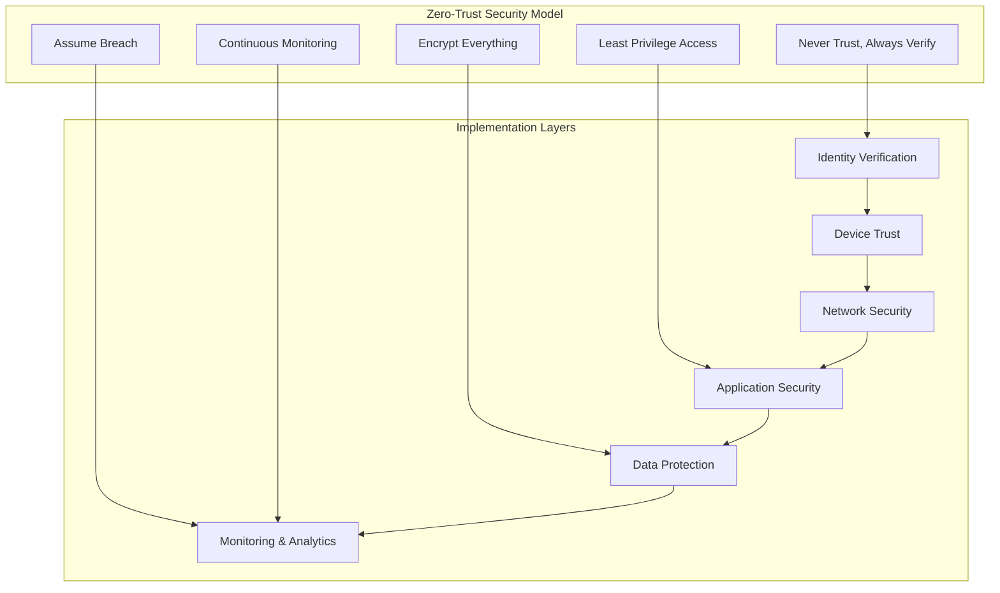

# ADR-0005: Security Implementation Approach for Skidspace Platform

## Status
**Accepted** - Date: 2026-03-23

## Context
The Skidspace platform handles sensitive business data including inventory information, financial transactions, customer data, and multi-tenant business operations. The platform requires enterprise-grade security to protect against modern threats while maintaining usability and performance.

## Decision
**Selected: Zero-Trust Security Architecture with Defense-in-Depth Strategy**

## Rationale

### Security Requirements Analysis
- **Data Protection**: Inventory, financial, and customer data security
- **Multi-Tenant Isolation**: Prevent cross-tenant data access
- **Regulatory Compliance**: GDPR, SOC2, PCI-DSS requirements
- **Threat Prevention**: Protection against OWASP Top 10 and beyond
- **Business Continuity**: Maintain operations under attack
- **Audit Requirements**: Complete security audit trails

### Alternative Security Approaches

#### 1. Traditional Perimeter Security (Rejected)
```
Internet -> Firewall -> Web Server -> Database
```
**Limitations**: Single point of failure, insider threats, cloud environment challenges

#### 2. Basic Application Security (Rejected)
```
Authentication + Basic Authorization + HTTPS
```
**Limitations**: Insufficient for multi-tenant SaaS, limited threat coverage

#### 3. Zero-Trust with Defense-in-Depth (Selected)
Multiple security layers with continuous verification

## Security Architecture Design

### 1. Zero-Trust Core Principles



### 2. Defense-in-Depth Layers

```typescript
// Security layer architecture
interface SecurityLayer {
  name: string
  purpose: string
  technologies: string[]
  controls: SecurityControl[]
}

const securityLayers: SecurityLayer[] = [
  {
    name: "Network Security",
    purpose: "Protect network infrastructure and traffic",
    technologies: ["CloudFlare", "AWS WAF", "VPC", "Security Groups"],
    controls: [
      "DDoS Protection",
      "IP Reputation Filtering",
      "Geographic Restrictions",
      "Rate Limiting",
      "TLS 1.3 Enforcement"
    ]
  },
  {
    name: "Application Security",
    purpose: "Secure application layer and APIs",
    technologies: ["Next.js Security Headers", "CSRF Protection", "Input Validation"],
    controls: [
      "XSS Prevention",
      "SQL Injection Protection",
      "CSRF Tokens",
      "Content Security Policy",
      "Request Validation"
    ]
  },
  {
    name: "Authentication & Authorization",
    purpose: "Identity and access management",
    technologies: ["NextAuth.js", "JWT", "RBAC", "MFA"],
    controls: [
      "Multi-Factor Authentication",
      "Role-Based Access Control",
      "Session Management",
      "Token Security",
      "Privilege Escalation Prevention"
    ]
  },
  {
    name: "Data Security",
    purpose: "Protect data at rest and in transit",
    technologies: ["AES-256", "TLS 1.3", "Database Encryption", "Key Management"],
    controls: [
      "Encryption at Rest",
      "Encryption in Transit",
      "Key Rotation",
      "Data Masking",
      "Backup Encryption"
    ]
  },
  {
    name: "Monitoring & Detection",
    purpose: "Continuous security monitoring",
    technologies: ["Security Information Event Management", "Intrusion Detection", "Anomaly Detection"],
    controls: [
      "Real-time Threat Detection",
      "Behavioral Analysis",
      "Audit Logging",
      "Incident Response",
      "Forensic Capabilities"
    ]
  }
]
```

### 3. Network Security Implementation

```typescript
// CloudFlare Security Configuration
const cloudflareSecurityConfig = {
  waf: {
    enabled: true,
    managedRules: [
      "OWASP Core Rule Set",
      "CloudFlare Managed Rules",
      "Custom Business Logic Rules"
    ],
    customRules: [
      {
        name: "Block Suspicious API Access",
        expression: "(http.request.uri.path contains \"/api/\" and rate(5m) > 100)",
        action: "block"
      },
      {
        name: "Protect Admin Routes",
        expression: "(http.request.uri.path contains \"/admin\" and cf.client.bot)",
        action: "challenge"
      }
    ]
  },
  ddosProtection: {
    enabled: true,
    sensitivity: "high",
    thresholds: {
      requestsPerSecond: 1000,
      bandwidthMbps: 100
    }
  },
  ipReputation: {
    enabled: true,
    blockMaliciousIPs: true,
    blockVpnTor: false, // Business requirement - allow VPN
    whitelistedCountries: ["US", "CA", "EU"],
    greylistedCountries: ["CN", "RU"] // Additional verification
  },
  rateLimiting: {
    api: {
      threshold: 100, // requests per minute
      period: 60,
      action: "block"
    },
    login: {
      threshold: 5, // attempts per minute
      period: 60,
      action: "block"
    },
    registration: {
      threshold: 3, // attempts per hour
      period: 3600,
      action: "block"
    }
  }
}

// AWS Security Groups Configuration
const awsSecurityGroups = {
  webTier: {
    inbound: [
      { port: 443, source: "0.0.0.0/0", protocol: "HTTPS" },
      { port: 80, source: "0.0.0.0/0", protocol: "HTTP", action: "redirect" }
    ],
    outbound: [
      { port: 443, destination: "app-tier-sg" },
      { port: 5432, destination: "db-tier-sg" }
    ]
  },
  appTier: {
    inbound: [
      { port: 443, source: "web-tier-sg" },
      { port: 22, source: "bastion-sg", protocol: "SSH" }
    ],
    outbound: [
      { port: 5432, destination: "db-tier-sg" },
      { port: 6379, destination: "redis-sg" },
      { port: 443, destination: "0.0.0.0/0", description: "External API calls" }
    ]
  },
  dbTier: {
    inbound: [
      { port: 5432, source: "app-tier-sg", protocol: "PostgreSQL" }
    ],
    outbound: [] // No outbound for database
  }
}
```

### 4. Application Security Implementation

```typescript
// Next.js Security Configuration
const nextSecurityConfig = {
  headers: {
    'X-Frame-Options': 'DENY',
    'X-Content-Type-Options': 'nosniff',
    'X-XSS-Protection': '1; mode=block',
    'Referrer-Policy': 'strict-origin-when-cross-origin',
    'Strict-Transport-Security': 'max-age=31536000; includeSubDomains; preload',
    'Content-Security-Policy': `
      default-src 'self';
      script-src 'self' 'unsafe-inline' 'unsafe-eval' https://vercel.live;
      style-src 'self' 'unsafe-inline' https://fonts.googleapis.com;
      img-src 'self' data: https:;
      font-src 'self' https://fonts.gstatic.com;
      connect-src 'self' https://api.skidspace.com wss:;
      frame-ancestors 'none';
      base-uri 'self';
      form-action 'self';
    `.replace(/\s+/g, ' ').trim(),
    'Permissions-Policy': 'camera=(), microphone=(), geolocation=()'
  },
  csrf: {
    enabled: true,
    cookieName: '__skidspace-csrf',
    headerName: 'X-CSRF-Token',
    sameSite: 'strict'
  }
}

// Input Validation and Sanitization
import { z } from 'zod'
import DOMPurify from 'isomorphic-dompurify'

export class InputValidator {
  static readonly schemas = {
    email: z.string().email().max(255),
    password: z.string().min(12).max(128).regex(/^(?=.*[a-z])(?=.*[A-Z])(?=.*\d)(?=.*[@$!%*?&])[A-Za-z\d@$!%*?&]/),
    tenantSlug: z.string().min(3).max(50).regex(/^[a-z0-9-]+$/),
    uuid: z.string().uuid(),
    warehouseName: z.string().min(1).max(255).trim(),
    quantity: z.number().int().min(0).max(999999),
    price: z.number().min(0).max(999999.99),
    sku: z.string().min(1).max(100).regex(/^[A-Z0-9-_]+$/),
    phoneNumber: z.string().regex(/^\+?[\d\s-()]+$/).optional(),
    address: z.object({
      street: z.string().min(1).max(255),
      city: z.string().min(1).max(100),
      state: z.string().min(2).max(50),
      zipCode: z.string().regex(/^\d{5}(-\d{4})?$/),
      country: z.string().length(2)
    })
  }

  static validate<T>(schema: z.ZodSchema<T>, data: unknown): T {
    const result = schema.safeParse(data)
    if (!result.success) {
      throw new ValidationError('Invalid input', result.error.errors)
    }
    return result.data
  }

  static sanitizeHTML(input: string): string {
    return DOMPurify.sanitize(input, {
      ALLOWED_TAGS: ['b', 'i', 'em', 'strong', 'p', 'br'],
      ALLOWED_ATTR: []
    })
  }

  static sanitizeSQL(input: string): string {
    // Remove potentially dangerous SQL keywords
    const dangerous = ['SELECT', 'INSERT', 'UPDATE', 'DELETE', 'DROP', 'CREATE', 'ALTER', 'EXEC', 'UNION', '--', ';']
    let sanitized = input

    dangerous.forEach(keyword => {
      sanitized = sanitized.replace(new RegExp(keyword, 'gi'), '')
    })

    return sanitized.trim()
  }

  static validateFileUpload(file: File): { valid: boolean; error?: string } {
    const allowedTypes = ['image/jpeg', 'image/png', 'image/webp', 'application/pdf']
    const maxSize = 10 * 1024 * 1024 // 10MB

    if (!allowedTypes.includes(file.type)) {
      return { valid: false, error: 'File type not allowed' }
    }

    if (file.size > maxSize) {
      return { valid: false, error: 'File too large' }
    }

    // Check for malicious file signatures
    const dangerousSignatures = ['%PDF-', '#!/bin/', '<?php', '<script']
    const reader = new FileReader()

    return new Promise((resolve) => {
      reader.onload = (e) => {
        const content = e.target?.result as string
        const hasSignature = dangerousSignatures.some(sig => content.includes(sig))

        resolve({
          valid: !hasSignature,
          error: hasSignature ? 'Potentially malicious file' : undefined
        })
      }
      reader.readAsText(file.slice(0, 1024)) // Check first 1KB
    })
  }
}

class ValidationError extends Error {
  constructor(message: string, public errors: any[]) {
    super(message)
    this.name = 'ValidationError'
  }
}
```

### 5. Authentication Security Enhancement

```typescript
// Enhanced Authentication Security
export class AuthenticationSecurity {
  private readonly maxFailedAttempts = 5
  private readonly lockoutDurationMs = 15 * 60 * 1000 // 15 minutes
  private readonly deviceTrustThreshold = 70

  async authenticateUser(
    credentials: LoginCredentials,
    deviceInfo: DeviceInfo,
    ipAddress: string
  ): Promise<AuthenticationResult> {
    // Pre-authentication security checks
    await this.performPreAuthChecks(credentials.email, ipAddress, deviceInfo)

    try {
      // Validate credentials
      const user = await this.validateCredentials(credentials)
      if (!user) {
        await this.recordFailedAttempt(credentials.email, ipAddress)
        throw new AuthenticationError('Invalid credentials')
      }

      // Check account status
      if (user.status !== 'active') {
        throw new AuthenticationError('Account is disabled')
      }

      // Device trust verification
      const deviceTrust = await this.calculateDeviceTrust(deviceInfo, user.id)
      const requiresMFA = await this.shouldRequireMFA(user, deviceTrust, ipAddress)

      if (requiresMFA && !credentials.mfaToken) {
        return {
          success: false,
          requiresMFA: true,
          mfaChallengeId: await this.createMFAChallenge(user.id)
        }
      }

      if (credentials.mfaToken) {
        const mfaValid = await this.validateMFA(user.id, credentials.mfaToken)
        if (!mfaValid) {
          throw new AuthenticationError('Invalid MFA token')
        }
      }

      // Successful authentication
      await this.clearFailedAttempts(credentials.email)
      await this.updateDeviceTrust(deviceInfo, user.id, 'success')

      const session = await this.createSecureSession(user, deviceInfo, ipAddress)

      // Log successful authentication
      await this.logSecurityEvent('authentication_success', {
        userId: user.id,
        ipAddress,
        deviceInfo,
        loginMethod: credentials.mfaToken ? 'mfa' : 'password',
        riskLevel: deviceTrust.riskLevel
      })

      return {
        success: true,
        user,
        session,
        deviceTrust
      }

    } catch (error) {
      await this.logSecurityEvent('authentication_failure', {
        email: credentials.email,
        ipAddress,
        deviceInfo,
        error: error.message,
        timestamp: new Date()
      })
      throw error
    }
  }

  private async performPreAuthChecks(
    email: string,
    ipAddress: string,
    deviceInfo: DeviceInfo
  ): Promise<void> {
    // Check account lockout
    const isLocked = await this.isAccountLocked(email)
    if (isLocked) {
      throw new AuthenticationError('Account temporarily locked due to failed attempts')
    }

    // Check IP reputation
    const ipReputation = await this.checkIPReputation(ipAddress)
    if (ipReputation.isMalicious) {
      await this.logSecurityEvent('malicious_ip_attempt', {
        email,
        ipAddress,
        reputation: ipReputation
      })
      throw new AuthenticationError('Access denied')
    }

    // Check for brute force attacks
    const rateLimitCheck = await this.checkRateLimit(email, ipAddress)
    if (!rateLimitCheck.allowed) {
      throw new AuthenticationError('Too many attempts. Please try again later.')
    }

    // Device fingerprint analysis
    const deviceRisk = await this.analyzeDeviceRisk(deviceInfo)
    if (deviceRisk.isHigh) {
      await this.logSecurityEvent('high_risk_device', {
        email,
        deviceInfo,
        riskFactors: deviceRisk.factors
      })
      // Continue but require additional verification
    }
  }

  private async shouldRequireMFA(
    user: User,
    deviceTrust: DeviceTrust,
    ipAddress: string
  ): Promise<boolean> {
    // Always require MFA for admin users
    if (user.globalRole === 'platform_admin') return true

    // Require MFA for untrusted devices
    if (deviceTrust.trustScore < this.deviceTrustThreshold) return true

    // Check for unusual location
    const locationCheck = await this.checkLocationAnomaly(user.id, ipAddress)
    if (locationCheck.isAnomalous) return true

    // Check tenant security policy
    const tenantPolicy = await this.getTenantSecurityPolicy(user.primaryTenantId)
    if (tenantPolicy.requireMFA) return true

    return false
  }

  private async validateMFA(userId: string, token: string): Promise<boolean> {
    const mfaSecret = await this.getMFASecret(userId)
    if (!mfaSecret) return false

    // TOTP validation
    const totp = speakeasy.totp({
      secret: mfaSecret,
      encoding: 'base32',
      time: Math.floor(Date.now() / 1000),
      window: 2 // Allow for clock drift
    })

    // Also check backup codes
    const isBackupCode = await this.validateBackupCode(userId, token)

    return totp === token || isBackupCode
  }

  // Password security enhancement
  async validatePasswordSecurity(password: string, userInfo: any): Promise<PasswordValidationResult> {
    const result: PasswordValidationResult = {
      isValid: false,
      score: 0,
      feedback: []
    }

    // Length check
    if (password.length < 12) {
      result.feedback.push('Password must be at least 12 characters long')
      return result
    }

    // Complexity requirements
    const hasLower = /[a-z]/.test(password)
    const hasUpper = /[A-Z]/.test(password)
    const hasNumber = /\d/.test(password)
    const hasSymbol = /[@$!%*?&]/.test(password)

    const complexity = [hasLower, hasUpper, hasNumber, hasSymbol].filter(Boolean).length

    if (complexity < 3) {
      result.feedback.push('Password must contain at least 3 of: lowercase, uppercase, numbers, symbols')
      return result
    }

    // Check against common passwords
    const isCommon = await this.checkCommonPasswords(password)
    if (isCommon) {
      result.feedback.push('Password is too common')
      return result
    }

    // Check for personal information
    if (userInfo.email && password.toLowerCase().includes(userInfo.email.split('@')[0].toLowerCase())) {
      result.feedback.push('Password should not contain parts of your email')
      return result
    }

    // Calculate strength score (0-100)
    let score = 0
    score += Math.min(password.length * 2, 50) // Length (max 50 points)
    score += complexity * 10 // Complexity (max 40 points)
    score += this.calculateEntropy(password) // Entropy (max 10 points)

    result.score = Math.min(score, 100)
    result.isValid = result.score >= 70

    if (!result.isValid) {
      result.feedback.push(`Password strength: ${result.score}/100. Need at least 70.`)
    }

    return result
  }

  private calculateEntropy(password: string): number {
    const uniqueChars = new Set(password).size
    const entropy = Math.log2(Math.pow(uniqueChars, password.length))
    return Math.min(entropy / 10, 10) // Normalize to 0-10
  }

  private async checkCommonPasswords(password: string): Promise<boolean> {
    // Check against rockyou.txt top 10,000 passwords
    // In production, use a bloom filter or external service
    const commonPasswords = [
      'password123', '123456789', 'qwertyuiop', 'admin123456',
      // ... truncated for brevity
    ]

    return commonPasswords.includes(password.toLowerCase())
  }
}

interface AuthenticationResult {
  success: boolean
  user?: User
  session?: Session
  deviceTrust?: DeviceTrust
  requiresMFA?: boolean
  mfaChallengeId?: string
}

interface PasswordValidationResult {
  isValid: boolean
  score: number
  feedback: string[]
}
```

### 6. Data Security and Encryption

```typescript
// Data Encryption Service
export class DataEncryptionService {
  private readonly algorithm = 'aes-256-gcm'
  private readonly keySize = 32 // 256 bits
  private readonly ivSize = 16  // 128 bits
  private readonly tagSize = 16 // 128 bits

  constructor(
    private masterKey: Buffer,
    private keyDerivationSalt: Buffer
  ) {}

  // Encrypt sensitive data before storage
  async encryptData(plaintext: string, keyId?: string): Promise<EncryptedData> {
    const key = keyId ? await this.deriveKey(keyId) : this.masterKey
    const iv = crypto.randomBytes(this.ivSize)

    const cipher = crypto.createCipher(this.algorithm, key, { iv })

    let encrypted = cipher.update(plaintext, 'utf8')
    encrypted = Buffer.concat([encrypted, cipher.final()])

    const tag = cipher.getAuthTag()

    return {
      algorithm: this.algorithm,
      encrypted: encrypted.toString('base64'),
      iv: iv.toString('base64'),
      tag: tag.toString('base64'),
      keyId: keyId || 'master'
    }
  }

  async decryptData(encryptedData: EncryptedData): Promise<string> {
    const key = encryptedData.keyId === 'master'
      ? this.masterKey
      : await this.deriveKey(encryptedData.keyId)

    const iv = Buffer.from(encryptedData.iv, 'base64')
    const encrypted = Buffer.from(encryptedData.encrypted, 'base64')
    const tag = Buffer.from(encryptedData.tag, 'base64')

    const decipher = crypto.createDecipher(this.algorithm, key, { iv })
    decipher.setAuthTag(tag)

    let decrypted = decipher.update(encrypted)
    decrypted = Buffer.concat([decrypted, decipher.final()])

    return decrypted.toString('utf8')
  }

  // Key derivation for tenant-specific encryption
  private async deriveKey(keyId: string): Promise<Buffer> {
    return crypto.pbkdf2Sync(
      this.masterKey,
      Buffer.concat([this.keyDerivationSalt, Buffer.from(keyId)]),
      100000, // iterations
      this.keySize,
      'sha256'
    )
  }

  // Encrypt PII data with additional metadata
  async encryptPII(data: PersonalData): Promise<EncryptedPersonalData> {
    const classification = this.classifyPII(data)

    const encrypted = await this.encryptData(
      JSON.stringify(data),
      `pii-${classification.level}`
    )

    return {
      ...encrypted,
      classification,
      encryptedAt: new Date(),
      retentionPolicy: this.getRetentionPolicy(classification.level)
    }
  }

  private classifyPII(data: PersonalData): PIIClassification {
    let level = 'low'
    const types: string[] = []

    // Check for high-sensitivity data
    if (data.ssn || data.creditCard || data.bankAccount) {
      level = 'high'
      types.push('financial')
    }

    // Check for medium-sensitivity data
    if (data.email || data.phone || data.address) {
      level = level === 'high' ? 'high' : 'medium'
      types.push('contact')
    }

    // Check for biometric data
    if (data.biometric) {
      level = 'high'
      types.push('biometric')
    }

    return { level, types, requiresConsent: level !== 'low' }
  }

  private getRetentionPolicy(level: string): RetentionPolicy {
    const policies = {
      low: { retainDays: 365 * 2, autoDelete: true },
      medium: { retainDays: 365 * 3, autoDelete: true },
      high: { retainDays: 365 * 7, autoDelete: false } // Manual review required
    }

    return policies[level] || policies.low
  }
}

// Database-level encryption
export class DatabaseSecurity {
  // Column-level encryption for sensitive fields
  static readonly encryptedColumns = {
    users: ['email', 'phone', 'address'],
    orders: ['shipping_address', 'billing_info'],
    payments: ['card_number', 'bank_account'],
    inventory: [] // Business decision: inventory not PII
  }

  static async encryptSensitiveColumns(
    tableName: string,
    record: Record<string, any>
  ): Promise<Record<string, any>> {
    const columnsToEncrypt = this.encryptedColumns[tableName] || []
    const encrypted = { ...record }

    for (const column of columnsToEncrypt) {
      if (record[column]) {
        encrypted[column] = await dataEncryption.encryptPII(record[column])
      }
    }

    return encrypted
  }

  // Transparent database encryption queries
  static createEncryptedTable(tableName: string): string {
    return `
      CREATE TABLE ${tableName} (
        -- Regular columns
        id UUID PRIMARY KEY,
        created_at TIMESTAMP DEFAULT CURRENT_TIMESTAMP,

        -- Encrypted columns
        encrypted_data JSONB, -- Contains encrypted sensitive data
        encryption_metadata JSONB -- Encryption metadata
      ) WITH (
        -- Enable row-level security
        oids = false,
        encryption_key_id = 'tenant-specific-key'
      );

      -- Enable RLS
      ALTER TABLE ${tableName} ENABLE ROW LEVEL SECURITY;

      -- Create policies for tenant isolation
      CREATE POLICY tenant_isolation ON ${tableName}
      FOR ALL TO application_role
      USING (tenant_id = current_setting('app.current_tenant')::UUID);
    `
  }
}

interface EncryptedData {
  algorithm: string
  encrypted: string
  iv: string
  tag: string
  keyId: string
}

interface EncryptedPersonalData extends EncryptedData {
  classification: PIIClassification
  encryptedAt: Date
  retentionPolicy: RetentionPolicy
}

interface PIIClassification {
  level: 'low' | 'medium' | 'high'
  types: string[]
  requiresConsent: boolean
}

interface RetentionPolicy {
  retainDays: number
  autoDelete: boolean
}
```

### 7. Security Monitoring and Incident Response

```typescript
// Security Monitoring System
export class SecurityMonitoringService {
  private readonly alertThresholds = {
    failedLogins: { count: 10, windowMs: 60000 }, // 10 failures in 1 minute
    suspiciousActivity: { score: 75, windowMs: 300000 }, // Score >75 in 5 minutes
    dataExfiltration: { volumeMB: 100, windowMs: 60000 }, // 100MB in 1 minute
    bruteForce: { attempts: 50, windowMs: 300000 }, // 50 attempts in 5 minutes
    privilegeEscalation: { count: 1, windowMs: 1 } // Immediate alert
  }

  async monitorSecurityEvents(): Promise<void> {
    const events = await this.collectSecurityEvents()

    for (const event of events) {
      const riskScore = await this.calculateRiskScore(event)

      if (riskScore >= 70) {
        await this.triggerSecurityAlert(event, riskScore)
      }

      await this.updateThreatIntelligence(event)
    }
  }

  private async calculateRiskScore(event: SecurityEvent): Promise<number> {
    let score = 0

    // Base score by event type
    const baseScores = {
      'failed_login': 5,
      'suspicious_device': 25,
      'location_anomaly': 30,
      'privilege_escalation': 90,
      'data_access_violation': 85,
      'malicious_ip': 70,
      'brute_force': 80,
      'sql_injection_attempt': 95,
      'xss_attempt': 60
    }

    score += baseScores[event.type] || 10

    // Increase score for known bad actors
    if (await this.isKnownBadActor(event.sourceIP)) {
      score += 40
    }

    // Increase score for privileged user events
    if (event.userRole === 'platform_admin') {
      score += 20
    }

    // Increase score for multiple rapid events
    const recentEvents = await this.getRecentEventsBySource(event.sourceIP, 300000)
    if (recentEvents.length > 5) {
      score += recentEvents.length * 5
    }

    // Geographic risk factors
    const geoRisk = await this.calculateGeographicRisk(event.sourceIP)
    score += geoRisk

    // Time-based risk (off-hours access)
    if (this.isOffHours(event.timestamp)) {
      score += 15
    }

    return Math.min(score, 100)
  }

  private async triggerSecurityAlert(
    event: SecurityEvent,
    riskScore: number
  ): Promise<void> {
    const alert: SecurityAlert = {
      id: crypto.randomUUID(),
      severity: this.getSeverity(riskScore),
      type: event.type,
      description: this.generateAlertDescription(event),
      affectedResources: event.resourcesAffected,
      sourceIP: event.sourceIP,
      userId: event.userId,
      timestamp: new Date(),
      riskScore,
      status: 'open',
      assignedTo: await this.getSecurityTeamAssignee(riskScore)
    }

    // Store alert
    await this.storeSecurityAlert(alert)

    // Real-time notifications
    if (riskScore >= 85) {
      await this.sendEmergencyAlert(alert)
    } else if (riskScore >= 70) {
      await this.sendSecurityTeamAlert(alert)
    }

    // Automated response for critical threats
    if (riskScore >= 95) {
      await this.initiateAutomatedResponse(event, alert)
    }

    // Log to SIEM
    await this.logToSIEM(alert, event)
  }

  private async initiateAutomatedResponse(
    event: SecurityEvent,
    alert: SecurityAlert
  ): Promise<void> {
    const responses: AutomatedResponse[] = []

    // Block malicious IP
    if (event.type.includes('injection') || event.type === 'brute_force') {
      await this.blockIPAddress(event.sourceIP, '1 hour')
      responses.push({
        type: 'ip_block',
        target: event.sourceIP,
        duration: '1 hour',
        reason: `Automated response to ${event.type}`
      })
    }

    // Suspend user account for privilege escalation
    if (event.type === 'privilege_escalation' && event.userId) {
      await this.suspendUserAccount(event.userId, 'security_incident')
      responses.push({
        type: 'account_suspension',
        target: event.userId,
        reason: 'Privilege escalation detected'
      })
    }

    // Revoke all sessions for compromised account
    if (event.type === 'data_access_violation' && event.userId) {
      await this.revokeAllUserSessions(event.userId)
      responses.push({
        type: 'session_revocation',
        target: event.userId,
        reason: 'Data access violation'
      })
    }

    // Update alert with responses
    await this.updateAlertWithResponses(alert.id, responses)

    // Notify security team of automated actions
    await this.notifyAutomatedActions(alert, responses)
  }

  // Behavioral analytics
  async analyzeUserBehavior(userId: string): Promise<BehaviorAnalysis> {
    const user = await this.getUserProfile(userId)
    const recentActivity = await this.getUserActivity(userId, 30) // Last 30 days

    const baseline = await this.calculateUserBaseline(userId)
    const current = this.analyzeCurrentBehavior(recentActivity)

    const anomalies = this.detectBehavioralAnomalies(baseline, current)

    return {
      userId,
      analysisDate: new Date(),
      baseline,
      current,
      anomalies,
      riskScore: this.calculateBehaviorRiskScore(anomalies),
      recommendations: this.generateSecurityRecommendations(anomalies)
    }
  }

  private detectBehavioralAnomalies(
    baseline: BehaviorBaseline,
    current: BehaviorMetrics
  ): BehaviorAnomaly[] {
    const anomalies: BehaviorAnomaly[] = []

    // Login time patterns
    if (this.isTimePatternAnomaly(baseline.loginTimes, current.loginTimes)) {
      anomalies.push({
        type: 'unusual_login_time',
        severity: 'medium',
        description: 'User logging in at unusual times',
        confidence: 0.8
      })
    }

    // Data access patterns
    if (current.dataAccessVolume > baseline.dataAccessVolume * 3) {
      anomalies.push({
        type: 'excessive_data_access',
        severity: 'high',
        description: 'Unusually high data access volume',
        confidence: 0.9
      })
    }

    // Location patterns
    if (current.uniqueLocations > baseline.uniqueLocations * 2) {
      anomalies.push({
        type: 'multiple_locations',
        severity: 'medium',
        description: 'Access from multiple unusual locations',
        confidence: 0.7
      })
    }

    // Feature usage patterns
    const newFeatures = current.featuresUsed.filter(f =>
      !baseline.featuresUsed.includes(f)
    )
    if (newFeatures.length > 5) {
      anomalies.push({
        type: 'unusual_feature_usage',
        severity: 'low',
        description: 'Using many new platform features',
        confidence: 0.6
      })
    }

    return anomalies
  }

  // Threat intelligence integration
  async updateThreatIntelligence(event: SecurityEvent): Promise<void> {
    // Update IP reputation database
    if (event.sourceIP) {
      await this.updateIPReputation(event.sourceIP, event.type)
    }

    // Update attack pattern database
    await this.recordAttackPattern({
      type: event.type,
      source: event.sourceIP,
      target: event.resourcesAffected,
      timestamp: event.timestamp,
      success: event.wasSuccessful
    })

    // Share with external threat intelligence feeds
    if (event.type.includes('injection') || event.riskScore > 80) {
      await this.shareWithThreatFeeds(event)
    }
  }

  // Incident response coordination
  async coordinateIncidentResponse(alert: SecurityAlert): Promise<void> {
    const incident: SecurityIncident = {
      id: crypto.randomUUID(),
      alertIds: [alert.id],
      severity: alert.severity,
      type: alert.type,
      description: `Security incident: ${alert.description}`,
      status: 'investigating',
      assignedTo: alert.assignedTo,
      createdAt: new Date(),
      timeline: [{
        timestamp: new Date(),
        action: 'incident_created',
        description: 'Security incident created from alert',
        performedBy: 'system'
      }]
    }

    // Create incident record
    await this.createIncident(incident)

    // Assign to security team
    await this.assignIncidentToTeam(incident.id, alert.severity)

    // Set up incident war room for critical incidents
    if (alert.severity === 'critical') {
      await this.createIncidentWarRoom(incident.id)
    }

    // Begin automated evidence collection
    await this.collectIncidentEvidence(incident.id, alert)

    // Notify stakeholders
    await this.notifyIncidentStakeholders(incident)
  }
}

interface SecurityEvent {
  id: string
  type: string
  timestamp: Date
  sourceIP: string
  userId?: string
  userRole?: string
  resourcesAffected: string[]
  wasSuccessful: boolean
  riskScore: number
  metadata: Record<string, any>
}

interface SecurityAlert {
  id: string
  severity: 'low' | 'medium' | 'high' | 'critical'
  type: string
  description: string
  affectedResources: string[]
  sourceIP: string
  userId?: string
  timestamp: Date
  riskScore: number
  status: 'open' | 'investigating' | 'resolved' | 'false_positive'
  assignedTo?: string
}

interface AutomatedResponse {
  type: 'ip_block' | 'account_suspension' | 'session_revocation' | 'rate_limit'
  target: string
  duration?: string
  reason: string
}

interface BehaviorAnomaly {
  type: string
  severity: 'low' | 'medium' | 'high'
  description: string
  confidence: number
}
```

## Compliance and Regulatory Framework

### 1. GDPR Compliance Implementation

```typescript
// GDPR Compliance Service
export class GDPRComplianceService {
  async processDataSubjectRequest(
    request: DataSubjectRequest
  ): Promise<DataSubjectResponse> {
    switch (request.type) {
      case 'access':
        return await this.handleAccessRequest(request)
      case 'rectification':
        return await this.handleRectificationRequest(request)
      case 'erasure':
        return await this.handleErasureRequest(request)
      case 'portability':
        return await this.handlePortabilityRequest(request)
      case 'restriction':
        return await this.handleRestrictionRequest(request)
      default:
        throw new Error('Invalid request type')
    }
  }

  private async handleErasureRequest(
    request: DataSubjectRequest
  ): Promise<DataSubjectResponse> {
    // Validate identity
    await this.verifyIdentity(request.subjectId, request.verification)

    // Find all personal data
    const personalData = await this.findPersonalData(request.subjectId)

    // Check for legal basis to retain data
    const retentionReasons = await this.checkRetentionReasons(personalData)

    // Anonymize or delete data
    for (const data of personalData) {
      if (retentionReasons[data.id]) {
        await this.anonymizeData(data)
      } else {
        await this.deleteData(data)
      }
    }

    // Generate compliance report
    const report = await this.generateErasureReport(personalData, retentionReasons)

    return {
      requestId: request.id,
      status: 'completed',
      completedAt: new Date(),
      report
    }
  }

  // Consent management
  async recordConsent(consent: ConsentRecord): Promise<void> {
    await prisma.dataConsents.create({
      data: {
        subjectId: consent.subjectId,
        purpose: consent.purpose,
        lawfulBasis: consent.lawfulBasis,
        consentGiven: consent.given,
        consentWithdrawn: consent.withdrawn,
        granularConsents: consent.granular,
        timestamp: new Date(),
        ipAddress: consent.ipAddress,
        userAgent: consent.userAgent,
        consentText: consent.consentText,
        version: consent.version
      }
    })

    // Update data processing permissions
    await this.updateProcessingPermissions(consent.subjectId, consent)
  }

  // Data retention management
  async enforceRetentionPolicies(): Promise<void> {
    const retentionPolicies = await this.getRetentionPolicies()

    for (const policy of retentionPolicies) {
      const expiredData = await this.findExpiredData(policy)

      for (const data of expiredData) {
        if (policy.action === 'delete') {
          await this.deleteData(data)
        } else if (policy.action === 'anonymize') {
          await this.anonymizeData(data)
        } else if (policy.action === 'archive') {
          await this.archiveData(data)
        }
      }
    }
  }
}

interface DataSubjectRequest {
  id: string
  type: 'access' | 'rectification' | 'erasure' | 'portability' | 'restriction'
  subjectId: string
  verification: IdentityVerification
  details?: any
}

interface ConsentRecord {
  subjectId: string
  purpose: string
  lawfulBasis: string
  given: boolean
  withdrawn?: boolean
  granular: Record<string, boolean>
  ipAddress: string
  userAgent: string
  consentText: string
  version: string
}
```

### 2. SOC2 Type II Controls

```typescript
// SOC2 Control Implementation
export class SOC2ControlsService {
  // CC6.1 - Logical Access Controls
  async implementAccessControls(): Promise<void> {
    // Role-based access control
    await this.enforceRBAC()

    // Principle of least privilege
    await this.auditPrivileges()

    // Regular access reviews
    await this.scheduleAccessReviews()
  }

  // CC6.2 - Authentication
  async implementAuthenticationControls(): Promise<void> {
    // Multi-factor authentication
    await this.enforceMultiFactorAuth()

    // Password complexity requirements
    await this.enforcePasswordComplexity()

    // Account lockout mechanisms
    await this.implementAccountLockout()
  }

  // CC6.3 - Authorization
  async implementAuthorizationControls(): Promise<void> {
    // Segregation of duties
    await this.enforceSeparationOfDuties()

    // Approval workflows
    await this.implementApprovalWorkflows()

    // Privilege escalation controls
    await this.monitorPrivilegeEscalation()
  }

  // CC7.1 - System Monitoring
  async implementMonitoringControls(): Promise<void> {
    // Continuous monitoring
    await this.setupContinuousMonitoring()

    // Anomaly detection
    await this.implementAnomalyDetection()

    // Incident response
    await this.establishIncidentResponse()
  }

  // Generate SOC2 compliance report
  async generateSOC2Report(period: DateRange): Promise<SOC2Report> {
    const controls = await this.evaluateControls(period)
    const exceptions = await this.findControlExceptions(period)
    const remediation = await this.getRemediationActions(exceptions)

    return {
      reportPeriod: period,
      controlsEvaluated: controls,
      exceptions,
      remediationActions: remediation,
      overallAssessment: this.calculateOverallAssessment(controls, exceptions),
      generatedAt: new Date(),
      generatedBy: 'SOC2ControlsService'
    }
  }
}
```

## Security Testing and Validation

### 1. Automated Security Testing

```typescript
// Security Testing Suite
export class SecurityTestingSuite {
  async runSecurityTests(): Promise<SecurityTestResults> {
    const results = await Promise.allSettled([
      this.testAuthentication(),
      this.testAuthorization(),
      this.testInputValidation(),
      this.testSessionManagement(),
      this.testCryptography(),
      this.testNetworkSecurity(),
      this.testDataProtection()
    ])

    return this.aggregateResults(results)
  }

  private async testAuthentication(): Promise<TestResult> {
    const tests = [
      this.testPasswordStrength(),
      this.testBruteForceProtection(),
      this.testMultiFactorAuth(),
      this.testSessionTimeout(),
      this.testAccountLockout()
    ]

    const results = await Promise.all(tests)
    return this.summarizeTestResults('Authentication', results)
  }

  private async testAuthorization(): Promise<TestResult> {
    const tests = [
      this.testRoleBasedAccess(),
      this.testPrivilegeEscalation(),
      this.testTenantIsolation(),
      this.testResourceAccess(),
      this.testAPIPermissions()
    ]

    const results = await Promise.all(tests)
    return this.summarizeTestResults('Authorization', results)
  }

  // OWASP Top 10 Testing
  private async testOWASPTop10(): Promise<TestResult[]> {
    return await Promise.all([
      this.testInjectionFlaws(),
      this.testBrokenAuthentication(),
      this.testSensitiveDataExposure(),
      this.testXXEAttacks(),
      this.testBrokenAccessControl(),
      this.testSecurityMisconfiguration(),
      this.testXSSFlaws(),
      this.testInsecureDeserialization(),
      this.testKnownVulnerabilities(),
      this.testInsufficientLogging()
    ])
  }

  private async testInjectionFlaws(): Promise<TestResult> {
    // SQL Injection testing
    const sqlTests = [
      "'; DROP TABLE users; --",
      "1' OR '1'='1",
      "1' UNION SELECT * FROM sensitive_table --"
    ]

    // NoSQL Injection testing
    const noSqlTests = [
      '{"$gt": ""}',
      '{"$ne": null}',
      '{"$where": "this.password.match(/.*/)"}'
    ]

    // Command Injection testing
    const cmdTests = [
      '; ls -la',
      '| cat /etc/passwd',
      '&& rm -rf /'
    ]

    let vulnerabilities = 0
    let totalTests = sqlTests.length + noSqlTests.length + cmdTests.length

    // Test each injection type
    for (const payload of [...sqlTests, ...noSqlTests, ...cmdTests]) {
      const isVulnerable = await this.testInjectionPayload(payload)
      if (isVulnerable) vulnerabilities++
    }

    return {
      category: 'Injection',
      passed: vulnerabilities === 0,
      vulnerabilities,
      totalTests,
      details: vulnerabilities > 0 ? 'Injection vulnerabilities detected' : 'No injection vulnerabilities found'
    }
  }

  private async testBrokenAuthentication(): Promise<TestResult> {
    const tests = [
      this.testWeakPasswords(),
      this.testCredentialStuffing(),
      this.testSessionFixation(),
      this.testPasswordRecovery(),
      this.testAccountEnumeration()
    ]

    const results = await Promise.all(tests)
    const failures = results.filter(r => !r.passed).length

    return {
      category: 'Broken Authentication',
      passed: failures === 0,
      vulnerabilities: failures,
      totalTests: tests.length,
      details: results.map(r => r.details).join('; ')
    }
  }

  // Penetration testing simulation
  async runPenetrationTests(): Promise<PenTestResults> {
    const results = {
      networkTests: await this.runNetworkPenTests(),
      webApplicationTests: await this.runWebAppPenTests(),
      socialEngineeringTests: await this.runSocialEngTests(),
      physicalSecurityTests: await this.runPhysicalSecTests()
    }

    return results
  }
}

interface TestResult {
  category: string
  passed: boolean
  vulnerabilities: number
  totalTests: number
  details: string
}

interface SecurityTestResults {
  overall: {
    passed: boolean
    score: number
    criticalIssues: number
    warnings: number
  }
  categories: TestResult[]
  recommendations: string[]
}
```

## Disaster Recovery and Business Continuity

### 1. Security Incident Recovery

```typescript
// Disaster Recovery Service
export class SecurityIncidentRecoveryService {
  async executeRecoveryPlan(incident: SecurityIncident): Promise<RecoveryResult> {
    const plan = await this.getRecoveryPlan(incident.type, incident.severity)

    const recovery: RecoveryExecution = {
      incidentId: incident.id,
      planId: plan.id,
      startedAt: new Date(),
      steps: [],
      status: 'in_progress'
    }

    try {
      for (const step of plan.steps) {
        const stepResult = await this.executeRecoveryStep(step, incident)
        recovery.steps.push(stepResult)

        if (!stepResult.success) {
          recovery.status = 'failed'
          break
        }
      }

      if (recovery.status === 'in_progress') {
        recovery.status = 'completed'
        recovery.completedAt = new Date()
      }

      // Validate recovery
      const validation = await this.validateRecovery(incident, recovery)
      recovery.validation = validation

      return {
        success: recovery.status === 'completed' && validation.passed,
        recovery,
        nextSteps: await this.getPostRecoverySteps(incident, recovery)
      }

    } catch (error) {
      recovery.status = 'failed'
      recovery.error = error.message

      return {
        success: false,
        recovery,
        error: error.message
      }
    }
  }

  // Data backup and restoration
  async initiateEmergencyBackup(): Promise<BackupResult> {
    const backup: EmergencyBackup = {
      id: crypto.randomUUID(),
      type: 'security_incident',
      startedAt: new Date(),
      databases: [],
      files: [],
      configurations: [],
      status: 'running'
    }

    try {
      // Backup critical databases
      backup.databases = await this.backupCriticalDatabases()

      // Backup configuration files
      backup.configurations = await this.backupConfigurations()

      // Backup user data
      backup.files = await this.backupUserData()

      // Verify backup integrity
      const integrity = await this.verifyBackupIntegrity(backup)

      backup.status = integrity.passed ? 'completed' : 'failed'
      backup.completedAt = new Date()
      backup.size = this.calculateBackupSize(backup)

      return {
        success: integrity.passed,
        backup,
        integrity
      }

    } catch (error) {
      backup.status = 'failed'
      backup.error = error.message

      return {
        success: false,
        backup,
        error: error.message
      }
    }
  }

  // System isolation during attacks
  async isolateCompromisedSystems(
    compromisedResources: string[]
  ): Promise<IsolationResult> {
    const isolation: SystemIsolation = {
      id: crypto.randomUUID(),
      resources: compromisedResources,
      startedAt: new Date(),
      actions: [],
      status: 'isolating'
    }

    try {
      for (const resource of compromisedResources) {
        const action = await this.isolateResource(resource)
        isolation.actions.push(action)
      }

      isolation.status = 'isolated'
      isolation.completedAt = new Date()

      // Verify isolation
      const verification = await this.verifyIsolation(isolation)

      return {
        success: verification.successful,
        isolation,
        verification
      }

    } catch (error) {
      isolation.status = 'failed'
      isolation.error = error.message

      return {
        success: false,
        isolation,
        error: error.message
      }
    }
  }
}
```

## Implementation Timeline and Success Metrics

### Phase 1: Core Security Foundation (Weeks 1-2)
- Network security configuration
- Basic authentication and authorization
- Input validation and sanitization
- Security headers and CSP

### Phase 2: Advanced Security Controls (Weeks 3-4)
- Multi-factor authentication
- Session management enhancement
- Data encryption implementation
- Security monitoring setup

### Phase 3: Compliance and Testing (Weeks 5-6)
- GDPR compliance implementation
- SOC2 controls deployment
- Security testing automation
- Penetration testing

### Phase 4: Monitoring and Response (Week 7-8)
- Security incident response system
- Behavioral analytics
- Threat intelligence integration
- Disaster recovery procedures

### Success Metrics

#### Security KPIs
- **Zero Critical Vulnerabilities**: Maintain 0 critical security issues
- **Mean Time to Detection (MTTD)**: < 5 minutes for security incidents
- **Mean Time to Response (MTTR)**: < 15 minutes for critical incidents
- **False Positive Rate**: < 5% for security alerts
- **Security Test Coverage**: 95%+ automated security test coverage

#### Compliance Metrics
- **Audit Compliance**: 100% SOC2 Type II controls implemented
- **Data Protection**: 100% GDPR compliance for data processing
- **Incident Response**: 100% incidents resolved within SLA
- **Vulnerability Management**: 99%+ vulnerability resolution within 30 days

#### Business Impact Metrics
- **Security Incidents**: Zero successful breaches
- **Customer Trust**: 98%+ customer confidence in security
- **Regulatory Fines**: $0 in security-related fines
- **Business Continuity**: 99.9%+ uptime during security events

## Conclusion

The Zero-Trust security architecture with defense-in-depth strategy provides comprehensive protection for the Skidspace platform while maintaining usability and compliance requirements. This approach ensures enterprise-grade security appropriate for a multi-tenant SaaS platform handling sensitive business data.

**Decision Confidence**: High (95%)
**Implementation Priority**: Critical (Parallel with core development)
**Security Audit Required**: Yes (Before production deployment)
**Review Date**: 2026-06-23 (3-month security review)