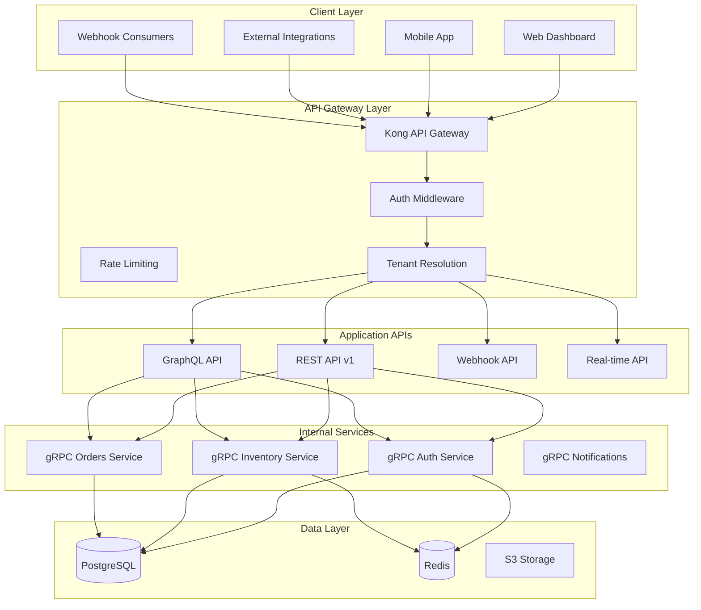

# ADR-0006: API Design for Role-Based Access Control

## Status
**Accepted** - Date: 2026-03-23

## Context
The Skidspace platform requires a comprehensive API design that supports role-based access control across multiple tenants, user types, and business scenarios. The API must be secure, scalable, performant, and developer-friendly while maintaining strict data isolation and permission enforcement.

## Decision
**Selected: RESTful API with GraphQL Query Layer + gRPC Internal Services**

## Rationale

### API Requirements Analysis
- **Multi-Tenant Support**: Tenant-scoped APIs with data isolation
- **Role-Based Access**: Fine-grained permission enforcement
- **Performance**: Sub-100ms response times for 95% of requests
- **Developer Experience**: Intuitive, well-documented APIs
- **Security**: Enterprise-grade security controls
- **Scalability**: Support 10K+ concurrent requests
- **Mobile Optimization**: Efficient data fetching for mobile clients

### Alternative API Approaches

#### 1. Pure REST API (Rejected for Frontend)
```
GET /api/v1/warehouses
POST /api/v1/warehouses
PUT /api/v1/warehouses/{id}
DELETE /api/v1/warehouses/{id}
```
**Limitations**: Over-fetching, multiple round trips, rigid structure

#### 2. Pure GraphQL API (Rejected for Simplicity)
```graphql
query {
  warehouses {
    id
    name
    inventory { sku quantity }
  }
}
```
**Limitations**: Complexity, caching challenges, security concerns

#### 3. Hybrid Approach (Selected)
RESTful API foundation with GraphQL query layer and gRPC for internal services

## API Architecture Design

### 1. API Layer Architecture



### 2. REST API Design with RBAC

```typescript
// API Route Structure with Role-Based Access
interface APIEndpoint {
  path: string
  method: 'GET' | 'POST' | 'PUT' | 'PATCH' | 'DELETE'
  permissions: Permission[]
  rateLimit?: RateLimit
  cacheTTL?: number
  validation: ValidationSchema
}

const apiEndpoints: APIEndpoint[] = [
  // Warehouse Management
  {
    path: '/api/v1/warehouses',
    method: 'GET',
    permissions: [{ resource: 'warehouses', action: 'read' }],
    rateLimit: { requests: 100, window: 60000 }, // 100/minute
    cacheTTL: 300, // 5 minutes
    validation: warehouseListQuerySchema
  },
  {
    path: '/api/v1/warehouses',
    method: 'POST',
    permissions: [{ resource: 'warehouses', action: 'create' }],
    rateLimit: { requests: 10, window: 60000 }, // 10/minute
    validation: warehouseCreateSchema
  },
  {
    path: '/api/v1/warehouses/:id',
    method: 'PUT',
    permissions: [
      { resource: 'warehouses', action: 'update' },
      { resource: 'warehouses', action: 'update', resourceId: ':id' } // Resource-specific
    ],
    validation: warehouseUpdateSchema
  },
  {
    path: '/api/v1/warehouses/:id',
    method: 'DELETE',
    permissions: [{ resource: 'warehouses', action: 'delete', resourceId: ':id' }],
    rateLimit: { requests: 5, window: 60000 }, // 5/minute
    validation: warehouseDeleteSchema
  },

  // Inventory Management
  {
    path: '/api/v1/inventory',
    method: 'GET',
    permissions: [{ resource: 'inventory', action: 'read' }],
    rateLimit: { requests: 200, window: 60000 },
    cacheTTL: 60, // 1 minute (inventory changes frequently)
    validation: inventoryListQuerySchema
  },
  {
    path: '/api/v1/inventory/bulk-update',
    method: 'POST',
    permissions: [{ resource: 'inventory', action: 'bulk_update' }],
    rateLimit: { requests: 5, window: 60000 },
    validation: inventoryBulkUpdateSchema
  },

  // Order Management
  {
    path: '/api/v1/orders',
    method: 'GET',
    permissions: [{ resource: 'orders', action: 'read' }],
    rateLimit: { requests: 150, window: 60000 },
    cacheTTL: 30,
    validation: orderListQuerySchema
  },
  {
    path: '/api/v1/orders',
    method: 'POST',
    permissions: [{ resource: 'orders', action: 'create' }],
    rateLimit: { requests: 20, window: 60000 },
    validation: orderCreateSchema
  },

  // User Management (Admin only)
  {
    path: '/api/v1/users',
    method: 'GET',
    permissions: [{ resource: 'users', action: 'read', role: 'admin' }],
    rateLimit: { requests: 50, window: 60000 },
    validation: userListQuerySchema
  },
  {
    path: '/api/v1/users/:id/roles',
    method: 'PUT',
    permissions: [{ resource: 'users', action: 'manage_roles', role: 'admin' }],
    rateLimit: { requests: 10, window: 60000 },
    validation: userRoleUpdateSchema
  },

  // Tenant Management (Platform Admin only)
  {
    path: '/api/v1/admin/tenants',
    method: 'GET',
    permissions: [{ resource: 'tenants', action: 'read', role: 'platform_admin' }],
    rateLimit: { requests: 100, window: 60000 },
    validation: tenantListQuerySchema
  },
  {
    path: '/api/v1/admin/tenants',
    method: 'POST',
    permissions: [{ resource: 'tenants', action: 'create', role: 'platform_admin' }],
    rateLimit: { requests: 5, window: 60000 },
    validation: tenantCreateSchema
  }
]

// API Route Handler with RBAC
export function createAPIRoute(endpoint: APIEndpoint) {
  return async function handler(request: NextRequest, context: any) {
    try {
      // 1. Extract route parameters
      const params = extractRouteParams(request.url, endpoint.path)

      // 2. Tenant resolution
      const tenant = await resolveTenant(request)
      if (!tenant) {
        return NextResponse.json(
          { error: 'Tenant not found' },
          { status: 404 }
        )
      }

      // 3. Authentication
      const session = await authenticateRequest(request)
      if (!session) {
        return NextResponse.json(
          { error: 'Authentication required' },
          { status: 401 }
        )
      }

      // 4. Rate limiting
      if (endpoint.rateLimit) {
        const rateLimitResult = await checkRateLimit(
          session.user.id,
          endpoint.path,
          endpoint.rateLimit
        )
        if (!rateLimitResult.allowed) {
          return NextResponse.json(
            { error: 'Rate limit exceeded' },
            {
              status: 429,
              headers: {
                'X-RateLimit-Limit': endpoint.rateLimit.requests.toString(),
                'X-RateLimit-Remaining': rateLimitResult.remaining.toString(),
                'X-RateLimit-Reset': rateLimitResult.resetTime.toString()
              }
            }
          )
        }
      }

      // 5. Authorization
      const authContext = {
        userId: session.user.id,
        tenantId: tenant.id,
        userRole: session.user.role,
        params
      }

      const hasPermission = await checkPermissions(
        endpoint.permissions,
        authContext
      )

      if (!hasPermission) {
        return NextResponse.json(
          { error: 'Insufficient permissions' },
          { status: 403 }
        )
      }

      // 6. Input validation
      const body = endpoint.method !== 'GET' ? await request.json() : null
      const query = Object.fromEntries(new URL(request.url).searchParams)

      const validationResult = await validateInput(
        endpoint.validation,
        { body, query, params }
      )

      if (!validationResult.success) {
        return NextResponse.json(
          {
            error: 'Validation failed',
            details: validationResult.errors
          },
          { status: 400 }
        )
      }

      // 7. Check cache (for GET requests)
      if (endpoint.method === 'GET' && endpoint.cacheTTL) {
        const cacheKey = generateCacheKey(endpoint.path, query, tenant.id, session.user.id)
        const cached = await getCachedResponse(cacheKey)

        if (cached) {
          return NextResponse.json(cached, {
            headers: {
              'X-Cache': 'HIT',
              'Cache-Control': `public, max-age=${endpoint.cacheTTL}`
            }
          })
        }
      }

      // 8. Execute business logic
      const result = await executeEndpointLogic(
        endpoint,
        validationResult.data,
        authContext
      )

      // 9. Cache response (for GET requests)
      if (endpoint.method === 'GET' && endpoint.cacheTTL && result) {
        const cacheKey = generateCacheKey(endpoint.path, query, tenant.id, session.user.id)
        await cacheResponse(cacheKey, result, endpoint.cacheTTL)
      }

      // 10. Audit logging
      await logAPIAccess({
        endpoint: endpoint.path,
        method: endpoint.method,
        userId: session.user.id,
        tenantId: tenant.id,
        ipAddress: getClientIP(request),
        userAgent: request.headers.get('user-agent'),
        responseStatus: 200,
        timestamp: new Date()
      })

      return NextResponse.json(result, {
        headers: endpoint.method === 'GET' && endpoint.cacheTTL ? {
          'X-Cache': 'MISS',
          'Cache-Control': `public, max-age=${endpoint.cacheTTL}`
        } : {}
      })

    } catch (error) {
      // Error handling and logging
      await logAPIError({
        endpoint: endpoint.path,
        method: endpoint.method,
        error: error.message,
        stack: error.stack,
        request: {
          headers: Object.fromEntries(request.headers.entries()),
          url: request.url
        },
        timestamp: new Date()
      })

      return NextResponse.json(
        {
          error: process.env.NODE_ENV === 'production'
            ? 'Internal server error'
            : error.message
        },
        { status: 500 }
      )
    }
  }
}
```

### 3. GraphQL Query Layer with RBAC

```typescript
// GraphQL Schema with Permission Directives
const typeDefs = gql`
  directive @auth(requires: [String!]) on FIELD_DEFINITION
  directive @tenant on FIELD_DEFINITION
  directive @rateLimit(max: Int!, window: Int!) on FIELD_DEFINITION

  type Query {
    # Warehouse queries
    warehouses(
      filters: WarehouseFilters
      pagination: PaginationInput
    ): WarehousesConnection @auth(requires: ["warehouses:read"]) @rateLimit(max: 100, window: 60)

    warehouse(id: ID!): Warehouse @auth(requires: ["warehouses:read"]) @tenant

    # Inventory queries
    inventory(
      warehouseId: ID
      filters: InventoryFilters
      pagination: PaginationInput
    ): InventoryConnection @auth(requires: ["inventory:read"]) @rateLimit(max: 200, window: 60)

    # Order queries
    orders(
      filters: OrderFilters
      pagination: PaginationInput
    ): OrdersConnection @auth(requires: ["orders:read"]) @rateLimit(max: 150, window: 60)

    # User queries (Admin only)
    users(
      filters: UserFilters
      pagination: PaginationInput
    ): UsersConnection @auth(requires: ["users:read", "role:admin"])

    # Analytics queries
    analytics(
      timeRange: TimeRange!
      metrics: [AnalyticsMetric!]!
    ): AnalyticsData @auth(requires: ["analytics:read"]) @rateLimit(max: 20, window: 60)
  }

  type Mutation {
    # Warehouse mutations
    createWarehouse(input: CreateWarehouseInput!): Warehouse
      @auth(requires: ["warehouses:create"]) @rateLimit(max: 10, window: 60)

    updateWarehouse(id: ID!, input: UpdateWarehouseInput!): Warehouse
      @auth(requires: ["warehouses:update"]) @tenant

    deleteWarehouse(id: ID!): Boolean
      @auth(requires: ["warehouses:delete"]) @tenant

    # Inventory mutations
    updateInventory(input: UpdateInventoryInput!): InventoryItem
      @auth(requires: ["inventory:update"]) @tenant

    bulkUpdateInventory(input: BulkUpdateInventoryInput!): [InventoryItem!]!
      @auth(requires: ["inventory:bulk_update"]) @rateLimit(max: 5, window: 60)

    # Order mutations
    createOrder(input: CreateOrderInput!): Order
      @auth(requires: ["orders:create"]) @rateLimit(max: 20, window: 60)

    updateOrderStatus(id: ID!, status: OrderStatus!): Order
      @auth(requires: ["orders:update"]) @tenant

    # User management mutations (Admin only)
    updateUserRoles(userId: ID!, roles: [String!]!): User
      @auth(requires: ["users:manage_roles", "role:admin"]) @rateLimit(max: 10, window: 60)
  }

  type Subscription {
    # Real-time inventory updates
    inventoryUpdated(warehouseId: ID): InventoryItem
      @auth(requires: ["inventory:read"]) @tenant

    # Real-time order status updates
    orderStatusChanged(orderId: ID): Order
      @auth(requires: ["orders:read"]) @tenant

    # Real-time notifications
    notifications: Notification
      @auth(requires: ["notifications:read"]) @tenant
  }

  # Types with field-level permissions
  type Warehouse {
    id: ID!
    name: String!
    address: Address!
    capacity: Int!
    availableSpace: Int!

    # Pricing visible only to warehouse managers and above
    pricing: PricingInfo @auth(requires: ["warehouses:pricing"])

    # Contact info visible only to managers
    contactInfo: ContactInfo @auth(requires: ["warehouses:contact"])

    inventory(filters: InventoryFilters): [InventoryItem!]!
      @auth(requires: ["inventory:read"])

    orders(filters: OrderFilters): [Order!]!
      @auth(requires: ["orders:read"])

    # Analytics visible only to managers and admins
    analytics: WarehouseAnalytics @auth(requires: ["analytics:read"])
  }

  type User {
    id: ID!
    email: String!
    name: String!
    role: String!

    # Sensitive info only for admins or self
    personalInfo: PersonalInfo @auth(requires: ["users:personal_info"])

    # Admin-only fields
    lastLogin: DateTime @auth(requires: ["users:admin_info", "role:admin"])
    ipAddress: String @auth(requires: ["users:admin_info", "role:admin"])
    sessions: [Session!]! @auth(requires: ["users:admin_info", "role:admin"])
  }
`

// GraphQL Resolvers with Permission Checking
const resolvers = {
  Query: {
    warehouses: async (
      parent,
      { filters, pagination },
      context: GraphQLContext
    ) => {
      // Permission checking handled by directive
      const { user, tenant } = context

      // Tenant-scoped query
      return await warehouseService.findMany({
        tenantId: tenant.id,
        filters,
        pagination,
        userId: user.id // For additional filtering based on user access
      })
    },

    warehouse: async (parent, { id }, context: GraphQLContext) => {
      const { user, tenant } = context

      // Resource-specific permission check
      const hasAccess = await permissionService.checkResourceAccess(
        user.id,
        tenant.id,
        'warehouses',
        id,
        'read'
      )

      if (!hasAccess) {
        throw new ForbiddenError('Access denied to this warehouse')
      }

      return await warehouseService.findById(id, tenant.id)
    },

    analytics: async (parent, { timeRange, metrics }, context: GraphQLContext) => {
      const { user, tenant } = context

      // Check if user has analytics permissions for requested metrics
      for (const metric of metrics) {
        const hasPermission = await permissionService.checkPermission(
          user.id,
          tenant.id,
          'analytics',
          `read:${metric}`
        )

        if (!hasPermission) {
          throw new ForbiddenError(`Access denied to ${metric} analytics`)
        }
      }

      return await analyticsService.getAnalytics({
        tenantId: tenant.id,
        timeRange,
        metrics,
        userId: user.id
      })
    }
  },

  Mutation: {
    updateUserRoles: async (
      parent,
      { userId, roles },
      context: GraphQLContext
    ) => {
      const { user: currentUser, tenant } = context

      // Verify admin role (handled by directive)
      // Additional validation: can't modify roles higher than current user
      const canModifyRoles = await roleService.canModifyRoles(
        currentUser.id,
        userId,
        roles,
        tenant.id
      )

      if (!canModifyRoles) {
        throw new ForbiddenError('Cannot assign roles higher than your own')
      }

      // Audit log
      await auditLog.log({
        action: 'user_roles_updated',
        performedBy: currentUser.id,
        targetUser: userId,
        oldRoles: await userService.getUserRoles(userId, tenant.id),
        newRoles: roles,
        tenantId: tenant.id
      })

      return await userService.updateRoles(userId, roles, tenant.id)
    }
  },

  Subscription: {
    inventoryUpdated: {
      subscribe: withFilter(
        () => pubsub.asyncIterator('INVENTORY_UPDATED'),
        (payload, variables, context) => {
          // Permission and tenant filtering for subscriptions
          const { user, tenant } = context

          // Check if user has permission to receive updates for this warehouse
          if (variables.warehouseId) {
            return permissionService.checkResourceAccess(
              user.id,
              tenant.id,
              'warehouses',
              variables.warehouseId,
              'read'
            )
          }

          // General inventory permission
          return permissionService.checkPermission(
            user.id,
            tenant.id,
            'inventory',
            'read'
          )
        }
      )
    }
  },

  # Field resolvers with conditional data based on permissions
  Warehouse: {
    pricing: async (parent, args, context: GraphQLContext) => {
      const { user, tenant } = context

      const canViewPricing = await permissionService.checkPermission(
        user.id,
        tenant.id,
        'warehouses',
        'pricing'
      )

      if (!canViewPricing) {
        return null // Hide pricing for unauthorized users
      }

      return await pricingService.getWarehousePricing(parent.id)
    },

    analytics: async (parent, args, context: GraphQLContext) => {
      const { user, tenant } = context

      const canViewAnalytics = await permissionService.checkPermission(
        user.id,
        tenant.id,
        'analytics',
        'read'
      )

      if (!canViewAnalytics) {
        return null
      }

      return await analyticsService.getWarehouseAnalytics(parent.id, tenant.id)
    }
  }
}

// GraphQL Directives for Permission Checking
const authDirective = (directiveName: string) => {
  return class extends SchemaDirectiveVisitor {
    visitFieldDefinition(field: GraphQLField<any, any>) {
      const { resolve = defaultFieldResolver } = field
      const requiredPermissions = this.args.requires

      field.resolve = async function (source, args, context, info) {
        const { user, tenant } = context

        if (!user) {
          throw new AuthenticationError('Authentication required')
        }

        // Check required permissions
        for (const permission of requiredPermissions) {
          const [resource, action] = permission.split(':')
          const hasPermission = await permissionService.checkPermission(
            user.id,
            tenant?.id,
            resource,
            action
          )

          if (!hasPermission) {
            throw new ForbiddenError(`Missing permission: ${permission}`)
          }
        }

        return resolve.apply(this, [source, args, context, info])
      }
    }
  }
}

const rateLimitDirective = () => {
  return class extends SchemaDirectiveVisitor {
    visitFieldDefinition(field: GraphQLField<any, any>) {
      const { resolve = defaultFieldResolver } = field
      const { max, window } = this.args

      field.resolve = async function (source, args, context, info) {
        const { user } = context
        const key = `${user.id}:${info.fieldName}`

        const rateLimitResult = await rateLimiter.checkLimit(key, max, window)

        if (!rateLimitResult.allowed) {
          throw new Error(`Rate limit exceeded. Try again in ${rateLimitResult.retryAfter} seconds`)
        }

        return resolve.apply(this, [source, args, context, info])
      }
    }
  }
}
```

### 4. Internal gRPC Services

```typescript
// gRPC Service Definitions
// auth.proto
syntax = "proto3";

service AuthService {
  rpc ValidateToken(ValidateTokenRequest) returns (ValidateTokenResponse);
  rpc CheckPermissions(CheckPermissionsRequest) returns (CheckPermissionsResponse);
  rpc GetUserPermissions(GetUserPermissionsRequest) returns (GetUserPermissionsResponse);
  rpc RefreshToken(RefreshTokenRequest) returns (RefreshTokenResponse);
}

message ValidateTokenRequest {
  string token = 1;
  string tenant_id = 2;
}

message ValidateTokenResponse {
  bool valid = 1;
  User user = 2;
  repeated string permissions = 3;
  int64 expires_at = 4;
}

message CheckPermissionsRequest {
  string user_id = 1;
  string tenant_id = 2;
  string resource = 3;
  string action = 4;
  string resource_id = 5;
  map<string, string> context = 6;
}

message CheckPermissionsResponse {
  bool allowed = 1;
  string reason = 2;
  repeated string missing_permissions = 3;
}

// inventory.proto
service InventoryService {
  rpc GetInventory(GetInventoryRequest) returns (GetInventoryResponse);
  rpc UpdateInventory(UpdateInventoryRequest) returns (UpdateInventoryResponse);
  rpc BulkUpdateInventory(BulkUpdateInventoryRequest) returns (BulkUpdateInventoryResponse);
  rpc ReserveInventory(ReserveInventoryRequest) returns (ReserveInventoryResponse);
  rpc ReleaseInventory(ReleaseInventoryRequest) returns (ReleaseInventoryResponse);
}

message GetInventoryRequest {
  string tenant_id = 1;
  string warehouse_id = 2;
  InventoryFilters filters = 3;
  Pagination pagination = 4;
  string user_id = 5; // For permission context
}

message UpdateInventoryRequest {
  string tenant_id = 1;
  string warehouse_id = 2;
  string sku = 3;
  int32 quantity = 4;
  string user_id = 5;
  string reason = 6;
}

// gRPC Service Implementation with RBAC
export class AuthGRPCService implements AuthServiceInterface {
  async validateToken(
    request: ValidateTokenRequest
  ): Promise<ValidateTokenResponse> {
    try {
      const { token, tenant_id } = request

      const payload = jwt.verify(token, process.env.JWT_SECRET!) as JWTPayload

      if (!payload) {
        return { valid: false, user: null, permissions: [], expires_at: 0 }
      }

      // Check if token is revoked
      const isRevoked = await this.checkTokenRevocation(payload.jti)
      if (isRevoked) {
        return { valid: false, user: null, permissions: [], expires_at: 0 }
      }

      // Get user and permissions
      const user = await this.getUserById(payload.sub)
      if (!user) {
        return { valid: false, user: null, permissions: [], expires_at: 0 }
      }

      const permissions = await this.getUserPermissions(
        payload.sub,
        tenant_id
      )

      return {
        valid: true,
        user: this.mapUserToProto(user),
        permissions: permissions.map(p => `${p.resource}:${p.action}`),
        expires_at: payload.exp
      }

    } catch (error) {
      console.error('Token validation error:', error)
      return { valid: false, user: null, permissions: [], expires_at: 0 }
    }
  }

  async checkPermissions(
    request: CheckPermissionsRequest
  ): Promise<CheckPermissionsResponse> {
    const {
      user_id,
      tenant_id,
      resource,
      action,
      resource_id,
      context
    } = request

    try {
      const hasPermission = await permissionService.checkPermission(
        user_id,
        tenant_id,
        resource,
        action,
        resource_id,
        context
      )

      if (hasPermission) {
        return {
          allowed: true,
          reason: 'Permission granted',
          missing_permissions: []
        }
      }

      // Get missing permissions for debugging
      const userPermissions = await permissionService.getUserPermissions(
        user_id,
        tenant_id
      )

      const requiredPermission = `${resource}:${action}`
      const hasRequiredPermission = userPermissions.some(p =>
        `${p.resource}:${p.action}` === requiredPermission ||
        p.resource === '*' ||
        (p.resource === resource && p.action === '*')
      )

      return {
        allowed: false,
        reason: hasRequiredPermission
          ? 'Resource-specific access denied'
          : 'Missing permission',
        missing_permissions: hasRequiredPermission
          ? [`${resource}:${action}:${resource_id}`]
          : [requiredPermission]
      }

    } catch (error) {
      console.error('Permission check error:', error)
      return {
        allowed: false,
        reason: 'Internal error during permission check',
        missing_permissions: []
      }
    }
  }
}

export class InventoryGRPCService implements InventoryServiceInterface {
  async getInventory(
    request: GetInventoryRequest
  ): Promise<GetInventoryResponse> {
    const { tenant_id, warehouse_id, filters, pagination, user_id } = request

    // Permission check via Auth service
    const permissionCheck = await this.authClient.checkPermissions({
      user_id,
      tenant_id,
      resource: 'inventory',
      action: 'read',
      resource_id: warehouse_id,
      context: {}
    })

    if (!permissionCheck.allowed) {
      throw new Error(`Permission denied: ${permissionCheck.reason}`)
    }

    // Get inventory data
    const inventory = await this.inventoryRepository.findMany({
      tenantId: tenant_id,
      warehouseId: warehouse_id,
      filters: this.mapFiltersFromProto(filters),
      pagination: this.mapPaginationFromProto(pagination)
    })

    return {
      items: inventory.items.map(item => this.mapInventoryToProto(item)),
      total_count: inventory.totalCount,
      has_next_page: inventory.hasNextPage
    }
  }

  async updateInventory(
    request: UpdateInventoryRequest
  ): Promise<UpdateInventoryResponse> {
    const {
      tenant_id,
      warehouse_id,
      sku,
      quantity,
      user_id,
      reason
    } = request

    // Permission check
    const permissionCheck = await this.authClient.checkPermissions({
      user_id,
      tenant_id,
      resource: 'inventory',
      action: 'update',
      resource_id: warehouse_id,
      context: { sku }
    })

    if (!permissionCheck.allowed) {
      throw new Error(`Permission denied: ${permissionCheck.reason}`)
    }

    // Update inventory
    const updatedItem = await this.inventoryRepository.update({
      tenantId: tenant_id,
      warehouseId: warehouse_id,
      sku,
      quantity,
      updatedBy: user_id,
      reason
    })

    // Audit log
    await this.auditClient.logInventoryUpdate({
      tenant_id,
      warehouse_id,
      sku,
      old_quantity: updatedItem.previousQuantity,
      new_quantity: quantity,
      user_id,
      reason,
      timestamp: Date.now()
    })

    // Publish inventory update event
    await this.eventClient.publishInventoryUpdate({
      tenant_id,
      warehouse_id,
      item: this.mapInventoryToProto(updatedItem)
    })

    return {
      success: true,
      item: this.mapInventoryToProto(updatedItem),
      message: 'Inventory updated successfully'
    }
  }
}
```

### 5. Permission Middleware Implementation

```typescript
// API Permission Middleware
export class APIPermissionMiddleware {
  static async checkEndpointPermissions(
    request: NextRequest,
    endpoint: APIEndpoint
  ): Promise<PermissionResult> {
    const session = await auth(request)
    const tenant = await resolveTenant(request)

    if (!session?.user || !tenant) {
      return { allowed: false, reason: 'Authentication required' }
    }

    const context = {
      userId: session.user.id,
      tenantId: tenant.id,
      userRole: session.user.role,
      ipAddress: getClientIP(request),
      userAgent: request.headers.get('user-agent'),
      params: extractRouteParams(request.url, endpoint.path),
      timestamp: new Date()
    }

    // Check each required permission
    for (const permission of endpoint.permissions) {
      const result = await this.checkSinglePermission(permission, context)
      if (!result.allowed) {
        return result
      }
    }

    // Additional context-based checks
    const contextResult = await this.checkContextualPermissions(
      endpoint,
      context,
      request
    )

    if (!contextResult.allowed) {
      return contextResult
    }

    // Record permission check for audit
    await this.recordPermissionCheck(endpoint, context, true)

    return { allowed: true, reason: 'Access granted' }
  }

  private static async checkSinglePermission(
    permission: Permission,
    context: PermissionContext
  ): Promise<PermissionResult> {
    const { resource, action, role, resourceId } = permission

    // Role-based check
    if (role && !this.hasRequiredRole(context.userRole, role)) {
      return {
        allowed: false,
        reason: `Requires role: ${role}`,
        missingPermissions: [role]
      }
    }

    // Resource-specific permission check
    const hasPermission = await permissionService.checkPermission(
      context.userId,
      context.tenantId,
      resource,
      action,
      resourceId ? this.resolveResourceId(resourceId, context.params) : undefined
    )

    if (!hasPermission) {
      return {
        allowed: false,
        reason: `Missing permission: ${resource}:${action}`,
        missingPermissions: [`${resource}:${action}`]
      }
    }

    return { allowed: true, reason: 'Permission granted' }
  }

  private static async checkContextualPermissions(
    endpoint: APIEndpoint,
    context: PermissionContext,
    request: NextRequest
  ): Promise<PermissionResult> {
    // Time-based access control
    if (endpoint.timeRestrictions) {
      const now = new Date()
      const currentHour = now.getHours()

      if (
        currentHour < endpoint.timeRestrictions.startHour ||
        currentHour > endpoint.timeRestrictions.endHour
      ) {
        return {
          allowed: false,
          reason: 'Access outside allowed hours'
        }
      }
    }

    // IP-based access control
    if (endpoint.ipRestrictions) {
      const clientIP = context.ipAddress
      const isAllowed = endpoint.ipRestrictions.allowedIPs.includes(clientIP) ||
        endpoint.ipRestrictions.allowedCIDRs.some(cidr =>
          this.isIPInCIDR(clientIP, cidr)
        )

      if (!isAllowed) {
        return {
          allowed: false,
          reason: 'IP address not allowed'
        }
      }
    }

    // Data access scope limitations
    if (endpoint.path.includes('users') && context.userRole !== 'platform_admin') {
      const targetUserId = context.params?.id
      if (targetUserId && targetUserId !== context.userId) {
        const canAccessOtherUsers = await permissionService.checkPermission(
          context.userId,
          context.tenantId,
          'users',
          'read_others'
        )

        if (!canAccessOtherUsers) {
          return {
            allowed: false,
            reason: 'Can only access own user data'
          }
        }
      }
    }

    // Tenant isolation enforcement
    const requestBody = request.method !== 'GET' ? await request.json() : null
    if (requestBody?.tenantId && requestBody.tenantId !== context.tenantId) {
      return {
        allowed: false,
        reason: 'Cross-tenant access denied'
      }
    }

    return { allowed: true, reason: 'Contextual checks passed' }
  }

  private static hasRequiredRole(userRole: string, requiredRole: string): boolean {
    const roleHierarchy = {
      'platform_admin': 0,
      'tenant_admin': 10,
      'warehouse_manager': 20,
      'warehouse_employee': 30,
      'customer': 40
    }

    const userLevel = roleHierarchy[userRole] ?? 999
    const requiredLevel = roleHierarchy[requiredRole] ?? 999

    return userLevel <= requiredLevel
  }

  private static resolveResourceId(
    resourceIdPattern: string,
    params: Record<string, string>
  ): string | undefined {
    if (resourceIdPattern.startsWith(':')) {
      const paramName = resourceIdPattern.substring(1)
      return params[paramName]
    }
    return resourceIdPattern
  }

  private static async recordPermissionCheck(
    endpoint: APIEndpoint,
    context: PermissionContext,
    allowed: boolean
  ): Promise<void> {
    await prisma.permissionAudit.create({
      data: {
        userId: context.userId,
        tenantId: context.tenantId,
        action: 'api_access',
        resourceType: endpoint.path,
        resourceId: null,
        allowed,
        ipAddress: context.ipAddress,
        userAgent: context.userAgent,
        metadata: {
          endpoint: endpoint.path,
          method: endpoint.method,
          permissions: endpoint.permissions
        },
        createdAt: context.timestamp
      }
    })
  }
}

interface Permission {
  resource: string
  action: string
  role?: string
  resourceId?: string
}

interface PermissionContext {
  userId: string
  tenantId: string
  userRole: string
  ipAddress: string
  userAgent?: string
  params: Record<string, string>
  timestamp: Date
}

interface PermissionResult {
  allowed: boolean
  reason: string
  missingPermissions?: string[]
}
```

### 6. API Rate Limiting and Caching

```typescript
// Advanced Rate Limiting Service
export class APIRateLimitService {
  private redis: Redis
  private limits: Map<string, RateLimit> = new Map()

  constructor() {
    this.redis = new Redis(process.env.REDIS_URL!)
    this.initializeDefaultLimits()
  }

  private initializeDefaultLimits(): void {
    // Global limits
    this.limits.set('global', { requests: 10000, window: 3600000 }) // 10K/hour

    // Per-user limits
    this.limits.set('user', { requests: 1000, window: 3600000 }) // 1K/hour per user

    // Per-tenant limits
    this.limits.set('tenant', { requests: 5000, window: 3600000 }) // 5K/hour per tenant

    // Endpoint-specific limits
    this.limits.set('login', { requests: 5, window: 300000 }) // 5/5min
    this.limits.set('password_reset', { requests: 3, window: 3600000 }) // 3/hour
    this.limits.set('bulk_upload', { requests: 10, window: 3600000 }) // 10/hour
    this.limits.set('export_data', { requests: 20, window: 3600000 }) // 20/hour
  }

  async checkRateLimit(
    identifier: string,
    limitType: string,
    customLimit?: RateLimit
  ): Promise<RateLimitResult> {
    const limit = customLimit || this.limits.get(limitType) || this.limits.get('global')!

    const key = `rate_limit:${limitType}:${identifier}`
    const window = Math.floor(Date.now() / limit.window)
    const windowKey = `${key}:${window}`

    // Use Redis pipeline for atomic operations
    const pipeline = this.redis.pipeline()
    pipeline.incr(windowKey)
    pipeline.expire(windowKey, Math.ceil(limit.window / 1000))

    const results = await pipeline.exec()
    const count = results?.[0]?.[1] as number

    const allowed = count <= limit.requests
    const remaining = Math.max(0, limit.requests - count)
    const resetTime = (window + 1) * limit.window

    // Apply progressive backoff for repeated violations
    if (!allowed) {
      await this.applyBackoffPenalty(identifier, limitType)
    }

    return {
      allowed,
      remaining,
      resetTime,
      retryAfter: allowed ? 0 : Math.ceil((resetTime - Date.now()) / 1000)
    }
  }

  private async applyBackoffPenalty(
    identifier: string,
    limitType: string
  ): Promise<void> {
    const penaltyKey = `penalty:${limitType}:${identifier}`
    const violations = await this.redis.incr(penaltyKey)

    // Exponential backoff: 2^violations minutes
    const penaltyDuration = Math.min(Math.pow(2, violations) * 60, 3600) // Max 1 hour

    await this.redis.expire(penaltyKey, penaltyDuration)

    // Block the identifier for penalty duration
    const blockKey = `blocked:${limitType}:${identifier}`
    await this.redis.setex(blockKey, penaltyDuration, violations.toString())
  }

  async isBlocked(identifier: string, limitType: string): Promise<boolean> {
    const blockKey = `blocked:${limitType}:${identifier}`
    const blocked = await this.redis.get(blockKey)
    return blocked !== null
  }

  // Adaptive rate limiting based on system load
  async getAdaptiveLimit(
    baseLimit: RateLimit,
    systemLoad: number
  ): Promise<RateLimit> {
    let multiplier = 1.0

    if (systemLoad > 0.8) {
      multiplier = 0.5 // Reduce by 50% under high load
    } else if (systemLoad > 0.6) {
      multiplier = 0.75 // Reduce by 25% under medium load
    }

    return {
      requests: Math.floor(baseLimit.requests * multiplier),
      window: baseLimit.window
    }
  }
}

// API Response Caching Service
export class APICacheService {
  private redis: Redis
  private defaultTTL = 300 // 5 minutes

  constructor() {
    this.redis = new Redis(process.env.REDIS_URL!)
  }

  generateCacheKey(
    endpoint: string,
    params: Record<string, any>,
    tenantId: string,
    userId?: string
  ): string {
    const paramString = Object.keys(params)
      .sort()
      .map(key => `${key}=${params[key]}`)
      .join('&')

    const userContext = userId ? `:user:${userId}` : ''

    return `api_cache:${tenantId}${userContext}:${endpoint}:${crypto
      .createHash('md5')
      .update(paramString)
      .digest('hex')}`
  }

  async get<T>(cacheKey: string): Promise<T | null> {
    try {
      const cached = await this.redis.get(cacheKey)
      if (!cached) return null

      const data = JSON.parse(cached)

      // Check if data includes user-specific content that should be filtered
      return this.filterCachedDataByPermissions(data)
    } catch (error) {
      console.error('Cache retrieval error:', error)
      return null
    }
  }

  async set<T>(
    cacheKey: string,
    data: T,
    ttl: number = this.defaultTTL
  ): Promise<void> {
    try {
      await this.redis.setex(cacheKey, ttl, JSON.stringify(data))
    } catch (error) {
      console.error('Cache storage error:', error)
    }
  }

  async invalidate(pattern: string): Promise<void> {
    try {
      const keys = await this.redis.keys(pattern)
      if (keys.length > 0) {
        await this.redis.del(...keys)
      }
    } catch (error) {
      console.error('Cache invalidation error:', error)
    }
  }

  async invalidateTenant(tenantId: string): Promise<void> {
    await this.invalidate(`api_cache:${tenantId}:*`)
  }

  async invalidateUser(tenantId: string, userId: string): Promise<void> {
    await this.invalidate(`api_cache:${tenantId}:user:${userId}:*`)
  }

  private async filterCachedDataByPermissions<T>(data: T): Promise<T> {
    // Filter cached data based on current user permissions
    // This ensures cached data doesn't leak information the user shouldn't see
    return data // Implementation depends on data structure
  }

  // Cache warming for frequently accessed data
  async warmCache(): Promise<void> {
    const popularEndpoints = [
      '/api/v1/warehouses',
      '/api/v1/inventory',
      '/api/v1/orders'
    ]

    const tenants = await prisma.tenant.findMany({
      where: { status: 'active' },
      select: { id: true }
    })

    for (const tenant of tenants) {
      for (const endpoint of popularEndpoints) {
        try {
          // Pre-populate cache with common queries
          const cacheKey = this.generateCacheKey(endpoint, {}, tenant.id)
          const data = await this.fetchDataForWarmup(endpoint, tenant.id)
          await this.set(cacheKey, data, 600) // 10 minutes
        } catch (error) {
          console.error(`Cache warming failed for ${endpoint}:`, error)
        }
      }
    }
  }

  private async fetchDataForWarmup(
    endpoint: string,
    tenantId: string
  ): Promise<any> {
    // Fetch data for cache warming
    // Implementation depends on specific endpoint logic
    return {}
  }
}

interface RateLimit {
  requests: number
  window: number // milliseconds
}

interface RateLimitResult {
  allowed: boolean
  remaining: number
  resetTime: number
  retryAfter: number
}
```

## API Documentation and OpenAPI Specification

### 1. OpenAPI 3.0 Specification

```yaml
openapi: 3.0.0
info:
  title: Skidspace Platform API
  description: Multi-tenant warehouse management platform API with role-based access control
  version: 1.0.0
  contact:
    name: Skidspace API Support
    email: api-support@skidspace.com
    url: https://docs.skidspace.com
  license:
    name: MIT
    url: https://opensource.org/licenses/MIT

servers:
  - url: https://api.skidspace.com/v1
    description: Production server
  - url: https://staging-api.skidspace.com/v1
    description: Staging server

security:
  - BearerAuth: []
  - ApiKeyAuth: []

components:
  securitySchemes:
    BearerAuth:
      type: http
      scheme: bearer
      bearerFormat: JWT
      description: JWT token obtained from /auth/login

    ApiKeyAuth:
      type: apiKey
      in: header
      name: X-API-Key
      description: API key for machine-to-machine access

  schemas:
    Error:
      type: object
      required: [code, message]
      properties:
        code:
          type: string
          description: Error code
          example: VALIDATION_ERROR
        message:
          type: string
          description: Human-readable error message
          example: Invalid input data
        details:
          type: object
          description: Additional error details
        traceId:
          type: string
          description: Request trace ID for debugging

    Pagination:
      type: object
      properties:
        page:
          type: integer
          minimum: 1
          default: 1
          description: Page number
        limit:
          type: integer
          minimum: 1
          maximum: 100
          default: 20
          description: Items per page
        total:
          type: integer
          description: Total number of items
        totalPages:
          type: integer
          description: Total number of pages

    Warehouse:
      type: object
      required: [id, name, address, capacity]
      properties:
        id:
          type: string
          format: uuid
          description: Unique warehouse identifier
        name:
          type: string
          maxLength: 255
          description: Warehouse name
        address:
          $ref: '#/components/schemas/Address'
        capacity:
          type: integer
          minimum: 0
          description: Total storage capacity in cubic feet
        availableSpace:
          type: integer
          minimum: 0
          description: Available storage space in cubic feet
        pricing:
          $ref: '#/components/schemas/PricingInfo'
          description: Pricing information (requires warehouses:pricing permission)
        contactInfo:
          $ref: '#/components/schemas/ContactInfo'
          description: Contact information (requires warehouses:contact permission)
        features:
          type: array
          items:
            type: string
          description: Available warehouse features
        status:
          type: string
          enum: [active, inactive, maintenance]
        metadata:
          type: object
          description: Additional warehouse metadata
        createdAt:
          type: string
          format: date-time
        updatedAt:
          type: string
          format: date-time

    InventoryItem:
      type: object
      required: [id, warehouseId, sku, productName, quantity]
      properties:
        id:
          type: string
          format: uuid
        warehouseId:
          type: string
          format: uuid
        sku:
          type: string
          maxLength: 100
          pattern: '^[A-Z0-9_-]+$'
        productName:
          type: string
          maxLength: 255
        category:
          type: string
          maxLength: 100
        quantity:
          type: integer
          minimum: 0
        reservedQuantity:
          type: integer
          minimum: 0
        unitPrice:
          type: number
          format: decimal
          minimum: 0
        metadata:
          type: object
        createdAt:
          type: string
          format: date-time
        updatedAt:
          type: string
          format: date-time

paths:
  /auth/login:
    post:
      tags: [Authentication]
      summary: Authenticate user
      description: Authenticate user and return JWT token
      operationId: loginUser
      security: [] # No authentication required for login
      requestBody:
        required: true
        content:
          application/json:
            schema:
              type: object
              required: [email, password]
              properties:
                email:
                  type: string
                  format: email
                password:
                  type: string
                  format: password
                mfaToken:
                  type: string
                  description: MFA token (required if MFA is enabled)
                deviceInfo:
                  type: object
                  properties:
                    platform:
                      type: string
                    userAgent:
                      type: string
                    deviceId:
                      type: string
      responses:
        200:
          description: Authentication successful
          content:
            application/json:
              schema:
                type: object
                properties:
                  accessToken:
                    type: string
                    description: JWT access token
                  refreshToken:
                    type: string
                    description: Refresh token
                  expiresIn:
                    type: integer
                    description: Token expiration time in seconds
                  user:
                    $ref: '#/components/schemas/User'
        400:
          description: Invalid credentials or missing MFA token
        401:
          description: Authentication failed
        429:
          description: Too many login attempts

  /warehouses:
    get:
      tags: [Warehouses]
      summary: List warehouses
      description: Get list of warehouses with pagination and filtering
      operationId: listWarehouses
      security:
        - BearerAuth: []
      parameters:
        - name: page
          in: query
          schema:
            type: integer
            minimum: 1
            default: 1
        - name: limit
          in: query
          schema:
            type: integer
            minimum: 1
            maximum: 100
            default: 20
        - name: status
          in: query
          schema:
            type: string
            enum: [active, inactive, maintenance]
        - name: search
          in: query
          schema:
            type: string
            maxLength: 255
          description: Search by warehouse name or address
        - name: minCapacity
          in: query
          schema:
            type: integer
            minimum: 0
        - name: maxCapacity
          in: query
          schema:
            type: integer
            minimum: 0
      responses:
        200:
          description: List of warehouses
          headers:
            X-RateLimit-Limit:
              description: Rate limit maximum requests
              schema:
                type: integer
            X-RateLimit-Remaining:
              description: Rate limit remaining requests
              schema:
                type: integer
            X-Cache:
              description: Cache status
              schema:
                type: string
                enum: [HIT, MISS]
          content:
            application/json:
              schema:
                type: object
                properties:
                  data:
                    type: array
                    items:
                      $ref: '#/components/schemas/Warehouse'
                  pagination:
                    $ref: '#/components/schemas/Pagination'
        401:
          $ref: '#/components/responses/Unauthorized'
        403:
          $ref: '#/components/responses/Forbidden'
        429:
          $ref: '#/components/responses/RateLimited'

    post:
      tags: [Warehouses]
      summary: Create warehouse
      description: Create a new warehouse (requires warehouses:create permission)
      operationId: createWarehouse
      security:
        - BearerAuth: []
      requestBody:
        required: true
        content:
          application/json:
            schema:
              type: object
              required: [name, address, capacity]
              properties:
                name:
                  type: string
                  maxLength: 255
                address:
                  $ref: '#/components/schemas/Address'
                capacity:
                  type: integer
                  minimum: 1
                features:
                  type: array
                  items:
                    type: string
                contactInfo:
                  $ref: '#/components/schemas/ContactInfo'
                pricing:
                  $ref: '#/components/schemas/PricingInfo'
                metadata:
                  type: object
      responses:
        201:
          description: Warehouse created successfully
          content:
            application/json:
              schema:
                $ref: '#/components/schemas/Warehouse'
        400:
          $ref: '#/components/responses/BadRequest'
        401:
          $ref: '#/components/responses/Unauthorized'
        403:
          $ref: '#/components/responses/Forbidden'

  /warehouses/{warehouseId}:
    get:
      tags: [Warehouses]
      summary: Get warehouse by ID
      description: Get specific warehouse details
      operationId: getWarehouse
      security:
        - BearerAuth: []
      parameters:
        - name: warehouseId
          in: path
          required: true
          schema:
            type: string
            format: uuid
      responses:
        200:
          description: Warehouse details
          content:
            application/json:
              schema:
                $ref: '#/components/schemas/Warehouse'
        404:
          $ref: '#/components/responses/NotFound'

  /inventory:
    get:
      tags: [Inventory]
      summary: List inventory items
      description: Get inventory items with filtering and pagination
      operationId: listInventory
      security:
        - BearerAuth: []
      parameters:
        - name: warehouseId
          in: query
          schema:
            type: string
            format: uuid
        - name: category
          in: query
          schema:
            type: string
        - name: sku
          in: query
          schema:
            type: string
        - name: minQuantity
          in: query
          schema:
            type: integer
            minimum: 0
        - name: page
          in: query
          schema:
            type: integer
            minimum: 1
            default: 1
        - name: limit
          in: query
          schema:
            type: integer
            minimum: 1
            maximum: 100
            default: 20
      responses:
        200:
          description: List of inventory items
          content:
            application/json:
              schema:
                type: object
                properties:
                  data:
                    type: array
                    items:
                      $ref: '#/components/schemas/InventoryItem'
                  pagination:
                    $ref: '#/components/schemas/Pagination'

  /webhooks:
    post:
      tags: [Webhooks]
      summary: Webhook endpoint
      description: Receive webhook events from external systems
      operationId: handleWebhook
      security:
        - ApiKeyAuth: []
      parameters:
        - name: X-Webhook-Signature
          in: header
          required: true
          schema:
            type: string
          description: HMAC signature for webhook verification
      requestBody:
        required: true
        content:
          application/json:
            schema:
              type: object
              properties:
                event:
                  type: string
                  description: Event type
                data:
                  type: object
                  description: Event payload
                timestamp:
                  type: string
                  format: date-time
                id:
                  type: string
                  description: Unique event ID
      responses:
        200:
          description: Webhook processed successfully
        400:
          description: Invalid webhook payload
        401:
          description: Invalid signature

components:
  responses:
    BadRequest:
      description: Bad request
      content:
        application/json:
          schema:
            $ref: '#/components/schemas/Error'

    Unauthorized:
      description: Authentication required
      content:
        application/json:
          schema:
            $ref: '#/components/schemas/Error'

    Forbidden:
      description: Insufficient permissions
      content:
        application/json:
          schema:
            $ref: '#/components/schemas/Error'

    NotFound:
      description: Resource not found
      content:
        application/json:
          schema:
            $ref: '#/components/schemas/Error'

    RateLimited:
      description: Rate limit exceeded
      headers:
        X-RateLimit-Limit:
          description: Rate limit maximum requests
          schema:
            type: integer
        X-RateLimit-Remaining:
          description: Rate limit remaining requests
          schema:
            type: integer
        X-RateLimit-Reset:
          description: Rate limit reset time
          schema:
            type: integer
        Retry-After:
          description: Seconds to wait before retry
          schema:
            type: integer
      content:
        application/json:
          schema:
            $ref: '#/components/schemas/Error'
```

## Success Metrics and KPIs

### Performance Metrics
- **API Response Time**: < 100ms p95 for GET requests, < 200ms for mutations
- **GraphQL Query Time**: < 150ms p95 including N+1 query prevention
- **gRPC Internal Latency**: < 10ms p95 for service communication
- **Rate Limiting Accuracy**: 99.9% accurate rate limit enforcement
- **Cache Hit Ratio**: > 85% for frequently accessed data

### Security Metrics
- **Permission Check Latency**: < 5ms p95 for permission verification
- **Zero Authorization Bypasses**: 100% permission enforcement
- **API Security Score**: > 95% based on OWASP API Security Top 10
- **Audit Coverage**: 100% API access logged and auditable

### Developer Experience Metrics
- **API Documentation Coverage**: 100% endpoint documentation
- **SDK Generation**: Automated client SDK for 5+ languages
- **Integration Time**: < 4 hours for new API integration
- **Error Message Quality**: 95% developer satisfaction with error messages

### Business Impact Metrics
- **API Adoption Rate**: 80%+ of eligible operations use API
- **Third-party Integrations**: Support 50+ external integrations
- **Mobile App Performance**: 90%+ user satisfaction with mobile API
- **Enterprise Readiness**: 100% enterprise security requirements met

## Conclusion

The hybrid API design provides a comprehensive solution for the Skidspace platform's needs, combining REST API simplicity with GraphQL flexibility and gRPC efficiency for internal services. The role-based access control implementation ensures enterprise-grade security while maintaining excellent developer experience and performance.

**Decision Confidence**: High (95%)
**Implementation Priority**: Core (Parallel with authentication development)
**API Versioning Strategy**: Semantic versioning with backward compatibility
**Review Date**: 2026-06-23 (3-month review for performance optimization)