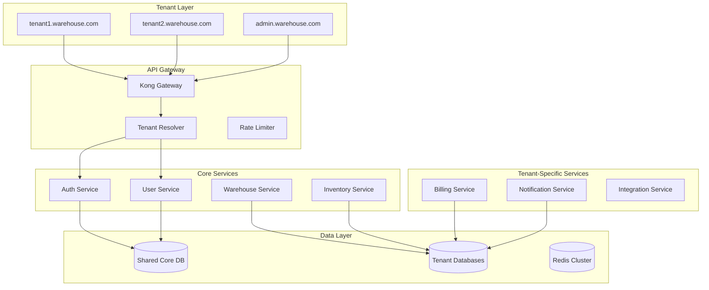

# ADR-002: Multi-tenant Architecture Pattern

## Status
Accepted

## Date
2026-03-23

## Context

The warehouse network platform serves multiple distinct user types with strict data isolation requirements:
- **Super Admins**: Platform-wide access across all tenants
- **Warehouse Admins**: Tenant-scoped administrative access
- **Partners**: Cross-tenant access with specific permissions
- **Customers**: Single-tenant access with limited scope

Each warehouse operates as an independent business entity requiring complete data isolation, custom branding, and tenant-specific configurations.

### Architecture Patterns Considered

1. **Single Database with Tenant ID (Shared Schema)**
   - Pros: Simplest implementation, resource efficient
   - Cons: Risk of data leakage, limited customization, scaling bottlenecks

2. **Database per Tenant (Isolated Schema)**
   - Pros: Complete isolation, tenant-specific optimizations
   - Cons: Management overhead, resource inefficiency, migration complexity

3. **Hybrid: Shared Core + Tenant-Specific Extensions**
   - Pros: Balance of isolation and efficiency, flexible customization
   - Cons: Increased complexity, careful boundary management required

4. **Microservices with Tenant Routing**
   - Pros: Service-level isolation, independent scaling
   - Cons: Network overhead, distributed system complexity

## Decision

**Selected: Hybrid Architecture with Tenant-Aware Microservices**

## Rationale

### Architecture Overview:


### Data Isolation Strategy:

#### Shared Core Schema:
```sql
-- Platform-level entities (shared across tenants)
CREATE SCHEMA core;

CREATE TABLE core.tenants (
    id UUID PRIMARY KEY,
    subdomain VARCHAR(63) UNIQUE NOT NULL,
    plan_tier VARCHAR(50) NOT NULL,
    status VARCHAR(20) DEFAULT 'active',
    created_at TIMESTAMP DEFAULT CURRENT_TIMESTAMP,
    config JSONB DEFAULT '{}',

    -- Tenant-specific database connection info
    db_host VARCHAR(255),
    db_name VARCHAR(63),
    db_user VARCHAR(63)
);

CREATE TABLE core.users (
    id UUID PRIMARY KEY,
    tenant_id UUID REFERENCES core.tenants(id),
    email VARCHAR(255) NOT NULL,
    role VARCHAR(50) NOT NULL,
    global_permissions JSONB DEFAULT '[]',
    created_at TIMESTAMP DEFAULT CURRENT_TIMESTAMP,

    UNIQUE(tenant_id, email)
);

CREATE TABLE core.super_admins (
    user_id UUID PRIMARY KEY REFERENCES core.users(id),
    permissions JSONB NOT NULL,
    created_at TIMESTAMP DEFAULT CURRENT_TIMESTAMP
);
```

#### Tenant-Specific Schema:
```sql
-- Per-tenant schema (isolated data)
CREATE SCHEMA tenant_{tenant_id};

CREATE TABLE tenant_{tenant_id}.warehouses (
    id UUID PRIMARY KEY,
    name VARCHAR(255) NOT NULL,
    address JSONB NOT NULL,
    capacity_specs JSONB,
    operating_hours JSONB,
    created_at TIMESTAMP DEFAULT CURRENT_TIMESTAMP
);

CREATE TABLE tenant_{tenant_id}.inventory (
    id UUID PRIMARY KEY,
    warehouse_id UUID REFERENCES tenant_{tenant_id}.warehouses(id),
    sku VARCHAR(100) NOT NULL,
    quantity INTEGER NOT NULL,
    reserved_quantity INTEGER DEFAULT 0,
    location_code VARCHAR(50),
    updated_at TIMESTAMP DEFAULT CURRENT_TIMESTAMP
);

CREATE TABLE tenant_{tenant_id}.orders (
    id UUID PRIMARY KEY,
    warehouse_id UUID REFERENCES tenant_{tenant_id}.warehouses(id),
    customer_info JSONB NOT NULL,
    items JSONB NOT NULL,
    status VARCHAR(50) DEFAULT 'pending',
    created_at TIMESTAMP DEFAULT CURRENT_TIMESTAMP
);
```

### Tenant Resolution Strategy:
```typescript
interface TenantContext {
  tenantId: string;
  subdomain: string;
  planTier: 'basic' | 'professional' | 'enterprise';
  dbConfig: {
    host: string;
    database: string;
    schema: string;
  };
  features: string[];
  limits: {
    apiCalls: number;
    storage: number;
    users: number;
  };
}

class TenantResolver {
  async resolveTenant(request: Request): Promise<TenantContext> {
    const subdomain = this.extractSubdomain(request.headers.host);
    const tenant = await this.tenantService.getTenantBySubdomain(subdomain);

    return {
      tenantId: tenant.id,
      subdomain: tenant.subdomain,
      planTier: tenant.planTier,
      dbConfig: tenant.dbConfig,
      features: this.getFeaturesByPlan(tenant.planTier),
      limits: this.getLimitsByPlan(tenant.planTier)
    };
  }
}
```

## Consequences

### Positive:
- **Data Isolation**: Complete tenant data separation with shared core efficiency
- **Scalability**: Independent scaling per tenant and service
- **Customization**: Tenant-specific schemas and configurations
- **Security**: Multiple layers of isolation (network, application, data)
- **Performance**: Optimized queries within tenant boundaries

### Negative:
- **Complexity**: Multi-dimensional routing and context management
- **Migration Overhead**: Schema changes across multiple tenant databases
- **Monitoring Complexity**: Distributed tracing across services and tenants
- **Development Overhead**: Tenant-aware development patterns required

### Risk Mitigation:

#### Data Leakage Prevention:
```typescript
// Automatic tenant context injection
class TenantAwareRepository<T> {
  constructor(
    private tenantContext: TenantContext,
    private entityType: string
  ) {}

  async find(criteria: any): Promise<T[]> {
    // Automatically inject tenant context
    const tenantCriteria = {
      ...criteria,
      tenant_id: this.tenantContext.tenantId
    };

    return this.query(tenantCriteria);
  }
}

// Row-level security for shared tables
ALTER TABLE core.users ENABLE ROW LEVEL SECURITY;

CREATE POLICY tenant_isolation ON core.users
  USING (tenant_id = current_setting('app.current_tenant_id')::UUID);
```

#### Schema Migration Management:
```typescript
class TenantMigrationManager {
  async runMigration(migration: Migration): Promise<void> {
    const tenants = await this.getAllActiveTenants();

    // Run migration on core schema first
    await this.runCoreSchemaActions(migration.coreActions);

    // Parallel execution for tenant-specific migrations
    await Promise.all(
      tenants.map(tenant =>
        this.runTenantMigration(tenant, migration.tenantActions)
      )
    );
  }
}
```

## Implementation Plan

### Phase 1: Core Infrastructure (Week 1-2)
- Tenant resolver middleware
- Database connection pooling per tenant
- Basic tenant isolation in shared tables

### Phase 2: Service Architecture (Week 3-4)
- Microservice deployment with tenant routing
- API Gateway configuration
- Tenant-aware authentication

### Phase 3: Data Migration (Week 5-6)
- Migrate existing data to new schema structure
- Set up tenant-specific databases
- Implement migration tooling

### Phase 4: Feature Rollout (Week 7-8)
- Tenant-specific customizations
- Plan-based feature flags
- Performance optimization

## Monitoring and Compliance

### Key Metrics:
- Tenant isolation verification (100% compliance)
- Cross-tenant data access attempts (0 tolerance)
- Performance per tenant (SLA compliance)
- Resource utilization by tenant tier

### Compliance Requirements:
- SOC 2 Type II compliance per tenant
- GDPR data residency requirements
- Audit trail for all cross-tenant operations
- Regular penetration testing

## Related ADRs
- ADR-001: Authentication Provider Selection
- ADR-003: Database Schema Design for RBAC
- ADR-004: Session Management Strategy
- ADR-005: API Security Implementation