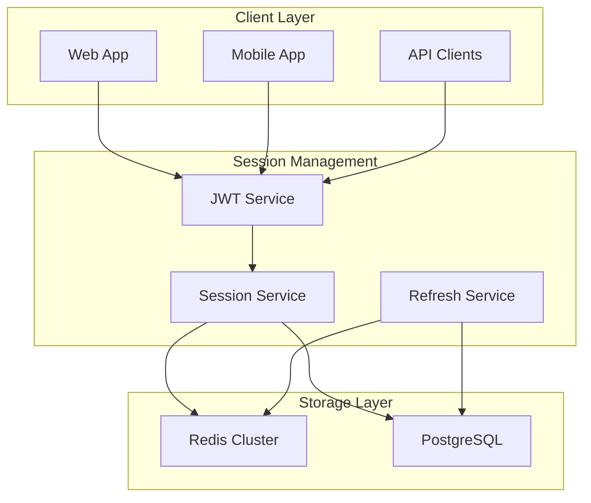

# ADR-004: Session Management Strategy

## Status
Accepted

## Date
2026-03-23

## Context

The warehouse network platform requires robust session management that handles:
- **Multi-device Access**: Users accessing from web, mobile, and API clients
- **Cross-tenant Sessions**: Partners with access to multiple warehouses
- **Security Requirements**: Session hijacking prevention, concurrent session limits
- **Performance**: Sub-10ms session validation for high-traffic operations
- **Compliance**: Audit trails, session termination policies, data residency

### Session Management Approaches Considered

1. **Server-side Sessions with Database Storage**
   - Pros: Complete control, easy revocation, detailed audit trails
   - Cons: Database load, scaling challenges, latency

2. **JWT Stateless Tokens**
   - Pros: Stateless, scalable, reduced database load
   - Cons: Difficult revocation, token size, security concerns with client storage

3. **Hybrid: Short-lived JWT + Refresh Tokens**
   - Pros: Balance of performance and security, revocation capability
   - Cons: Increased complexity, token rotation overhead

4. **Redis-based Session Store**
   - Pros: High performance, built-in expiration, clustering support
   - Cons: Memory requirements, Redis availability dependency

## Decision

**Selected: Hybrid JWT + Redis Session Store with Multi-tenant Isolation**

## Rationale

### Architecture Overview:



### Session Architecture:

```typescript
interface SessionData {
  sessionId: string;
  userId: string;
  tenantId: string;
  roleIds: string[];
  deviceInfo: {
    type: 'web' | 'mobile' | 'api';
    fingerprint: string;
    userAgent: string;
    ipAddress: string;
  };
  permissions: string[];
  createdAt: Date;
  lastAccessedAt: Date;
  expiresAt: Date;
  refreshTokenHash: string;
  metadata: Record<string, any>;
}

interface JWTPayload {
  sub: string; // User ID
  tid: string; // Tenant ID
  sid: string; // Session ID
  roles: string[];
  exp: number;
  iat: number;
  jti: string; // JWT ID
}
```

### Multi-layered Session Implementation:

#### 1. JWT Access Tokens (Short-lived):
```typescript
class JWTService {
  private readonly ACCESS_TOKEN_EXPIRY = 15 * 60; // 15 minutes
  private readonly REFRESH_TOKEN_EXPIRY = 7 * 24 * 60 * 60; // 7 days

  async generateAccessToken(session: SessionData): Promise<string> {
    const payload: JWTPayload = {
      sub: session.userId,
      tid: session.tenantId,
      sid: session.sessionId,
      roles: session.roleIds,
      exp: Math.floor(Date.now() / 1000) + this.ACCESS_TOKEN_EXPIRY,
      iat: Math.floor(Date.now() / 1000),
      jti: crypto.randomUUID()
    };

    return jwt.sign(payload, this.getPrivateKey(), {
      algorithm: 'RS256',
      issuer: 'warehouse-network',
      audience: session.tenantId
    });
  }

  async validateAccessToken(token: string, tenantId: string): Promise<JWTPayload> {
    try {
      const payload = jwt.verify(token, this.getPublicKey(), {
        algorithms: ['RS256'],
        issuer: 'warehouse-network',
        audience: tenantId
      }) as JWTPayload;

      // Verify session is still active in Redis
      const sessionExists = await this.sessionService.validateSession(payload.sid);
      if (!sessionExists) {
        throw new Error('Session no longer valid');
      }

      return payload;
    } catch (error) {
      throw new UnauthorizedError('Invalid access token');
    }
  }
}
```

#### 2. Redis Session Store:
```typescript
class RedisSessionService {
  private redis: RedisCluster;

  // Tenant-isolated session keys
  private getSessionKey(tenantId: string, sessionId: string): string {
    return `session:${tenantId}:${sessionId}`;
  }

  private getUserSessionsKey(tenantId: string, userId: string): string {
    return `user_sessions:${tenantId}:${userId}`;
  }

  async createSession(sessionData: SessionData): Promise<void> {
    const sessionKey = this.getSessionKey(sessionData.tenantId, sessionData.sessionId);
    const userSessionsKey = this.getUserSessionsKey(sessionData.tenantId, sessionData.userId);

    const pipeline = this.redis.pipeline();

    // Store session data with expiration
    pipeline.setex(
      sessionKey,
      this.SESSION_EXPIRY,
      JSON.stringify(sessionData)
    );

    // Track user's active sessions
    pipeline.sadd(userSessionsKey, sessionData.sessionId);
    pipeline.expire(userSessionsKey, this.SESSION_EXPIRY);

    // Track sessions by device type for analytics
    const deviceKey = `sessions:device:${sessionData.deviceInfo.type}`;
    pipeline.incr(deviceKey);

    await pipeline.exec();
  }

  async getSession(tenantId: string, sessionId: string): Promise<SessionData | null> {
    const sessionKey = this.getSessionKey(tenantId, sessionId);
    const sessionJson = await this.redis.get(sessionKey);

    if (!sessionJson) {
      return null;
    }

    const session = JSON.parse(sessionJson) as SessionData;

    // Update last accessed time
    session.lastAccessedAt = new Date();
    await this.redis.setex(
      sessionKey,
      this.SESSION_EXPIRY,
      JSON.stringify(session)
    );

    return session;
  }

  async invalidateSession(tenantId: string, sessionId: string): Promise<void> {
    const session = await this.getSession(tenantId, sessionId);
    if (!session) return;

    const sessionKey = this.getSessionKey(tenantId, sessionId);
    const userSessionsKey = this.getUserSessionsKey(tenantId, session.userId);

    const pipeline = this.redis.pipeline();
    pipeline.del(sessionKey);
    pipeline.srem(userSessionsKey, sessionId);

    await pipeline.exec();

    // Audit log session termination
    await this.auditService.logSessionEnd(session, 'manual_logout');
  }

  async invalidateAllUserSessions(tenantId: string, userId: string): Promise<void> {
    const userSessionsKey = this.getUserSessionsKey(tenantId, userId);
    const sessionIds = await this.redis.smembers(userSessionsKey);

    if (sessionIds.length === 0) return;

    const pipeline = this.redis.pipeline();

    // Remove all sessions
    sessionIds.forEach(sessionId => {
      const sessionKey = this.getSessionKey(tenantId, sessionId);
      pipeline.del(sessionKey);
    });

    // Clear user sessions set
    pipeline.del(userSessionsKey);

    await pipeline.exec();
  }
}
```

#### 3. Refresh Token Management:
```typescript
class RefreshTokenService {
  async generateRefreshToken(sessionId: string, tenantId: string): Promise<string> {
    const refreshToken = crypto.randomBytes(32).toString('hex');
    const hashedToken = await bcrypt.hash(refreshToken, 12);

    // Store refresh token in database for audit
    await this.db.query(`
      INSERT INTO core.refresh_tokens (
        session_id, tenant_id, token_hash, expires_at
      ) VALUES ($1, $2, $3, $4)
    `, [sessionId, tenantId, hashedToken, new Date(Date.now() + this.REFRESH_TOKEN_EXPIRY * 1000)]);

    return refreshToken;
  }

  async refreshAccessToken(
    refreshToken: string,
    tenantId: string
  ): Promise<{ accessToken: string; newRefreshToken: string }> {
    // Find and validate refresh token
    const tokenRecord = await this.db.query(`
      SELECT rt.session_id, rt.token_hash, rt.expires_at, s.user_id
      FROM core.refresh_tokens rt
      JOIN core.sessions s ON rt.session_id = s.id
      WHERE rt.tenant_id = $1 AND rt.expires_at > NOW() AND rt.used_at IS NULL
    `, [tenantId]);

    if (tokenRecord.rows.length === 0) {
      throw new UnauthorizedError('Invalid refresh token');
    }

    const { session_id, token_hash, user_id } = tokenRecord.rows[0];

    // Verify token hash
    const isValid = await bcrypt.compare(refreshToken, token_hash);
    if (!isValid) {
      throw new UnauthorizedError('Invalid refresh token');
    }

    // Mark old refresh token as used
    await this.db.query(`
      UPDATE core.refresh_tokens
      SET used_at = NOW()
      WHERE session_id = $1 AND tenant_id = $2
    `, [session_id, tenantId]);

    // Get current session data
    const session = await this.sessionService.getSession(tenantId, session_id);
    if (!session) {
      throw new UnauthorizedError('Session not found');
    }

    // Generate new tokens
    const accessToken = await this.jwtService.generateAccessToken(session);
    const newRefreshToken = await this.generateRefreshToken(session_id, tenantId);

    return { accessToken, newRefreshToken };
  }
}
```

### Session Security Features:

#### 1. Concurrent Session Limits:
```typescript
class SessionLimitService {
  async enforceSessionLimits(userId: string, tenantId: string): Promise<void> {
    const userSessionsKey = `user_sessions:${tenantId}:${userId}`;
    const currentSessions = await this.redis.scard(userSessionsKey);

    const maxSessions = this.getMaxSessionsForUser(userId, tenantId);

    if (currentSessions >= maxSessions) {
      // Remove oldest session
      const oldestSession = await this.getOldestSession(userId, tenantId);
      if (oldestSession) {
        await this.sessionService.invalidateSession(tenantId, oldestSession.sessionId);
      }
    }
  }

  private getMaxSessionsForUser(userId: string, tenantId: string): number {
    // Different limits based on role/plan
    return {
      'super_admin': 10,
      'warehouse_admin': 5,
      'partner': 3,
      'customer': 2
    }[this.getUserRole(userId)] || 2;
  }
}
```

#### 2. Device Fingerprinting:
```typescript
class DeviceFingerprintService {
  generateFingerprint(request: Request): string {
    const components = [
      request.headers['user-agent'],
      request.headers['accept-language'],
      request.headers['accept-encoding'],
      this.getClientIP(request),
      request.headers['sec-ch-ua'] // Chrome client hints
    ].filter(Boolean);

    return crypto
      .createHash('sha256')
      .update(components.join('|'))
      .digest('hex');
  }

  async validateDeviceFingerprint(
    sessionId: string,
    tenantId: string,
    currentFingerprint: string
  ): Promise<boolean> {
    const session = await this.sessionService.getSession(tenantId, sessionId);
    if (!session) return false;

    // Allow slight variations in fingerprint (browser updates, etc.)
    const similarity = this.calculateSimilarity(
      session.deviceInfo.fingerprint,
      currentFingerprint
    );

    return similarity > 0.8; // 80% similarity threshold
  }
}
```

### Database Audit Tables:

```sql
-- Session Audit Trail
CREATE TABLE core.sessions (
    id UUID PRIMARY KEY DEFAULT gen_random_uuid(),
    user_id UUID NOT NULL REFERENCES core.users(id),
    tenant_id UUID NOT NULL REFERENCES core.tenants(id),
    device_type VARCHAR(20) NOT NULL,
    device_fingerprint VARCHAR(64) NOT NULL,
    ip_address INET NOT NULL,
    user_agent TEXT,
    created_at TIMESTAMP DEFAULT CURRENT_TIMESTAMP,
    last_accessed_at TIMESTAMP DEFAULT CURRENT_TIMESTAMP,
    ended_at TIMESTAMP NULL,
    end_reason VARCHAR(50) NULL -- 'logout', 'expired', 'revoked', 'limit_exceeded'
);

-- Refresh Tokens
CREATE TABLE core.refresh_tokens (
    id UUID PRIMARY KEY DEFAULT gen_random_uuid(),
    session_id UUID NOT NULL REFERENCES core.sessions(id),
    tenant_id UUID NOT NULL REFERENCES core.tenants(id),
    token_hash VARCHAR(255) NOT NULL,
    expires_at TIMESTAMP NOT NULL,
    used_at TIMESTAMP NULL,
    created_at TIMESTAMP DEFAULT CURRENT_TIMESTAMP
);

-- Session Analytics
CREATE TABLE core.session_analytics (
    date DATE NOT NULL,
    tenant_id UUID NOT NULL REFERENCES core.tenants(id),
    device_type VARCHAR(20) NOT NULL,
    total_sessions INTEGER DEFAULT 0,
    concurrent_peak INTEGER DEFAULT 0,
    avg_duration_minutes INTEGER DEFAULT 0,

    PRIMARY KEY (date, tenant_id, device_type)
);
```

## Consequences

### Positive:
- **High Performance**: Sub-10ms session validation with Redis
- **Security**: Multi-layered validation with device fingerprinting
- **Scalability**: Stateless JWT with Redis clustering support
- **Audit Compliance**: Complete session lifecycle tracking
- **Multi-tenant Isolation**: Tenant-specific session namespacing

### Negative:
- **Complexity**: Multiple components (JWT, Redis, Database) to coordinate
- **Memory Usage**: Redis memory requirements for session storage
- **Token Rotation**: Refresh token management overhead
- **Redis Dependency**: Session system availability tied to Redis cluster

### Risk Mitigation:

#### Redis High Availability:
```yaml
# Redis Sentinel Configuration
redis_sentinel:
  replicas: 3
  sentinel_nodes: 3
  automatic_failover: true
  data_persistence: true
  backup_schedule: "0 */6 * * *" # Every 6 hours
```

#### Session Recovery:
```typescript
class SessionRecoveryService {
  async recoverSessionsFromDatabase(): Promise<void> {
    // Rebuild Redis sessions from database on Redis failure
    const activeSessions = await this.db.query(`
      SELECT * FROM core.sessions
      WHERE ended_at IS NULL AND last_accessed_at > NOW() - INTERVAL '1 day'
    `);

    for (const session of activeSessions.rows) {
      await this.sessionService.createSession(this.mapDbSessionToRedis(session));
    }
  }
}
```

## Performance Metrics

### Target Performance:
- Session validation: < 10ms (p95)
- Session creation: < 50ms (p95)
- Token refresh: < 100ms (p95)
- Redis availability: 99.9%

### Monitoring:
- Active sessions by tenant
- Session duration analytics
- Failed authentication attempts
- Concurrent session peaks

## Implementation Plan

### Phase 1: Core Infrastructure (Week 1-2)
- JWT service implementation
- Redis session store
- Basic session CRUD operations

### Phase 2: Security Features (Week 3)
- Refresh token management
- Device fingerprinting
- Concurrent session limits

### Phase 3: Audit & Analytics (Week 4)
- Session audit logging
- Analytics collection
- Performance monitoring

### Phase 4: High Availability (Week 5)
- Redis clustering
- Session recovery mechanisms
- Load testing and optimization

## Related ADRs
- ADR-001: Authentication Provider Selection
- ADR-002: Multi-tenant Architecture Pattern
- ADR-003: Database Schema Design for RBAC
- ADR-005: API Security Implementation