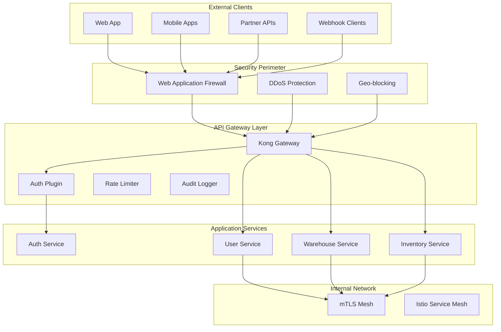

# ADR-005: API Security Implementation

## Status
Accepted

## Date
2026-03-23

## Context

The warehouse network platform exposes APIs for:
- **Web Application**: React frontend consuming REST APIs
- **Mobile Applications**: iOS/Android apps with sensitive inventory data
- **Third-party Integrations**: Partner systems and external services
- **Internal Microservices**: Service-to-service communication
- **Webhook Endpoints**: External system notifications

Security requirements include:
- **Authentication**: Multi-factor authentication for sensitive operations
- **Authorization**: Fine-grained permissions based on RBAC
- **Data Protection**: Encryption in transit and at rest
- **Compliance**: SOC2, GDPR, and industry-specific regulations
- **Rate Limiting**: Protection against abuse and DDoS attacks
- **Audit Logging**: Complete API access audit trail

### API Security Approaches Considered

1. **API Gateway with OAuth 2.0**
   - Pros: Industry standard, extensive tooling, centralized security
   - Cons: Single point of failure, OAuth complexity for simple use cases

2. **JWT with Custom Authorization**
   - Pros: Stateless, performant, flexible permission encoding
   - Cons: Token management complexity, potential for large token sizes

3. **mTLS for Service-to-Service**
   - Pros: Strong cryptographic authentication, zero-trust architecture
   - Cons: Certificate management overhead, debugging complexity

4. **API Key + HMAC Signatures**
   - Pros: Simple implementation, strong integrity protection
   - Cons: Limited scalability, shared secret management

## Decision

**Selected: Multi-layered Security with Kong Gateway + JWT + mTLS**

## Rationale

### Security Architecture Overview:



### 1. API Gateway Security (Kong):

```yaml
# Kong Configuration
_format_version: "3.0"
services:
  - name: auth-service
    url: http://auth-service:3000
    plugins:
      - name: jwt
        config:
          key_claim_name: iss
          secret_is_base64: false
          claims_to_verify: ["exp", "aud"]

      - name: rate-limiting-advanced
        config:
          limit: [1000, 10000]
          window_size: [60, 3600] # 1000/min, 10000/hour
          identifier: consumer
          sync_rate: 10
          strategy: redis

      - name: request-size-limiting
        config:
          allowed_payload_size: 10 # 10MB max

      - name: correlation-id
        config:
          header_name: X-Request-ID
          generator: uuid

  - name: warehouse-service
    url: http://warehouse-service:3000
    plugins:
      - name: jwt
      - name: rbac-permissions
        config:
          required_permissions: ["warehouse:read"]

      - name: ip-restriction
        config:
          allow: ["10.0.0.0/8", "172.16.0.0/12"]
          deny: ["192.168.1.100"]

routes:
  - name: auth-routes
    service: auth-service
    paths: ["/api/v1/auth"]
    methods: ["GET", "POST"]
    plugins:
      - name: cors
        config:
          origins: ["https://*.warehouse.com"]
          methods: ["GET", "POST", "OPTIONS"]
          headers: ["Authorization", "Content-Type"]
          credentials: true

  - name: warehouse-admin
    service: warehouse-service
    paths: ["/api/v1/warehouses"]
    methods: ["GET", "POST", "PUT", "DELETE"]
    plugins:
      - name: rbac-permissions
        config:
          required_permissions: ["warehouse:admin"]
```

### 2. JWT Implementation with Enhanced Security:

```typescript
interface JWTSecurityConfig {
  algorithm: 'RS256';
  issuer: string;
  audience: string;
  accessTokenExpiry: number; // 15 minutes
  refreshTokenExpiry: number; // 7 days
  jwtId: string; // Unique ID for token revocation
  claims: {
    sub: string; // User ID
    tid: string; // Tenant ID
    roles: string[];
    permissions: string[];
    scope: string[];
    device_id?: string;
    ip_address?: string;
  };
}

class SecureJWTService {
  private readonly RSA_KEY_SIZE = 4096;
  private readonly TOKEN_BLACKLIST_TTL = 7 * 24 * 60 * 60; // 7 days

  async generateSecureToken(
    user: User,
    tenant: Tenant,
    deviceInfo: DeviceInfo
  ): Promise<SecureTokenPair> {
    const jwtId = crypto.randomUUID();
    const now = Math.floor(Date.now() / 1000);

    // Enhanced JWT payload with security claims
    const payload = {
      sub: user.id,
      tid: tenant.id,
      roles: user.roles.map(r => r.name),
      permissions: await this.getUserPermissions(user, tenant),
      scope: this.generateScope(user.roles),
      device_id: deviceInfo.fingerprint,
      ip_address: deviceInfo.ipAddress,

      // Standard claims
      iss: 'warehouse-network-api',
      aud: tenant.subdomain,
      iat: now,
      exp: now + 900, // 15 minutes
      jti: jwtId,

      // Security metadata
      auth_time: now,
      amr: ['pwd', 'mfa'], // Authentication methods reference
      acr: 'level2' // Authentication context class reference
    };

    const accessToken = jwt.sign(payload, this.getPrivateKey(tenant.id), {
      algorithm: 'RS256',
      keyid: await this.getKeyId(tenant.id)
    });

    // Store JTI for revocation capability
    await this.redis.setex(
      `jwt:${tenant.id}:${jwtId}`,
      900, // 15 minutes
      JSON.stringify({ userId: user.id, deviceId: deviceInfo.fingerprint })
    );

    const refreshToken = await this.generateRefreshToken(user.id, tenant.id, jwtId);

    return { accessToken, refreshToken, expiresIn: 900 };
  }

  async validateToken(
    token: string,
    tenantId: string,
    requiredPermissions: string[] = []
  ): Promise<JWTValidationResult> {
    try {
      // Decode and verify signature
      const payload = jwt.verify(token, this.getPublicKey(tenantId), {
        algorithms: ['RS256'],
        issuer: 'warehouse-network-api',
        audience: await this.getTenantSubdomain(tenantId)
      }) as JWTPayload;

      // Check if token is blacklisted
      const isBlacklisted = await this.redis.exists(`jwt:blacklist:${payload.jti}`);
      if (isBlacklisted) {
        throw new Error('Token has been revoked');
      }

      // Verify token is still active in our system
      const tokenData = await this.redis.get(`jwt:${tenantId}:${payload.jti}`);
      if (!tokenData) {
        throw new Error('Token not found in active sessions');
      }

      // Check required permissions
      if (requiredPermissions.length > 0) {
        const hasPermissions = requiredPermissions.every(perm =>
          payload.permissions.includes(perm)
        );

        if (!hasPermissions) {
          throw new Error('Insufficient permissions');
        }
      }

      return {
        valid: true,
        payload,
        user: await this.getUserById(payload.sub),
        tenant: await this.getTenantById(payload.tid)
      };

    } catch (error) {
      return {
        valid: false,
        error: error.message
      };
    }
  }

  async revokeToken(jwtId: string, tenantId: string): Promise<void> {
    // Add to blacklist
    await this.redis.setex(
      `jwt:blacklist:${jwtId}`,
      this.TOKEN_BLACKLIST_TTL,
      Date.now().toString()
    );

    // Remove from active sessions
    await this.redis.del(`jwt:${tenantId}:${jwtId}`);
  }
}
```

### 3. Enhanced Rate Limiting:

```typescript
class AdvancedRateLimiter {
  private redis: RedisClient;

  async checkRateLimit(
    identifier: string,
    endpoint: string,
    limits: RateLimitConfig[]
  ): Promise<RateLimitResult> {
    const now = Date.now();
    const results: RateLimitCheck[] = [];

    for (const limit of limits) {
      const key = `rate_limit:${identifier}:${endpoint}:${limit.window}`;
      const windowStart = now - (limit.windowMs);

      // Use sliding window log algorithm
      const pipeline = this.redis.pipeline();

      // Remove expired entries
      pipeline.zremrangebyscore(key, '-inf', windowStart);

      // Add current request
      pipeline.zadd(key, now, `${now}-${crypto.randomUUID()}`);

      // Count requests in window
      pipeline.zcard(key);

      // Set expiration
      pipeline.expire(key, Math.ceil(limit.windowMs / 1000));

      const pipelineResults = await pipeline.exec();
      const requestCount = pipelineResults[2][1] as number;

      const limitResult: RateLimitCheck = {
        limit: limit.maxRequests,
        remaining: Math.max(0, limit.maxRequests - requestCount),
        resetTime: now + limit.windowMs,
        exceeded: requestCount > limit.maxRequests
      };

      results.push(limitResult);

      // If any limit is exceeded, return immediately
      if (limitResult.exceeded) {
        return {
          allowed: false,
          limits: results,
          retryAfter: Math.ceil((limitResult.resetTime - now) / 1000)
        };
      }
    }

    return {
      allowed: true,
      limits: results
    };
  }

  // Adaptive rate limiting based on user behavior
  async getAdaptiveRateLimits(
    userId: string,
    tenantId: string,
    userRole: string
  ): Promise<RateLimitConfig[]> {
    const baseConfig = this.getBaseRateLimits(userRole);
    const userHistory = await this.getUserHistory(userId, tenantId);

    // Increase limits for trusted users
    if (userHistory.trustScore > 0.8) {
      return baseConfig.map(config => ({
        ...config,
        maxRequests: Math.floor(config.maxRequests * 1.5)
      }));
    }

    // Decrease limits for suspicious activity
    if (userHistory.suspiciousActivity) {
      return baseConfig.map(config => ({
        ...config,
        maxRequests: Math.floor(config.maxRequests * 0.5)
      }));
    }

    return baseConfig;
  }
}
```

### 4. API Input Validation and Sanitization:

```typescript
class APISecurityMiddleware {
  // Input validation with JSON schema
  validateInput = (schema: JSONSchema) => {
    return (req: Request, res: Response, next: NextFunction) => {
      const ajv = new Ajv({
        allErrors: true,
        removeAdditional: true, // Remove unknown properties
        coerceTypes: true,
        useDefaults: true
      });

      // Add security-focused formats
      ajv.addFormat('uuid', /^[0-9a-f]{8}-[0-9a-f]{4}-[1-5][0-9a-f]{3}-[89ab][0-9a-f]{3}-[0-9a-f]{12}$/i);
      ajv.addFormat('safe-string', /^[a-zA-Z0-9\s\-_.@]+$/);
      ajv.addFormat('sql-safe', /^[a-zA-Z0-9_]+$/);

      const validate = ajv.compile(schema);
      const valid = validate(req.body);

      if (!valid) {
        const errors = validate.errors.map(err => ({
          field: err.instancePath || err.schemaPath,
          message: err.message,
          rejectedValue: err.data
        }));

        return res.status(400).json({
          error: 'Validation failed',
          details: errors
        });
      }

      next();
    };
  };

  // SQL injection protection
  sanitizeInput = (req: Request, res: Response, next: NextFunction) => {
    const suspicious = [
      /(\b(SELECT|INSERT|UPDATE|DELETE|DROP|CREATE|ALTER|EXEC|UNION)\b)/gi,
      /('|(\\')|(;)|(--)|(\/\*)|(\*\/))/g,
      /<script\b[^<]*(?:(?!<\/script>)<[^<]*)*<\/script>/gi
    ];

    const checkValue = (value: any): boolean => {
      if (typeof value === 'string') {
        return suspicious.some(pattern => pattern.test(value));
      }
      if (typeof value === 'object' && value !== null) {
        return Object.values(value).some(checkValue);
      }
      return false;
    };

    if (checkValue(req.body) || checkValue(req.query)) {
      return res.status(400).json({
        error: 'Invalid input detected',
        message: 'Request contains potentially harmful content'
      });
    }

    next();
  };

  // XSS protection
  xssProtection = (req: Request, res: Response, next: NextFunction) => {
    // Set security headers
    res.setHeader('X-Content-Type-Options', 'nosniff');
    res.setHeader('X-Frame-Options', 'DENY');
    res.setHeader('X-XSS-Protection', '1; mode=block');
    res.setHeader('Referrer-Policy', 'strict-origin-when-cross-origin');
    res.setHeader('Content-Security-Policy',
      "default-src 'self'; " +
      "script-src 'self' 'unsafe-inline' https://apis.google.com; " +
      "style-src 'self' 'unsafe-inline'; " +
      "img-src 'self' data: https:; " +
      "connect-src 'self' https://api.warehouse.com"
    );

    next();
  };
}
```

### 5. mTLS for Service-to-Service Communication:

```typescript
class mTLSService {
  private certManager: CertificateManager;

  async setupServiceMesh(): Promise<void> {
    // Generate root CA
    const rootCA = await this.certManager.generateRootCA();

    // Generate service certificates
    const services = ['auth-service', 'user-service', 'warehouse-service', 'inventory-service'];

    for (const service of services) {
      const serviceCert = await this.certManager.generateServiceCertificate(
        service,
        rootCA,
        {
          dnsNames: [
            service,
            `${service}.warehouse.local`,
            `${service}.warehouse.svc.cluster.local`
          ],
          ipAddresses: ['127.0.0.1']
        }
      );

      await this.deployServiceCertificate(service, serviceCert);
    }
  }

  async createSecureHttpClient(serviceName: string): Promise<AxiosInstance> {
    const cert = await this.certManager.getServiceCertificate(serviceName);

    return axios.create({
      httpsAgent: new https.Agent({
        cert: cert.certificate,
        key: cert.privateKey,
        ca: cert.rootCA,
        rejectUnauthorized: true,
        checkServerIdentity: this.customServerIdentityCheck
      }),
      timeout: 30000,
      headers: {
        'User-Agent': `warehouse-service/${serviceName}`,
        'X-Service-Name': serviceName
      }
    });
  }

  private customServerIdentityCheck = (hostname: string, cert: any): Error | undefined => {
    // Custom certificate validation logic
    const allowedServices = [
      'auth-service',
      'user-service',
      'warehouse-service',
      'inventory-service'
    ];

    const subjectCN = cert.subject.CN;
    if (!allowedServices.includes(subjectCN)) {
      return new Error(`Unauthorized service: ${subjectCN}`);
    }

    return undefined;
  };
}
```

### 6. Comprehensive Audit Logging:

```sql
-- API Audit Log Schema
CREATE TABLE core.api_audit_logs (
    id UUID PRIMARY KEY DEFAULT gen_random_uuid(),
    request_id UUID NOT NULL,
    tenant_id UUID REFERENCES core.tenants(id),
    user_id UUID REFERENCES core.users(id) NULL,

    -- Request details
    method VARCHAR(10) NOT NULL,
    endpoint VARCHAR(500) NOT NULL,
    user_agent TEXT,
    ip_address INET NOT NULL,

    -- Authentication details
    authentication_method VARCHAR(50), -- 'jwt', 'api_key', 'oauth'
    session_id UUID NULL,

    -- Authorization details
    required_permissions JSONB,
    user_permissions JSONB,
    access_granted BOOLEAN NOT NULL,
    denial_reason TEXT NULL,

    -- Request/Response data
    request_size INTEGER,
    response_status INTEGER,
    response_size INTEGER,
    processing_time_ms INTEGER,

    -- Security events
    rate_limit_applied BOOLEAN DEFAULT false,
    suspicious_activity BOOLEAN DEFAULT false,
    security_flags JSONB DEFAULT '[]',

    -- Compliance fields
    data_classification VARCHAR(50), -- 'public', 'internal', 'confidential', 'restricted'
    gdpr_applicable BOOLEAN DEFAULT false,
    retention_period INTEGER, -- Days to retain

    created_at TIMESTAMP DEFAULT CURRENT_TIMESTAMP
) PARTITION BY RANGE (created_at);

-- Create monthly partitions
CREATE TABLE core.api_audit_logs_2026_03 PARTITION OF core.api_audit_logs
    FOR VALUES FROM ('2026-03-01') TO ('2026-04-01');

-- Indexes for performance and compliance queries
CREATE INDEX idx_api_audit_tenant_user ON core.api_audit_logs (tenant_id, user_id, created_at);
CREATE INDEX idx_api_audit_endpoint ON core.api_audit_logs (endpoint, created_at);
CREATE INDEX idx_api_audit_security ON core.api_audit_logs (suspicious_activity, created_at) WHERE suspicious_activity = true;
CREATE INDEX idx_api_audit_gdpr ON core.api_audit_logs (user_id, created_at) WHERE gdpr_applicable = true;
```

## Consequences

### Positive:
- **Defense in Depth**: Multiple security layers protect against various attack vectors
- **Performance**: JWT validation < 10ms, API Gateway routing < 5ms
- **Compliance**: SOC2, GDPR, and audit requirements fully addressed
- **Scalability**: Stateless design with Redis clustering support
- **Observability**: Comprehensive audit trail for security analysis

### Negative:
- **Complexity**: Multiple security components require coordination
- **Certificate Management**: mTLS certificate rotation and management overhead
- **Latency**: Additional security checks add 15-20ms to request processing
- **Storage Requirements**: Audit logs require significant database storage

### Risk Mitigation:

#### Security Monitoring:
```typescript
class SecurityMonitoringService {
  async detectAnomalies(userId: string, tenantId: string): Promise<SecurityAlert[]> {
    const alerts: SecurityAlert[] = [];

    // Check for unusual access patterns
    const recentActivity = await this.getRecentActivity(userId, tenantId, '1 hour');

    if (recentActivity.uniqueIPs.length > 5) {
      alerts.push({
        severity: 'HIGH',
        type: 'MULTIPLE_IPS',
        description: `User accessing from ${recentActivity.uniqueIPs.length} different IPs`,
        metadata: { ips: recentActivity.uniqueIPs }
      });
    }

    if (recentActivity.failedAttempts > 10) {
      alerts.push({
        severity: 'MEDIUM',
        type: 'EXCESSIVE_FAILURES',
        description: `${recentActivity.failedAttempts} failed authentication attempts`,
        metadata: { attempts: recentActivity.failedAttempts }
      });
    }

    return alerts;
  }
}
```

## Performance Metrics

### Target Performance:
- JWT validation: < 10ms (p95)
- API Gateway routing: < 5ms (p95)
- mTLS handshake: < 100ms (p95)
- Rate limit check: < 2ms (p95)
- Audit log write: < 5ms (p95)

### Security Metrics:
- Failed authentication attempts
- Rate limiting triggers
- Suspicious activity detection
- Certificate expiration monitoring

## Implementation Plan

### Phase 1: Core Security (Week 1-2)
- Kong API Gateway setup
- JWT service implementation
- Basic rate limiting

### Phase 2: Advanced Features (Week 3-4)
- mTLS service mesh
- Advanced rate limiting
- Input validation middleware

### Phase 3: Monitoring & Compliance (Week 5)
- Audit logging system
- Security monitoring
- Compliance reporting

### Phase 4: Optimization (Week 6)
- Performance optimization
- Load testing
- Security testing

## Related ADRs
- ADR-001: Authentication Provider Selection
- ADR-002: Multi-tenant Architecture Pattern
- ADR-003: Database Schema Design for RBAC
- ADR-004: Session Management Strategy