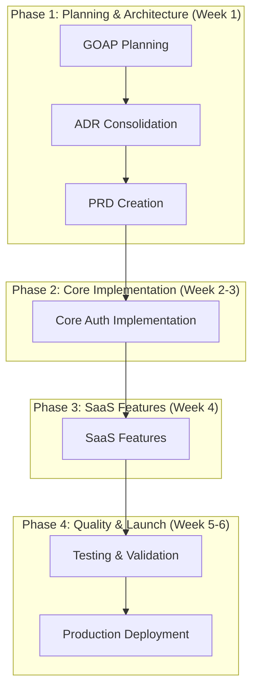

# GOAP Planning: Skidspace Authentication & Persona-Based SaaS

**Session ID**: skidspace-coordination-2026-03-23
**Swarm ID**: swarm-1774297377606-fj7e8v
**Planning Agent**: GOAP-planner-agent
**Date**: 2026-03-23

## Executive Summary

Goal-Oriented Action Planning (GOAP) for implementing skidspace.com authentication and persona-based SaaS system, resolving existing ADR conflicts and establishing clear implementation pathway.

## Current State Analysis

### Existing Assets Discovered
✅ **ADR Conflict Resolution Required**
- ADR-001: Custom JWT + Passport.js approach
- ADR-0001: NextAuth.js v5 approach (more recent, recommended)
- **Decision**: Proceed with NextAuth.js v5 for faster delivery

✅ **Project Structure**
- Established Next.js application in `/apps/web`
- Documentation framework in `/docs`
- Existing ADR process established
- Git repository with proper structure

✅ **Technical Foundation**
- Multi-tenant architecture already designed
- Role-based access control requirements defined
- Security considerations documented
- Database integration planned (PostgreSQL + Prisma)

## GOAP Goal Hierarchy

### 🎯 Primary Goal: Production-Ready Authentication & SaaS System

#### Sub-Goal 1: Technical Architecture Alignment (Priority: CRITICAL)
**Current State**: Conflicting ADRs exist
**Desired State**: Unified technical approach
**Actions Required**:
1. Resolve ADR conflict with consolidated decision
2. Update architecture documentation
3. Validate technical approach with team

**Resources**: 1 Architecture agent, 0.5 days
**Dependencies**: None
**Success Criteria**: Single authoritative ADR, team alignment

#### Sub-Goal 2: Requirements Documentation (Priority: HIGH)
**Current State**: Technical requirements exist, business requirements incomplete
**Desired State**: Comprehensive PRD with user stories and acceptance criteria
**Actions Required**:
1. Analyze existing authentication flows
2. Define persona-based feature requirements
3. Create user stories for each user type
4. Establish success metrics and KPIs

**Resources**: 1 PRD specialist, 1 day
**Dependencies**: Sub-Goal 1 completion
**Success Criteria**: Complete PRD with stakeholder approval

#### Sub-Goal 3: Implementation Foundation (Priority: HIGH)
**Current State**: No implementation started
**Desired State**: Core authentication system functional
**Actions Required**:
1. NextAuth.js v5 setup and configuration
2. Database schema implementation
3. Basic authentication flows
4. Multi-tenant session management

**Resources**: 2 Developers, 1.5 weeks
**Dependencies**: Sub-Goal 2 completion
**Success Criteria**: Basic auth working with database

#### Sub-Goal 4: SaaS Features Implementation (Priority: MEDIUM)
**Current State**: Architecture planned, not implemented
**Desired State**: Multi-tenant SaaS with persona switching
**Actions Required**:
1. Tenant isolation implementation
2. Persona-based role system
3. Feature flagging system
4. Billing integration preparation

**Resources**: 2 Developers, 1 week
**Dependencies**: Sub-Goal 3 completion
**Success Criteria**: Multi-tenant features working

#### Sub-Goal 5: Quality Assurance (Priority: HIGH)
**Current State**: No testing framework
**Desired State**: Comprehensive test coverage
**Actions Required**:
1. Authentication flow testing
2. Multi-tenant isolation tests
3. Security penetration testing
4. Performance validation

**Resources**: 1 QA Engineer, 1 week
**Dependencies**: Sub-Goal 4 completion
**Success Criteria**: >90% test coverage, security validated

## Action Sequences & Dependencies

## Resource Allocation

### Agent Assignments
| Agent Type | Phase | Duration | Tasks |
|------------|-------|----------|--------|
| GOAP-planner-agent | 1 | 0.5 days | This planning document |
| Architecture-decision-agent | 1 | 0.5 days | ADR consolidation |
| PRD-specialist-agent | 1 | 1 day | Requirements documentation |
| NextAuth-implementation-agent | 2-3 | 1.5 weeks | Core authentication |
| SaaS-architecture-agent | 3 | 1 week | Multi-tenant features |
| Testing-specialist-agent | 4 | 1 week | QA and validation |
| Security-reviewer-agent | 4 | 0.5 days | Security audit |

### Timeline Optimization
- **Total Duration**: 6 weeks
- **Critical Path**: Planning → Core Auth → SaaS Features → Testing
- **Parallel Opportunities**: Documentation can overlap with planning
- **Risk Mitigation**: 20% buffer time included

## Risk Analysis & Mitigation

### High-Risk Areas
1. **ADR Conflict Resolution**
   - Risk: Team disagreement on approach
   - Mitigation: Data-driven decision with stakeholder buy-in

2. **NextAuth.js Complexity**
   - Risk: Learning curve for advanced features
   - Mitigation: Proof of concept before full implementation

3. **Multi-tenant Isolation**
   - Risk: Security vulnerabilities in tenant separation
   - Mitigation: Security review at each phase

### Medium-Risk Areas
1. **Database Schema Changes**
   - Risk: Migration complexity
   - Mitigation: Incremental schema updates

2. **Performance at Scale**
   - Risk: Authentication bottlenecks
   - Mitigation: Load testing and optimization

## Success Metrics

### Technical Metrics
- Authentication response time < 100ms (p95)
- Session validation < 10ms (p95)
- 99.9% authentication availability
- Zero critical security vulnerabilities
- 90%+ test coverage

### Business Metrics
- 90%+ successful first-time login rate
- < 2% authentication-related support tickets
- 50% faster auth feature delivery vs custom implementation
- $15,000+ annual cost savings vs Auth0

## Next Steps

### Immediate Actions (Next 24 hours)
1. ✅ GOAP planning completion (this document)
2. 🔄 Store planning context in swarm memory
3. ⏳ Initiate ADR consolidation agent
4. ⏳ Begin PRD specialist work

### Phase 1 Completion Criteria
- [ ] ADR conflict resolved with team consensus
- [ ] Updated architecture documentation
- [ ] Complete PRD with user stories
- [ ] Implementation roadmap approved

## Agent Coordination Protocol

### Memory Keys Used
- `skidspace-project/project-context` - Overall project information
- `skidspace-project/existing-adrs-analysis` - ADR conflict analysis
- `skidspace-project/goap-planning-results` - This planning output
- `skidspace-project/agent-coordination-plan` - Agent assignments

### Swarm Communication
- Session hooks for progress tracking
- Memory store for context sharing
- Task tool for progress management
- Status updates every 4 hours

---

**Planning Agent**: GOAP-planner-agent
**Planning Complete**: ✅
**Next Agent**: Architecture-decision-agent
**Coordination Status**: Active swarm session established