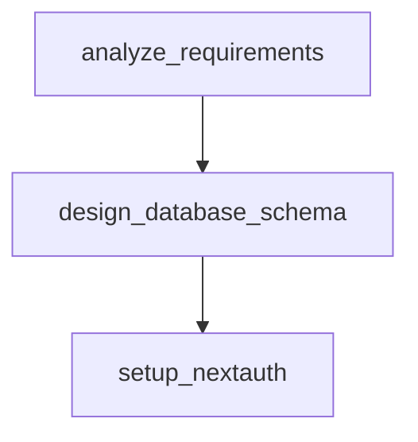
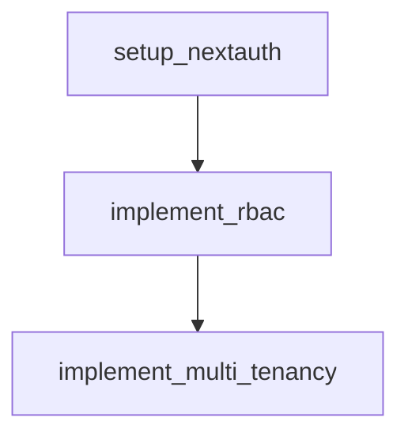
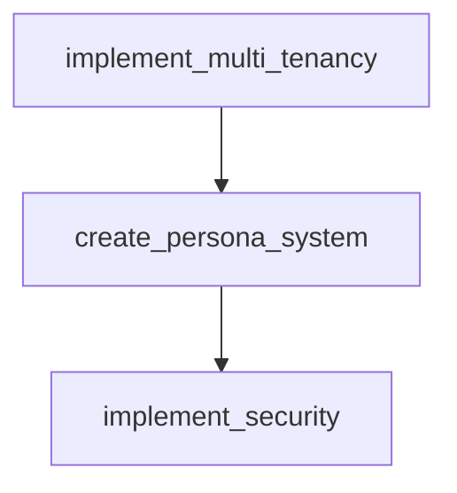
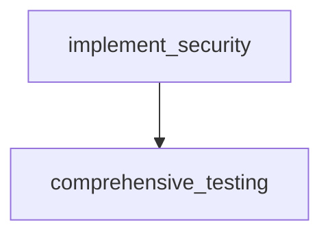

# GOAP Implementation Plan: Skidspace.com Authentication SaaS

**Goal-Oriented Action Planning for Multi-Tenant Authentication System**

## Executive Summary

This document outlines the Goal-Oriented Action Planning (GOAP) approach for transforming skidspace.com from its current state (no authentication) to a fully-featured multi-tenant SaaS platform with role-based access controls and persona management.

## Current State Analysis

### System State
- **Authentication**: ❌ None implemented
- **Multi-tenancy**: ❌ No tenant isolation
- **User Management**: ❌ No user system
- **Role-Based Access**: ❌ No RBAC
- **Persona System**: ❌ No persona management
- **SaaS Features**: ❌ No subscription/billing
- **Database Schema**: ❌ No auth tables

### Codebase State
- **Architecture**: ✅ Monorepo structure
- **Auth Package**: ⚠️ Empty placeholder
- **Database Package**: ⚠️ Basic structure
- **Security Package**: ⚠️ Placeholder
- **Types Package**: ⚠️ Basic types
- **Infrastructure**: ✅ Docker, Terraform ready

## Goal State Definition

### Target System Features
- **Authentication**: ✅ NextAuth.js with multiple providers
- **Multi-tenancy**: ✅ Tenant isolation and management
- **User Management**: ✅ Complete user lifecycle
- **Role-Based Access**: ✅ Granular permissions
- **Persona System**: ✅ Context-aware access
- **SaaS Features**: ✅ Subscription management
- **Database Schema**: ✅ Comprehensive auth/tenant schema

### Success Metrics
- Users can authenticate via multiple providers
- Tenants are completely isolated
- Roles and permissions work correctly
- Persona switching functions properly
- Security compliance is maintained

## GOAP Action Definitions

### Action 1: Research & Requirements Analysis
**Name**: `analyze_requirements`
**Preconditions**:
- Existing codebase available
- Business requirements understood

**Effects**:
- Authentication requirements documented
- Multi-tenant patterns identified
- Security requirements specified
- Technical constraints understood

**Effort**: 8 hours
**Priority**: Critical
**Dependencies**: None

### Action 2: Database Schema Design
**Name**: `design_database_schema`
**Preconditions**:
- Requirements analysis complete
- Multi-tenant patterns selected

**Effects**:
- Auth tables designed
- Tenant isolation schema created
- Role/permission models defined
- Persona management tables designed

**Effort**: 16 hours
**Priority**: Critical
**Dependencies**: `analyze_requirements`

### Action 3: NextAuth.js Setup
**Name**: `setup_nextauth`
**Preconditions**:
- Database schema designed
- Provider requirements known

**Effects**:
- NextAuth.js configured
- Providers integrated
- Session management implemented
- Database adapter configured

**Effort**: 12 hours
**Priority**: Critical
**Dependencies**: `design_database_schema`

### Action 4: Role-Based Access Control Implementation
**Name**: `implement_rbac`
**Preconditions**:
- Authentication system working
- Database schema implemented

**Effects**:
- Role definitions created
- Permission system implemented
- Middleware for access control
- API route protection

**Effort**: 20 hours
**Priority**: High
**Dependencies**: `setup_nextauth`

### Action 5: Multi-Tenant Architecture
**Name**: `implement_multi_tenancy`
**Preconditions**:
- RBAC system working
- Database supports tenants

**Effects**:
- Tenant isolation implemented
- Data segregation enforced
- Tenant management interfaces
- Billing/subscription hooks

**Effort**: 24 hours
**Priority**: High
**Dependencies**: `implement_rbac`

### Action 6: Persona Management System
**Name**: `create_persona_system`
**Preconditions**:
- Multi-tenancy implemented
- User roles defined

**Effects**:
- Persona definitions created
- Context switching implemented
- Persona-based permissions
- UI persona selectors

**Effort**: 16 hours
**Priority**: Medium
**Dependencies**: `implement_multi_tenancy`

### Action 7: Security Hardening
**Name**: `implement_security`
**Preconditions**:
- All core systems implemented
- Security requirements defined

**Effects**:
- Security middleware implemented
- Input validation added
- Rate limiting configured
- Audit logging enabled

**Effort**: 12 hours
**Priority**: High
**Dependencies**: `create_persona_system`

### Action 8: Testing & Validation
**Name**: `comprehensive_testing`
**Preconditions**:
- All features implemented
- Security hardening complete

**Effects**:
- Unit tests written
- Integration tests created
- Security tests implemented
- Performance tests added

**Effort**: 20 hours
**Priority**: High
**Dependencies**: `implement_security`

## Implementation Sequence & Dependencies

### Phase 1: Foundation (24 hours)

1. **analyze_requirements** (8h)
2. **design_database_schema** (16h) - depends on #1

### Phase 2: Core Authentication (32 hours)

3. **setup_nextauth** (12h) - depends on #2
4. **implement_rbac** (20h) - depends on #3

### Phase 3: Advanced Features (40 hours)

5. **implement_multi_tenancy** (24h) - depends on #4
6. **create_persona_system** (16h) - depends on #5

### Phase 4: Security & Testing (32 hours)

7. **implement_security** (12h) - depends on #6
8. **comprehensive_testing** (20h) - depends on #7

## Critical Path Analysis

**Total Estimated Effort**: 128 hours (16 working days)

**Critical Path**:
1. Requirements Analysis →
2. Database Design →
3. NextAuth Setup →
4. RBAC Implementation →
5. Multi-tenancy →
6. Persona System →
7. Security →
8. Testing

**Parallel Opportunities**:
- Documentation can be written alongside implementation
- Frontend components can be built after NextAuth setup
- API design can proceed with database design

## Risk Assessment & Mitigation

### High-Risk Areas
1. **Multi-tenant Data Isolation**: Risk of data leakage
   - Mitigation: Strict schema design, comprehensive testing
2. **Authentication Security**: Risk of auth bypass
   - Mitigation: Security audit, penetration testing
3. **Performance Impact**: Risk of slow queries
   - Mitigation: Proper indexing, query optimization

### Technical Risks
1. **NextAuth.js Complexity**: Learning curve
   - Mitigation: Thorough documentation review, proof of concept
2. **Database Migration**: Existing data compatibility
   - Mitigation: Migration scripts, data backup procedures

## Success Criteria

### Functional Requirements
- [ ] Users can register and authenticate
- [ ] Multiple authentication providers work
- [ ] Users can be assigned to tenants
- [ ] Role-based permissions function correctly
- [ ] Persona switching works seamlessly
- [ ] Data isolation is maintained

### Non-Functional Requirements
- [ ] Authentication response time < 200ms
- [ ] System supports 1000+ concurrent users
- [ ] 99.9% uptime maintained
- [ ] Security audit passes
- [ ] Performance benchmarks met

## Coordination Protocol

### Memory Keys for Agent Coordination
- `swarm/goap/current_action`: Current action being executed
- `swarm/goap/completed_actions`: List of completed actions
- `swarm/goap/blockers`: Current blockers and dependencies
- `swarm/goap/progress`: Percentage completion per action

### Agent Responsibilities
- **Research Agent**: Execute `analyze_requirements`
- **Architecture Agent**: Execute `design_database_schema` and `implement_multi_tenancy`
- **Implementation Agent**: Execute `setup_nextauth`, `implement_rbac`, `create_persona_system`
- **Security Agent**: Execute `implement_security`
- **Testing Agent**: Execute `comprehensive_testing`

### Communication Protocol
1. Agents update memory after each major milestone
2. Dependencies checked before starting new actions
3. Blockers escalated to coordinator immediately
4. Progress reported every 4 hours

## Next Steps

1. **Immediate**: Begin requirements analysis and research
2. **Short-term**: Complete database schema design
3. **Medium-term**: Implement core authentication
4. **Long-term**: Add advanced SaaS features

---

*This GOAP plan will be updated as implementation progresses and new information becomes available.*