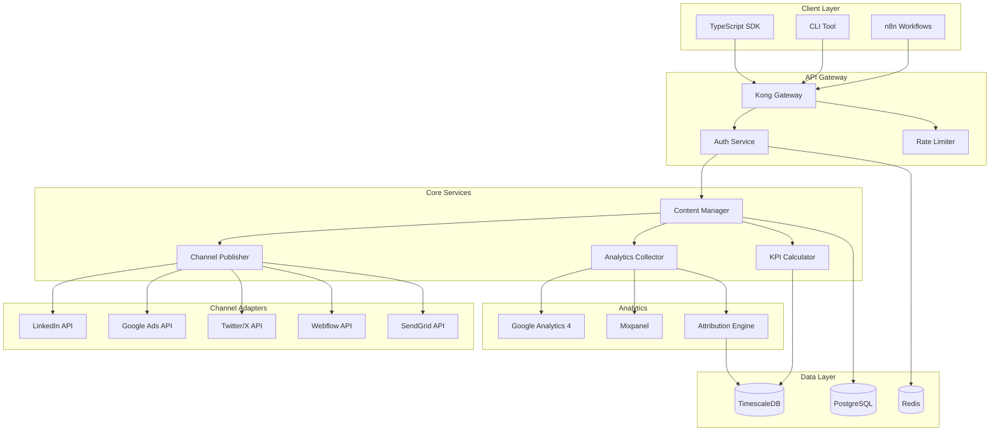

# Marketing Engine Documentation

> Production-ready content marketing orchestration platform with multi-channel publishing, financial KPI tracking, and real-time attribution analytics.

## 📋 Table of Contents

- [Platform Overview](#platform-overview)
- [Quick Start](#quick-start)
- [Architecture](#architecture)
- [Features](#features)
- [Documentation](#documentation)
- [Security](#security)
- [Performance](#performance)

## 🚀 Platform Overview

Marketing Engine is a comprehensive content marketing operating system designed for modern startups and enterprises. It provides:

- **Multi-Channel Publishing**: Automated content distribution across LinkedIn, Google Ads, Twitter/X, blogs, and email
- **Financial KPI Tracking**: Real-time CPL, CAC, ROAS, LTV:CAC ratio calculations
- **Attribution Analytics**: Multi-touch attribution models with conversion path analysis
- **AI-Powered Optimization**: Automated budget reallocation based on channel performance
- **Enterprise Security**: JWT authentication, rate limiting, and comprehensive audit logging

### Key Metrics Tracked

- **Cost Per Lead (CPL)**: Track acquisition costs across all channels
- **Customer Acquisition Cost (CAC)**: Full-funnel cost analysis
- **Return on Ad Spend (ROAS)**: Revenue attribution per channel
- **Lifetime Value to CAC Ratio**: Unit economics validation
- **Content ROI**: Performance metrics for organic content

## 🏗️ Architecture



### Component Relationships

1. **API Gateway (Kong)**
   - Handles authentication, rate limiting, and request routing
   - Provides SSL termination and DDoS protection
   - Manages API versioning and deprecation

2. **Core Services**
   - **Content Manager**: Orchestrates content lifecycle
   - **Channel Publisher**: Manages multi-channel distribution
   - **Analytics Collector**: Aggregates performance data
   - **KPI Calculator**: Computes financial metrics

3. **Data Storage**
   - **PostgreSQL**: Primary data store for content, users, and configuration
   - **Redis**: Session management, caching, and real-time metrics
   - **TimescaleDB**: Time-series data for analytics and attribution

## 📊 Technology Stack

### Backend
- **Runtime**: Node.js 20 LTS with TypeScript 5
- **Framework**: Fastify for high-performance APIs
- **Database**: PostgreSQL 16 with pgvector extension
- **Cache**: Redis 7 with Redis Streams
- **Queue**: BullMQ for background jobs
- **Analytics**: TimescaleDB for time-series data

### Infrastructure
- **Container**: Docker with multi-stage builds
- **Orchestration**: Kubernetes with Helm charts
- **Monitoring**: Prometheus + Grafana stack
- **Logging**: ELK stack (Elasticsearch, Logstash, Kibana)
- **Tracing**: OpenTelemetry with Jaeger
- **Security**: Vault for secrets management

### Integrations
- **LinkedIn**: Marketing API v2
- **Google Ads**: Google Ads API v15
- **Twitter/X**: API v2
- **Analytics**: GA4 Measurement Protocol
- **Email**: SendGrid API v3
- **CMS**: Webflow API v2

## 🚀 Quick Start

### Prerequisites

- Node.js 20+ 
- PostgreSQL 16+
- Redis 7+
- Docker & Docker Compose
- Valid API credentials for channels

### Installation

```bash
# Clone the repository
git clone https://github.com/yourusername/marketing-engine.git
cd marketing-engine

# Install dependencies
npm install

# Set up environment variables
cp .env.example .env
# Edit .env with your credentials

# Run database migrations
npm run db:migrate

# Start development server
npm run dev
```

### Basic Usage

```typescript
import { ContentManager } from '@varai/marketing-engine';
import { LinkedInChannel, GoogleAdsChannel } from '@varai/marketing-engine/channels';

// Initialize the marketing engine
const marketing = new ContentManager({
  productName: 'Your Product',
  channels: [
    new LinkedInChannel({
      accessToken: process.env.LINKEDIN_TOKEN,
      companyId: 'your-company'
    }),
    new GoogleAdsChannel({
      accountId: process.env.GOOGLE_ADS_ACCOUNT,
      dailyBudget: 100
    })
  ],
  attributionWindow: 30,
  adSpend: {
    linkedin: { monthly: 2000 },
    google: { monthly: 3000 }
  }
});

// Publish content across channels
const result = await marketing.publishContent({
  title: 'Your Content Title',
  body: 'Content body...',
  targetChannels: ['linkedin', 'google'],
  utmParams: {
    source: 'blog',
    medium: 'organic',
    campaign: 'q1-2024'
  }
});

// Get real-time KPIs
const kpis = await marketing.getKPIs({
  period: 'last-30-days'
});
```

## 📚 Documentation

### API Documentation
- [OpenAPI Specification](./api/openapi.yaml)
- [Authentication Guide](./api/authentication.md)
- [Rate Limiting](./api/rate-limiting.md)
- [SDK Documentation](./api/sdk.md)

### Channel Guides
- [LinkedIn Setup](./channels/linkedin.md)
- [Google Ads Setup](./channels/google-ads.md)
- [Twitter/X Setup](./channels/twitter.md)
- [Email Setup](./channels/email.md)
- [Blog Integration](./channels/blog.md)

### Analytics Documentation
- [Metrics Definitions](./analytics/metrics.md)
- [Attribution Models](./analytics/attribution.md)
- [Dashboard Creation](./analytics/dashboards.md)
- [Custom Reports](./analytics/custom-reports.md)

### Deployment Guides
- [Infrastructure Requirements](./deployment/infrastructure.md)
- [Environment Setup](./deployment/environment.md)
- [Security Hardening](./deployment/security.md)
- [Scaling Strategies](./deployment/scaling.md)
- [Backup Procedures](./deployment/backup.md)

### Integration Tutorials
- [CRM Integration](./integrations/crm.md)
- [E-commerce Platforms](./integrations/ecommerce.md)
- [Analytics Tools](./integrations/analytics.md)
- [Custom Webhooks](./integrations/webhooks.md)

## 🔒 Security

### Authentication
- JWT tokens with refresh token rotation
- OAuth 2.0 for third-party integrations
- API key management with scopes
- Multi-factor authentication support

### Data Protection
- AES-256 encryption at rest
- TLS 1.3 for data in transit
- PII tokenization
- GDPR compliance tools

### Access Control
- Role-based access control (RBAC)
- Resource-level permissions
- Audit logging for all actions
- IP whitelisting support

## ⚡ Performance

### Benchmarks
- **API Response Time**: p95 < 100ms
- **Content Publishing**: < 2s per channel
- **Analytics Processing**: Real-time with < 5s delay
- **Dashboard Generation**: < 1s for 30-day view

### Optimization
- Redis caching with smart invalidation
- Database connection pooling
- Async job processing with BullMQ
- CDN integration for static assets

### Scalability
- Horizontal scaling with Kubernetes
- Read replicas for analytics queries
- Sharded Redis cluster
- Auto-scaling based on CPU/memory

## 📞 Support

- **Documentation**: https://docs.marketingengine.io
- **API Status**: https://status.marketingengine.io
- **Support**: support@marketingengine.io
- **Security**: security@marketingengine.io

## 📄 License

Copyright © 2024 Marketing Engine. All rights reserved.

---

Built with ❤️ for modern marketing teams who demand production-ready infrastructure.