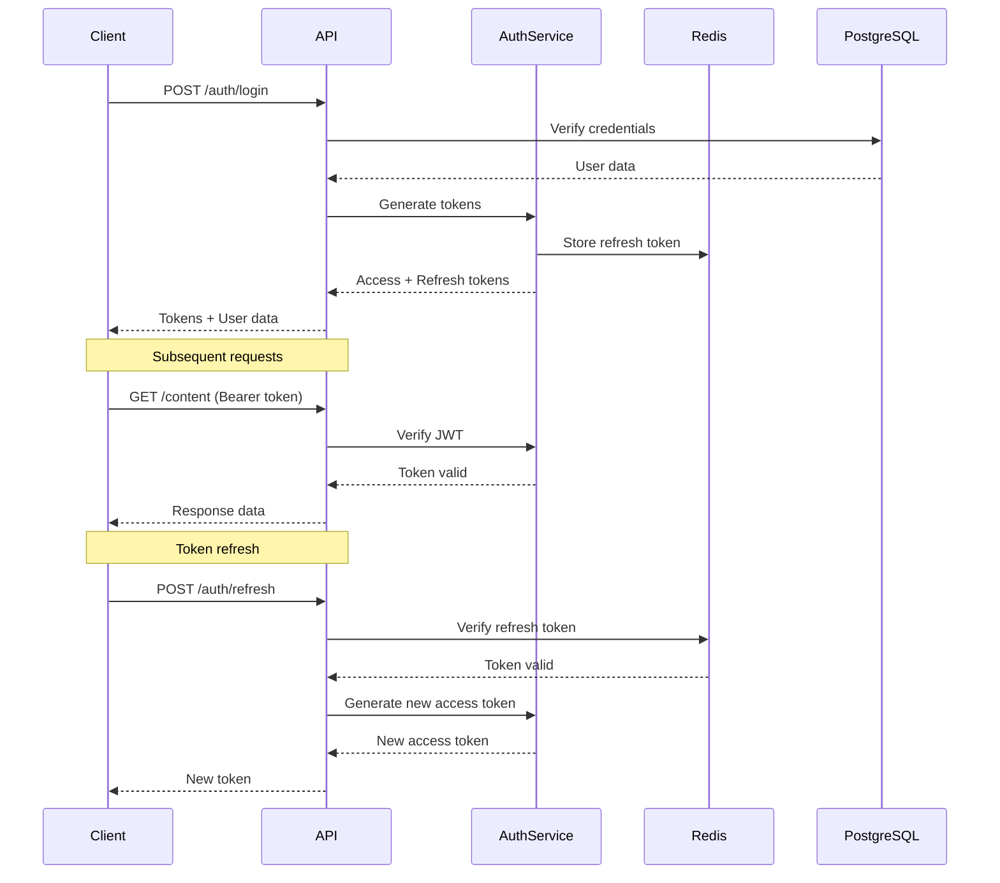

# Authentication Guide

## Overview

Marketing Engine uses JWT-based authentication with refresh tokens for secure API access. All production endpoints require authentication except for login and health check endpoints.

## Authentication Flow



## JWT Token Structure

### Access Token Claims

```json
{
  "sub": "user-uuid",
  "email": "user@example.com",
  "role": "manager",
  "company": "company-uuid",
  "permissions": ["content:write", "analytics:read", "campaigns:manage"],
  "iat": 1703635200,
  "exp": 1703638800,
  "iss": "https://api.marketingengine.io",
  "aud": "marketing-engine-api"
}
```

### Token Lifetimes

- **Access Token**: 1 hour (3600 seconds)
- **Refresh Token**: 30 days (2592000 seconds)
- **Remember Me**: 90 days (7776000 seconds)

## Implementation Guide

### 1. Login Request

```typescript
const response = await fetch('https://api.marketingengine.io/v1/auth/login', {
  method: 'POST',
  headers: {
    'Content-Type': 'application/json',
  },
  body: JSON.stringify({
    email: 'user@example.com',
    password: 'secure-password',
    mfaToken: '123456' // Optional, required if MFA enabled
  })
});

const data = await response.json();
// Store tokens securely
localStorage.setItem('accessToken', data.accessToken);
localStorage.setItem('refreshToken', data.refreshToken);
```

### 2. Making Authenticated Requests

```typescript
const response = await fetch('https://api.marketingengine.io/v1/content', {
  headers: {
    'Authorization': `Bearer ${accessToken}`,
    'Content-Type': 'application/json'
  }
});
```

### 3. Token Refresh

```typescript
async function refreshAccessToken() {
  const refreshToken = localStorage.getItem('refreshToken');
  
  const response = await fetch('https://api.marketingengine.io/v1/auth/refresh', {
    method: 'POST',
    headers: {
      'Content-Type': 'application/json'
    },
    body: JSON.stringify({ refreshToken })
  });

  if (response.ok) {
    const data = await response.json();
    localStorage.setItem('accessToken', data.accessToken);
    return data.accessToken;
  }
  
  // Refresh failed, redirect to login
  window.location.href = '/login';
}
```

### 4. Auto-Refresh Interceptor

```typescript
// Axios interceptor example
axios.interceptors.response.use(
  response => response,
  async error => {
    const originalRequest = error.config;
    
    if (error.response?.status === 401 && !originalRequest._retry) {
      originalRequest._retry = true;
      
      try {
        const newToken = await refreshAccessToken();
        axios.defaults.headers.common['Authorization'] = `Bearer ${newToken}`;
        originalRequest.headers['Authorization'] = `Bearer ${newToken}`;
        return axios(originalRequest);
      } catch (refreshError) {
        // Redirect to login
        window.location.href = '/login';
        return Promise.reject(refreshError);
      }
    }
    
    return Promise.reject(error);
  }
);
```

## Multi-Factor Authentication (MFA)

### Setup MFA

```typescript
// 1. Enable MFA for user
const response = await fetch('/v1/auth/mfa/enable', {
  method: 'POST',
  headers: {
    'Authorization': `Bearer ${accessToken}`
  }
});

const { qrCode, secret, backupCodes } = await response.json();

// 2. Display QR code for user to scan with authenticator app
// 3. Verify MFA setup
const verifyResponse = await fetch('/v1/auth/mfa/verify', {
  method: 'POST',
  headers: {
    'Authorization': `Bearer ${accessToken}`,
    'Content-Type': 'application/json'
  },
  body: JSON.stringify({
    token: '123456' // Token from authenticator app
  })
});
```

### Login with MFA

```typescript
// 1. Initial login
const loginResponse = await fetch('/v1/auth/login', {
  method: 'POST',
  headers: {
    'Content-Type': 'application/json'
  },
  body: JSON.stringify({
    email: 'user@example.com',
    password: 'password'
  })
});

const { requiresMfa, mfaSessionToken } = await loginResponse.json();

if (requiresMfa) {
  // 2. Submit MFA token
  const mfaResponse = await fetch('/v1/auth/mfa/complete', {
    method: 'POST',
    headers: {
      'Content-Type': 'application/json'
    },
    body: JSON.stringify({
      sessionToken: mfaSessionToken,
      mfaToken: '123456'
    })
  });
  
  const { accessToken, refreshToken } = await mfaResponse.json();
}
```

## API Key Authentication

For server-to-server integrations, use API keys instead of JWT tokens.

### Creating API Keys

```typescript
const response = await fetch('/v1/api-keys', {
  method: 'POST',
  headers: {
    'Authorization': `Bearer ${accessToken}`,
    'Content-Type': 'application/json'
  },
  body: JSON.stringify({
    name: 'Production Server',
    permissions: ['content:write', 'analytics:read'],
    expiresAt: '2024-12-31T23:59:59Z' // Optional
  })
});

const { key, keyId } = await response.json();
// Store key securely - it won't be shown again
```

### Using API Keys

```typescript
const response = await fetch('https://api.marketingengine.io/v1/content', {
  headers: {
    'X-API-Key': 'mkt_live_1234567890abcdef',
    'Content-Type': 'application/json'
  }
});
```

## OAuth 2.0 for Third-Party Apps

Marketing Engine supports OAuth 2.0 for third-party integrations.

### Authorization Flow

```typescript
// 1. Redirect to authorization endpoint
const params = new URLSearchParams({
  client_id: 'your-client-id',
  redirect_uri: 'https://yourapp.com/callback',
  response_type: 'code',
  scope: 'content:write analytics:read',
  state: 'random-state-string'
});

window.location.href = `https://api.marketingengine.io/oauth/authorize?${params}`;

// 2. Exchange code for tokens
const tokenResponse = await fetch('https://api.marketingengine.io/oauth/token', {
  method: 'POST',
  headers: {
    'Content-Type': 'application/json',
    'Authorization': `Basic ${btoa(`${clientId}:${clientSecret}`)}`
  },
  body: JSON.stringify({
    grant_type: 'authorization_code',
    code: authorizationCode,
    redirect_uri: 'https://yourapp.com/callback'
  })
});
```

## Security Best Practices

### Token Storage

```typescript
// ❌ Never store tokens in localStorage for sensitive apps
localStorage.setItem('token', token);

// ✅ Use httpOnly cookies for web apps
document.cookie = `refreshToken=${token}; HttpOnly; Secure; SameSite=Strict`;

// ✅ For SPAs, use memory + refresh strategy
class TokenManager {
  private accessToken: string | null = null;
  
  setAccessToken(token: string) {
    this.accessToken = token;
  }
  
  getAccessToken(): string | null {
    return this.accessToken;
  }
  
  async ensureValidToken(): Promise<string> {
    if (!this.accessToken || this.isTokenExpired()) {
      await this.refreshToken();
    }
    return this.accessToken!;
  }
}
```

### Request Signing

For additional security, sign requests with HMAC:

```typescript
import crypto from 'crypto';

function signRequest(method: string, path: string, body: any, secret: string) {
  const timestamp = Math.floor(Date.now() / 1000);
  const payload = `${method}:${path}:${timestamp}:${JSON.stringify(body)}`;
  
  const signature = crypto
    .createHmac('sha256', secret)
    .update(payload)
    .digest('hex');
  
  return {
    'X-Timestamp': timestamp,
    'X-Signature': signature
  };
}

// Use in request
const headers = {
  'Authorization': `Bearer ${token}`,
  ...signRequest('POST', '/v1/content', body, apiSecret)
};
```

## Session Management

### Session Configuration

```typescript
// Server-side session configuration
const sessionConfig = {
  secret: process.env.SESSION_SECRET,
  resave: false,
  saveUninitialized: false,
  cookie: {
    secure: true, // HTTPS only
    httpOnly: true,
    sameSite: 'strict',
    maxAge: 3600000 // 1 hour
  },
  store: new RedisStore({
    client: redisClient,
    prefix: 'sess:',
    ttl: 3600
  })
};
```

### Concurrent Session Limits

```typescript
// Limit to 3 concurrent sessions per user
const activeSessions = await redis.smembers(`user:${userId}:sessions`);
if (activeSessions.length >= 3) {
  // Revoke oldest session
  const oldestSession = activeSessions[0];
  await redis.del(`sess:${oldestSession}`);
  await redis.srem(`user:${userId}:sessions`, oldestSession);
}

// Add new session
await redis.sadd(`user:${userId}:sessions`, sessionId);
```

## Rate Limiting by Auth Type

Different rate limits apply based on authentication method:

| Auth Type | Requests/Hour | Burst |
|-----------|--------------|-------|
| Anonymous | 20 | 5 |
| JWT Token | 1000 | 100 |
| API Key (Free) | 500 | 50 |
| API Key (Pro) | 5000 | 500 |
| API Key (Enterprise) | Unlimited | 1000 |

## Troubleshooting

### Common Issues

1. **401 Unauthorized**
   - Token expired: Refresh the token
   - Invalid token: Check token format
   - Wrong environment: Ensure using correct API URL

2. **403 Forbidden**
   - Insufficient permissions: Check user role
   - Feature not in plan: Upgrade required
   - IP not whitelisted: Add IP to whitelist

3. **429 Too Many Requests**
   - Rate limit exceeded: Implement exponential backoff
   - Check X-RateLimit headers for limits

### Debug Headers

Enable debug headers for troubleshooting:

```typescript
const response = await fetch('/v1/content', {
  headers: {
    'Authorization': `Bearer ${token}`,
    'X-Debug-Auth': 'true' // Returns auth debug info
  }
});

// Response headers:
// X-Auth-User-Id: uuid
// X-Auth-Role: manager
// X-Auth-Permissions: content:write,analytics:read
// X-Token-Expires-In: 3245
```

## SDK Authentication

### TypeScript SDK

```typescript
import { MarketingEngine } from '@marketing-engine/sdk';

const client = new MarketingEngine({
  accessToken: 'your-access-token',
  refreshToken: 'your-refresh-token',
  onTokenRefresh: (tokens) => {
    // Store new tokens
    localStorage.setItem('accessToken', tokens.accessToken);
  }
});

// SDK handles token refresh automatically
const content = await client.content.publish({
  title: 'My Content',
  channels: ['linkedin', 'twitter']
});
```

### Python SDK

```python
from marketing_engine import Client

client = Client(
    access_token="your-access-token",
    refresh_token="your-refresh-token",
    auto_refresh=True
)

# Automatic token refresh
content = client.content.publish(
    title="My Content",
    channels=["linkedin", "twitter"]
)
```

## Support

For authentication issues:
- Email: auth-support@marketingengine.io
- Status: https://status.marketingengine.io
- Docs: https://docs.marketingengine.io/auth