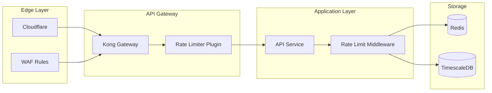

# Rate Limiting Guide

## Overview

Marketing Engine implements sophisticated rate limiting to ensure fair usage and protect system stability. Rate limits are applied per user, per endpoint, and globally.

## Rate Limit Headers

Every API response includes rate limit information:

```http
HTTP/1.1 200 OK
X-RateLimit-Limit: 1000
X-RateLimit-Remaining: 999
X-RateLimit-Reset: 1703638800
X-RateLimit-Policy: user-tier-pro
```

### Header Definitions

| Header | Description |
|--------|-------------|
| `X-RateLimit-Limit` | Maximum requests allowed in the window |
| `X-RateLimit-Remaining` | Requests remaining in current window |
| `X-RateLimit-Reset` | Unix timestamp when the window resets |
| `X-RateLimit-Policy` | Applied rate limit policy |

## Rate Limit Tiers

### User-Based Tiers

| Tier | Requests/Hour | Burst | Concurrent | Monthly Quota |
|------|--------------|-------|------------|---------------|
| Free | 100 | 20 | 2 | 10,000 |
| Starter | 500 | 50 | 5 | 100,000 |
| Professional | 2,000 | 200 | 10 | 1,000,000 |
| Enterprise | 10,000 | 1,000 | 50 | Unlimited |
| Custom | Negotiated | Negotiated | Negotiated | Negotiated |

### Endpoint-Specific Limits

```yaml
# Critical endpoints have stricter limits
POST /auth/login: 5 requests per minute
POST /auth/refresh: 10 requests per minute
POST /auth/reset-password: 3 requests per hour

# Content publishing
POST /content: 100 requests per hour
GET /content: 1000 requests per hour

# Analytics (read-heavy)
GET /kpis: 500 requests per hour
GET /attribution/paths: 100 requests per hour

# Resource-intensive operations
POST /campaigns: 20 requests per hour
POST /reports/generate: 10 requests per hour
```

## Implementation Architecture



## Rate Limiting Algorithms

### 1. Token Bucket Algorithm (Default)

```typescript
class TokenBucket {
  private tokens: number;
  private capacity: number;
  private refillRate: number;
  private lastRefill: number;

  constructor(capacity: number, refillRate: number) {
    this.capacity = capacity;
    this.tokens = capacity;
    this.refillRate = refillRate;
    this.lastRefill = Date.now();
  }

  async consume(tokens: number = 1): Promise<boolean> {
    this.refill();
    
    if (this.tokens >= tokens) {
      this.tokens -= tokens;
      return true;
    }
    
    return false;
  }

  private refill() {
    const now = Date.now();
    const timePassed = (now - this.lastRefill) / 1000;
    const tokensToAdd = timePassed * this.refillRate;
    
    this.tokens = Math.min(this.capacity, this.tokens + tokensToAdd);
    this.lastRefill = now;
  }
}
```

### 2. Sliding Window Counter

```typescript
class SlidingWindowCounter {
  private redis: Redis;
  private windowSize: number; // in seconds
  private limit: number;

  async isAllowed(key: string): Promise<boolean> {
    const now = Date.now();
    const windowStart = now - (this.windowSize * 1000);
    
    // Remove old entries
    await this.redis.zremrangebyscore(key, 0, windowStart);
    
    // Count requests in window
    const count = await this.redis.zcard(key);
    
    if (count < this.limit) {
      // Add current request
      await this.redis.zadd(key, now, `${now}-${Math.random()}`);
      await this.redis.expire(key, this.windowSize);
      return true;
    }
    
    return false;
  }
}
```

### 3. Distributed Rate Limiting

```typescript
// Lua script for atomic rate limit check
const rateLimitScript = `
  local key = KEYS[1]
  local limit = tonumber(ARGV[1])
  local window = tonumber(ARGV[2])
  local now = tonumber(ARGV[3])
  
  -- Clear old entries
  redis.call('ZREMRANGEBYSCORE', key, 0, now - window)
  
  -- Count current entries
  local current = redis.call('ZCARD', key)
  
  if current < limit then
    -- Add new entry
    redis.call('ZADD', key, now, now .. ':' .. math.random())
    redis.call('EXPIRE', key, window)
    return {1, limit - current - 1}
  else
    return {0, 0}
  end
`;

// Usage in middleware
async function checkRateLimit(userId: string, limit: number, window: number) {
  const result = await redis.eval(
    rateLimitScript,
    1,
    `ratelimit:${userId}`,
    limit,
    window,
    Date.now()
  );
  
  return {
    allowed: result[0] === 1,
    remaining: result[1]
  };
}
```

## Handling Rate Limits

### Client-Side Best Practices

```typescript
class APIClient {
  private queue: Array<() => Promise<any>> = [];
  private processing = false;

  async request(config: RequestConfig): Promise<any> {
    return new Promise((resolve, reject) => {
      this.queue.push(async () => {
        try {
          const response = await this.executeRequest(config);
          resolve(response);
        } catch (error) {
          if (error.status === 429) {
            // Handle rate limit
            await this.handleRateLimit(error);
            // Retry
            const retryResponse = await this.executeRequest(config);
            resolve(retryResponse);
          } else {
            reject(error);
          }
        }
      });
      
      this.processQueue();
    });
  }

  private async handleRateLimit(error: any) {
    const retryAfter = error.headers['retry-after'] || 60;
    console.log(`Rate limited. Waiting ${retryAfter} seconds...`);
    await this.sleep(retryAfter * 1000);
  }

  private async processQueue() {
    if (this.processing || this.queue.length === 0) return;
    
    this.processing = true;
    
    while (this.queue.length > 0) {
      const request = this.queue.shift()!;
      await request();
      // Add delay between requests
      await this.sleep(100);
    }
    
    this.processing = false;
  }

  private sleep(ms: number): Promise<void> {
    return new Promise(resolve => setTimeout(resolve, ms));
  }
}
```

### Exponential Backoff

```typescript
class ExponentialBackoff {
  private baseDelay = 1000; // 1 second
  private maxDelay = 60000; // 60 seconds
  private maxRetries = 5;

  async execute<T>(
    fn: () => Promise<T>,
    onRetry?: (attempt: number, delay: number) => void
  ): Promise<T> {
    let lastError: any;
    
    for (let attempt = 0; attempt < this.maxRetries; attempt++) {
      try {
        return await fn();
      } catch (error: any) {
        lastError = error;
        
        if (error.status !== 429 || attempt === this.maxRetries - 1) {
          throw error;
        }
        
        const delay = Math.min(
          this.baseDelay * Math.pow(2, attempt) + Math.random() * 1000,
          this.maxDelay
        );
        
        if (onRetry) {
          onRetry(attempt + 1, delay);
        }
        
        await new Promise(resolve => setTimeout(resolve, delay));
      }
    }
    
    throw lastError;
  }
}

// Usage
const backoff = new ExponentialBackoff();

const result = await backoff.execute(
  () => api.publishContent(content),
  (attempt, delay) => {
    console.log(`Retry attempt ${attempt} after ${delay}ms`);
  }
);
```

## Advanced Rate Limiting Features

### 1. Cost-Based Rate Limiting

Different operations consume different amounts of quota:

```typescript
const operationCosts = {
  'GET /content': 1,
  'POST /content': 10,
  'GET /kpis': 5,
  'POST /reports/generate': 100,
  'POST /campaigns': 50
};

async function checkCostBasedLimit(userId: string, operation: string) {
  const cost = operationCosts[operation] || 1;
  const userQuota = await getUserQuota(userId);
  
  if (userQuota.remaining < cost) {
    throw new RateLimitError({
      message: 'Insufficient quota',
      quotaRequired: cost,
      quotaRemaining: userQuota.remaining,
      resetsAt: userQuota.resetsAt
    });
  }
  
  await deductQuota(userId, cost);
}
```

### 2. Dynamic Rate Limiting

Adjust limits based on system load:

```typescript
class DynamicRateLimiter {
  private baseLimit = 1000;
  private metrics: SystemMetrics;

  async getCurrentLimit(): Promise<number> {
    const load = await this.metrics.getSystemLoad();
    
    if (load.cpu > 80 || load.memory > 85) {
      // High load: reduce limits
      return Math.floor(this.baseLimit * 0.5);
    } else if (load.cpu > 60 || load.memory > 70) {
      // Medium load: slightly reduce
      return Math.floor(this.baseLimit * 0.8);
    }
    
    // Normal load: full capacity
    return this.baseLimit;
  }
}
```

### 3. Burst Allowance

Allow temporary bursts above the limit:

```typescript
interface BurstConfig {
  normalLimit: number;
  burstLimit: number;
  burstDuration: number; // seconds
}

class BurstRateLimiter {
  async checkLimit(userId: string, config: BurstConfig): Promise<boolean> {
    const key = `burst:${userId}`;
    const now = Date.now();
    
    // Check if in burst period
    const burstStart = await redis.get(`${key}:start`);
    
    if (burstStart && now - parseInt(burstStart) < config.burstDuration * 1000) {
      // In burst period
      return await this.checkWindowLimit(key, config.burstLimit);
    } else {
      // Normal period
      const allowed = await this.checkWindowLimit(key, config.normalLimit);
      
      if (!allowed) {
        // Start burst period
        await redis.set(`${key}:start`, now, 'EX', config.burstDuration);
      }
      
      return allowed;
    }
  }
}
```

### 4. Priority Queuing

Premium users get priority during high load:

```typescript
class PriorityRateLimiter {
  private queues = {
    high: [],
    medium: [],
    low: []
  };

  async processRequest(request: Request, userTier: string) {
    const priority = this.getPriority(userTier);
    
    return new Promise((resolve, reject) => {
      this.queues[priority].push({ request, resolve, reject });
      this.processQueues();
    });
  }

  private getPriority(tier: string): 'high' | 'medium' | 'low' {
    switch (tier) {
      case 'enterprise': return 'high';
      case 'professional': return 'medium';
      default: return 'low';
    }
  }

  private async processQueues() {
    // Process high priority first
    for (const priority of ['high', 'medium', 'low']) {
      const queue = this.queues[priority];
      
      while (queue.length > 0 && await this.hasCapacity()) {
        const { request, resolve, reject } = queue.shift();
        
        try {
          const result = await this.executeRequest(request);
          resolve(result);
        } catch (error) {
          reject(error);
        }
      }
    }
  }
}
```

## Rate Limit Configuration

### Environment Variables

```bash
# Global settings
RATE_LIMIT_ENABLED=true
RATE_LIMIT_ALGORITHM=token_bucket
RATE_LIMIT_REDIS_URL=redis://localhost:6379

# Per-tier settings
RATE_LIMIT_FREE_HOURLY=100
RATE_LIMIT_FREE_BURST=20
RATE_LIMIT_STARTER_HOURLY=500
RATE_LIMIT_STARTER_BURST=50
RATE_LIMIT_PRO_HOURLY=2000
RATE_LIMIT_PRO_BURST=200

# Feature flags
RATE_LIMIT_DYNAMIC_ENABLED=true
RATE_LIMIT_BURST_ENABLED=true
RATE_LIMIT_COST_BASED=true
```

### Configuration Schema

```typescript
interface RateLimitConfig {
  enabled: boolean;
  algorithm: 'token_bucket' | 'sliding_window' | 'fixed_window';
  storage: 'redis' | 'memory' | 'dynamodb';
  
  tiers: {
    [key: string]: {
      hourly: number;
      daily: number;
      monthly: number;
      burst: number;
      concurrent: number;
    };
  };
  
  endpoints: {
    [pattern: string]: {
      limit: number;
      window: number;
      cost?: number;
    };
  };
  
  features: {
    dynamicScaling: boolean;
    burstAllowance: boolean;
    costBased: boolean;
    priorityQueuing: boolean;
  };
}
```

## Monitoring & Alerts

### Metrics Collection

```typescript
// Prometheus metrics
const rateLimitMetrics = {
  requests: new promClient.Counter({
    name: 'rate_limit_requests_total',
    help: 'Total rate limit checks',
    labelNames: ['status', 'tier', 'endpoint']
  }),
  
  rejections: new promClient.Counter({
    name: 'rate_limit_rejections_total',
    help: 'Total rejected requests',
    labelNames: ['tier', 'endpoint', 'reason']
  }),
  
  quotaUsage: new promClient.Gauge({
    name: 'rate_limit_quota_usage_ratio',
    help: 'Quota usage ratio by tier',
    labelNames: ['tier', 'user_id']
  })
};

// Log rate limit events
middleware.on('rateLimitExceeded', (event) => {
  logger.warn('Rate limit exceeded', {
    userId: event.userId,
    endpoint: event.endpoint,
    limit: event.limit,
    tier: event.tier,
    ip: event.ip
  });
  
  // Send alert for abuse patterns
  if (event.consecutiveHits > 10) {
    alerting.send({
      severity: 'warning',
      title: 'Potential rate limit abuse',
      details: event
    });
  }
});
```

### Dashboard Queries

```sql
-- Top rate limited users
SELECT 
  user_id,
  tier,
  COUNT(*) as rejection_count,
  COUNT(DISTINCT endpoint) as unique_endpoints
FROM rate_limit_events
WHERE event_type = 'rejected'
  AND timestamp > NOW() - INTERVAL '1 hour'
GROUP BY user_id, tier
ORDER BY rejection_count DESC
LIMIT 20;

-- Rate limit usage by tier
SELECT 
  tier,
  AVG(usage_ratio) as avg_usage,
  MAX(usage_ratio) as max_usage,
  PERCENTILE_CONT(0.95) WITHIN GROUP (ORDER BY usage_ratio) as p95_usage
FROM rate_limit_metrics
WHERE timestamp > NOW() - INTERVAL '1 hour'
GROUP BY tier;
```

## Error Responses

### 429 Too Many Requests

```json
{
  "error": "rate_limit_exceeded",
  "message": "API rate limit exceeded",
  "details": {
    "limit": 1000,
    "remaining": 0,
    "reset": 1703638800,
    "retryAfter": 3600
  }
}
```

### Headers on 429 Response

```http
HTTP/1.1 429 Too Many Requests
Content-Type: application/json
X-RateLimit-Limit: 1000
X-RateLimit-Remaining: 0
X-RateLimit-Reset: 1703638800
Retry-After: 3600
```

## Best Practices

### For API Consumers

1. **Always check rate limit headers**
   ```typescript
   if (response.headers['x-ratelimit-remaining'] < 10) {
     console.warn('Approaching rate limit');
   }
   ```

2. **Implement proper backoff**
   - Use exponential backoff with jitter
   - Respect Retry-After header
   - Don't hammer the API

3. **Batch operations when possible**
   ```typescript
   // ❌ Bad: Multiple individual requests
   for (const item of items) {
     await api.create(item);
   }
   
   // ✅ Good: Batch request
   await api.createBatch(items);
   ```

4. **Cache responses**
   ```typescript
   const cache = new NodeCache({ stdTTL: 300 });
   
   async function getWithCache(key: string) {
     const cached = cache.get(key);
     if (cached) return cached;
     
     const data = await api.get(key);
     cache.set(key, data);
     return data;
   }
   ```

5. **Use webhooks for updates**
   - Instead of polling, register webhooks
   - Reduces API calls significantly

## Support

For rate limit issues:
- Check current limits: GET /v1/account/limits
- Request increase: support@marketingengine.io
- Status page: https://status.marketingengine.io