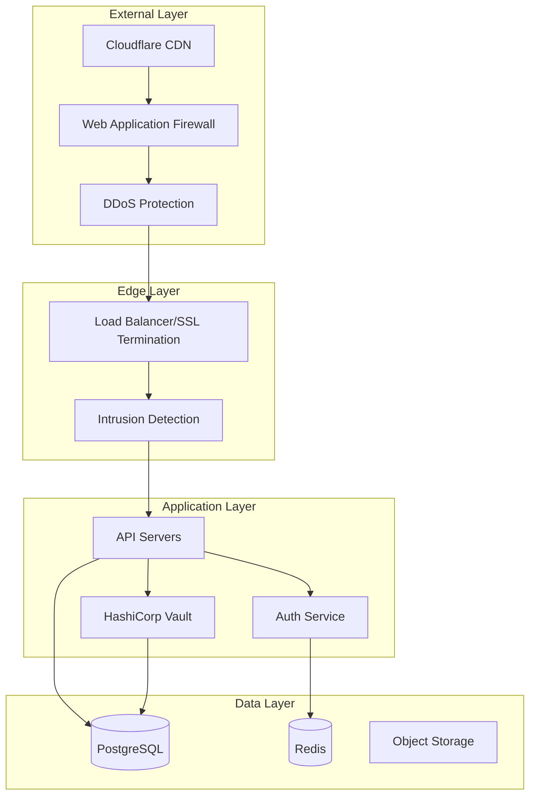

# Security Hardening Guide

## Overview

This guide provides comprehensive security hardening procedures for Marketing Engine deployments. All recommendations follow OWASP, NIST, and industry best practices for production environments.

## Security Architecture



## Infrastructure Security

### Network Segmentation

```yaml
# VPC Configuration
resource "aws_vpc" "main" {
  cidr_block           = "10.0.0.0/16"
  enable_dns_hostnames = true
  enable_dns_support   = true

  tags = {
    Name = "marketing-engine-vpc"
  }
}

# Public Subnet (Load Balancers only)
resource "aws_subnet" "public" {
  count             = 2
  vpc_id            = aws_vpc.main.id
  cidr_block        = "10.0.${count.index}.0/24"
  availability_zone = data.aws_availability_zones.available.names[count.index]

  tags = {
    Name = "Public-${count.index}"
    Type = "public"
  }
}

# Private Subnet (Application servers)
resource "aws_subnet" "private" {
  count             = 2
  vpc_id            = aws_vpc.main.id
  cidr_block        = "10.0.${10 + count.index}.0/24"
  availability_zone = data.aws_availability_zones.available.names[count.index]

  tags = {
    Name = "Private-${count.index}"
    Type = "private"
  }
}

# Database Subnet (Isolated)
resource "aws_subnet" "database" {
  count             = 2
  vpc_id            = aws_vpc.main.id
  cidr_block        = "10.0.${20 + count.index}.0/24"
  availability_zone = data.aws_availability_zones.available.names[count.index]

  tags = {
    Name = "Database-${count.index}"
    Type = "database"
  }
}
```

### Security Groups

```yaml
# Load Balancer Security Group
resource "aws_security_group" "alb" {
  name_prefix = "alb-"
  vpc_id      = aws_vpc.main.id

  ingress {
    from_port   = 443
    to_port     = 443
    protocol    = "tcp"
    cidr_blocks = ["0.0.0.0/0"]
    description = "HTTPS from anywhere"
  }

  ingress {
    from_port   = 80
    to_port     = 80
    protocol    = "tcp"
    cidr_blocks = ["0.0.0.0/0"]
    description = "HTTP from anywhere (redirect to HTTPS)"
  }

  egress {
    from_port   = 0
    to_port     = 0
    protocol    = "-1"
    cidr_blocks = ["0.0.0.0/0"]
    description = "Allow all outbound"
  }

  lifecycle {
    create_before_destroy = true
  }
}

# Application Security Group
resource "aws_security_group" "app" {
  name_prefix = "app-"
  vpc_id      = aws_vpc.main.id

  ingress {
    from_port       = 3000
    to_port         = 3000
    protocol        = "tcp"
    security_groups = [aws_security_group.alb.id]
    description     = "API access from ALB only"
  }

  ingress {
    from_port = 22
    to_port   = 22
    protocol  = "tcp"
    cidr_blocks = [var.bastion_ip]
    description = "SSH from bastion only"
  }

  egress {
    from_port   = 0
    to_port     = 0
    protocol    = "-1"
    cidr_blocks = ["0.0.0.0/0"]
    description = "Allow all outbound"
  }
}

# Database Security Group
resource "aws_security_group" "database" {
  name_prefix = "db-"
  vpc_id      = aws_vpc.main.id

  ingress {
    from_port       = 5432
    to_port         = 5432
    protocol        = "tcp"
    security_groups = [aws_security_group.app.id]
    description     = "PostgreSQL from app servers only"
  }

  egress {
    from_port   = 0
    to_port     = 0
    protocol    = "-1"
    cidr_blocks = ["0.0.0.0/0"]
    description = "Allow all outbound"
  }
}
```

### WAF Configuration

```typescript
// AWS WAF Rules
const wafRules = {
  // SQL Injection Protection
  sqlInjectionRule: {
    name: 'SQLInjectionRule',
    priority: 1,
    statement: {
      sqliMatchStatement: {
        fieldToMatch: {
          body: {}
        },
        textTransformations: [{
          priority: 0,
          type: 'URL_DECODE'
        }, {
          priority: 1,
          type: 'HTML_ENTITY_DECODE'
        }]
      }
    },
    action: {
      block: {}
    }
  },

  // XSS Protection
  xssRule: {
    name: 'XSSRule',
    priority: 2,
    statement: {
      xssMatchStatement: {
        fieldToMatch: {
          body: {}
        },
        textTransformations: [{
          priority: 0,
          type: 'URL_DECODE'
        }, {
          priority: 1,
          type: 'HTML_ENTITY_DECODE'
        }]
      }
    },
    action: {
      block: {}
    }
  },

  // Rate Limiting
  rateLimitRule: {
    name: 'RateLimitRule',
    priority: 3,
    statement: {
      rateBasedStatement: {
        limit: 2000,
        aggregateKeyType: 'IP',
        scopeDownStatement: {
          notStatement: {
            statement: {
              iPSetReferenceStatement: {
                arn: 'arn:aws:wafv2:us-east-1:123456789:regional/ipset/whitelist'
              }
            }
          }
        }
      }
    },
    action: {
      block: {}
    }
  },

  // Geo Blocking
  geoBlockingRule: {
    name: 'GeoBlockingRule',
    priority: 4,
    statement: {
      geoMatchStatement: {
        countryCodes: ['CN', 'RU', 'KP'] // Example blocked countries
      }
    },
    action: {
      block: {}
    }
  }
};
```

## Application Security

### Input Validation

```typescript
import { body, param, query, validationResult } from 'express-validator';
import xss from 'xss';
import DOMPurify from 'isomorphic-dompurify';

// Validation middleware
export const validateInput = {
  // Email validation
  email: body('email')
    .isEmail()
    .normalizeEmail()
    .custom(async (email) => {
      // Check against disposable email domains
      const isDisposable = await checkDisposableEmail(email);
      if (isDisposable) {
        throw new Error('Disposable email addresses are not allowed');
      }
      return true;
    }),

  // SQL injection prevention
  searchQuery: query('q')
    .trim()
    .escape()
    .isLength({ max: 100 })
    .matches(/^[a-zA-Z0-9\s\-\_]+$/)
    .withMessage('Invalid search query'),

  // XSS prevention for rich text
  content: body('content')
    .custom((value) => {
      const clean = DOMPurify.sanitize(value, {
        ALLOWED_TAGS: ['b', 'i', 'em', 'strong', 'a', 'p', 'br'],
        ALLOWED_ATTR: ['href', 'title']
      });
      return clean === value;
    })
    .withMessage('Content contains disallowed HTML'),

  // Path traversal prevention
  filename: param('filename')
    .matches(/^[a-zA-Z0-9\-\_\.]+$/)
    .custom((value) => {
      if (value.includes('..')) {
        throw new Error('Invalid filename');
      }
      return true;
    }),

  // JSON injection prevention
  jsonData: body('data')
    .isJSON()
    .custom((value) => {
      try {
        const parsed = JSON.parse(value);
        // Additional validation on parsed data
        return true;
      } catch (e) {
        throw new Error('Invalid JSON data');
      }
    })
};

// Sanitization functions
export const sanitize = {
  // HTML sanitization
  html: (input: string): string => {
    return DOMPurify.sanitize(input, {
      ALLOWED_TAGS: ['b', 'i', 'em', 'strong', 'a', 'p', 'br', 'ul', 'li'],
      ALLOWED_ATTR: ['href', 'title', 'target'],
      ALLOW_DATA_ATTR: false
    });
  },

  // SQL parameter sanitization
  sqlParam: (input: string): string => {
    // This is handled by parameterized queries
    // Never concatenate user input into SQL
    return input.replace(/['";\\]/g, '');
  },

  // Filename sanitization
  filename: (input: string): string => {
    return input
      .replace(/[^a-zA-Z0-9\-\_\.]/g, '')
      .replace(/\.{2,}/g, '.')
      .substring(0, 255);
  },

  // URL sanitization
  url: (input: string): string => {
    try {
      const url = new URL(input);
      // Whitelist allowed protocols
      if (!['http:', 'https:'].includes(url.protocol)) {
        throw new Error('Invalid protocol');
      }
      return url.toString();
    } catch (e) {
      throw new Error('Invalid URL');
    }
  }
};
```

### Authentication & Authorization

```typescript
// JWT Configuration with RSA keys
import { generateKeyPairSync } from 'crypto';
import jwt from 'jsonwebtoken';

class AuthService {
  private publicKey: string;
  private privateKey: string;

  constructor() {
    // Generate RSA key pair
    const { publicKey, privateKey } = generateKeyPairSync('rsa', {
      modulusLength: 4096,
      publicKeyEncoding: {
        type: 'spki',
        format: 'pem'
      },
      privateKeyEncoding: {
        type: 'pkcs8',
        format: 'pem',
        cipher: 'aes-256-cbc',
        passphrase: process.env.KEY_PASSPHRASE!
      }
    });

    this.publicKey = publicKey;
    this.privateKey = privateKey;
  }

  generateToken(user: User): string {
    return jwt.sign({
      sub: user.id,
      email: user.email,
      roles: user.roles,
      permissions: user.permissions,
      sessionId: generateSessionId(),
      iat: Math.floor(Date.now() / 1000),
      exp: Math.floor(Date.now() / 1000) + (60 * 60) // 1 hour
    }, {
      key: this.privateKey,
      passphrase: process.env.KEY_PASSPHRASE!
    }, {
      algorithm: 'RS256',
      issuer: 'https://api.marketingengine.io',
      audience: 'marketing-engine-api'
    });
  }

  verifyToken(token: string): any {
    return jwt.verify(token, this.publicKey, {
      algorithms: ['RS256'],
      issuer: 'https://api.marketingengine.io',
      audience: 'marketing-engine-api'
    });
  }
}

// RBAC Implementation
class RBAC {
  private permissions = {
    'content:read': ['viewer', 'editor', 'admin'],
    'content:write': ['editor', 'admin'],
    'content:delete': ['admin'],
    'analytics:read': ['viewer', 'editor', 'admin'],
    'settings:manage': ['admin'],
    'users:manage': ['admin']
  };

  hasPermission(userRoles: string[], permission: string): boolean {
    const allowedRoles = this.permissions[permission] || [];
    return userRoles.some(role => allowedRoles.includes(role));
  }

  // Middleware
  requirePermission(permission: string) {
    return (req: Request, res: Response, next: NextFunction) => {
      if (!req.user) {
        return res.status(401).json({ error: 'Unauthorized' });
      }

      if (!this.hasPermission(req.user.roles, permission)) {
        return res.status(403).json({ error: 'Forbidden' });
      }

      next();
    };
  }
}
```

### API Security Headers

```typescript
// Security headers middleware
export const securityHeaders = (req: Request, res: Response, next: NextFunction) => {
  // HSTS
  res.setHeader(
    'Strict-Transport-Security',
    'max-age=31536000; includeSubDomains; preload'
  );

  // Content Security Policy
  res.setHeader(
    'Content-Security-Policy',
    "default-src 'self'; " +
    "script-src 'self' 'unsafe-inline' 'unsafe-eval' https://cdn.jsdelivr.net; " +
    "style-src 'self' 'unsafe-inline' https://fonts.googleapis.com; " +
    "font-src 'self' https://fonts.gstatic.com; " +
    "img-src 'self' data: https:; " +
    "connect-src 'self' https://api.marketingengine.io wss://ws.marketingengine.io; " +
    "frame-ancestors 'none'; " +
    "base-uri 'self'; " +
    "form-action 'self'; " +
    "upgrade-insecure-requests;"
  );

  // Other security headers
  res.setHeader('X-Content-Type-Options', 'nosniff');
  res.setHeader('X-Frame-Options', 'DENY');
  res.setHeader('X-XSS-Protection', '1; mode=block');
  res.setHeader('Referrer-Policy', 'strict-origin-when-cross-origin');
  res.setHeader('Permissions-Policy', 
    'accelerometer=(), camera=(), geolocation=(), gyroscope=(), ' +
    'magnetometer=(), microphone=(), payment=(), usb=()'
  );

  // Remove fingerprinting headers
  res.removeHeader('X-Powered-By');
  res.removeHeader('Server');

  next();
};

// CORS configuration
export const corsOptions = {
  origin: (origin: string, callback: Function) => {
    const allowedOrigins = [
      'https://app.marketingengine.io',
      'https://staging.marketingengine.io'
    ];

    if (!origin || allowedOrigins.includes(origin)) {
      callback(null, true);
    } else {
      callback(new Error('Not allowed by CORS'));
    }
  },
  credentials: true,
  methods: ['GET', 'POST', 'PUT', 'DELETE', 'OPTIONS'],
  allowedHeaders: ['Content-Type', 'Authorization', 'X-Request-ID'],
  exposedHeaders: ['X-Request-ID', 'X-RateLimit-Remaining'],
  maxAge: 86400 // 24 hours
};
```

## Data Security

### Encryption at Rest

```typescript
// Field-level encryption for sensitive data
import { createCipheriv, createDecipheriv, randomBytes, scrypt } from 'crypto';
import { promisify } from 'util';

class FieldEncryption {
  private algorithm = 'aes-256-gcm';
  private keyDerivation = promisify(scrypt);

  async encrypt(text: string, masterKey: string): Promise<EncryptedData> {
    const iv = randomBytes(16);
    const salt = randomBytes(32);
    
    // Derive encryption key
    const key = await this.keyDerivation(masterKey, salt, 32) as Buffer;
    
    const cipher = createCipheriv(this.algorithm, key, iv);
    
    const encrypted = Buffer.concat([
      cipher.update(text, 'utf8'),
      cipher.final()
    ]);
    
    const authTag = cipher.getAuthTag();
    
    return {
      encrypted: encrypted.toString('base64'),
      authTag: authTag.toString('base64'),
      iv: iv.toString('base64'),
      salt: salt.toString('base64')
    };
  }

  async decrypt(data: EncryptedData, masterKey: string): Promise<string> {
    const key = await this.keyDerivation(
      masterKey,
      Buffer.from(data.salt, 'base64'),
      32
    ) as Buffer;
    
    const decipher = createDecipheriv(
      this.algorithm,
      key,
      Buffer.from(data.iv, 'base64')
    );
    
    decipher.setAuthTag(Buffer.from(data.authTag, 'base64'));
    
    const decrypted = Buffer.concat([
      decipher.update(Buffer.from(data.encrypted, 'base64')),
      decipher.final()
    ]);
    
    return decrypted.toString('utf8');
  }
}

// Database encryption with PostgreSQL
const encryptedColumns = `
-- Enable pgcrypto extension
CREATE EXTENSION IF NOT EXISTS pgcrypto;

-- Create encrypted table
CREATE TABLE users_encrypted (
  id UUID PRIMARY KEY DEFAULT gen_random_uuid(),
  email TEXT NOT NULL UNIQUE,
  -- Encrypt sensitive fields
  ssn_encrypted BYTEA,
  credit_card_encrypted BYTEA,
  -- Store non-sensitive data normally
  created_at TIMESTAMP DEFAULT NOW()
);

-- Function to encrypt data
CREATE OR REPLACE FUNCTION encrypt_sensitive(
  data TEXT,
  key TEXT
) RETURNS BYTEA AS $$
BEGIN
  RETURN pgp_sym_encrypt(data, key);
END;
$$ LANGUAGE plpgsql SECURITY DEFINER;

-- Function to decrypt data
CREATE OR REPLACE FUNCTION decrypt_sensitive(
  data BYTEA,
  key TEXT
) RETURNS TEXT AS $$
BEGIN
  RETURN pgp_sym_decrypt(data, key);
END;
$$ LANGUAGE plpgsql SECURITY DEFINER;

-- Create secure view
CREATE VIEW users_decrypted AS
SELECT 
  id,
  email,
  decrypt_sensitive(ssn_encrypted, current_setting('app.encryption_key')) as ssn,
  created_at
FROM users_encrypted;

-- Row-level security
ALTER TABLE users_encrypted ENABLE ROW LEVEL SECURITY;

CREATE POLICY user_access ON users_encrypted
  FOR ALL
  TO application_role
  USING (
    id = current_setting('app.current_user_id')::UUID
    OR 
    current_setting('app.user_role') = 'admin'
  );
`;
```

### Secrets Management

```typescript
// HashiCorp Vault integration
import { Vault } from 'node-vault';

class SecretsManager {
  private vault: Vault;

  constructor() {
    this.vault = new Vault({
      endpoint: process.env.VAULT_ADDR!,
      token: process.env.VAULT_TOKEN!
    });
  }

  async getSecret(path: string): Promise<any> {
    try {
      const response = await this.vault.read(`secret/data/${path}`);
      return response.data.data;
    } catch (error) {
      console.error('Failed to retrieve secret:', error);
      throw new Error('Secret retrieval failed');
    }
  }

  async rotateApiKeys(): Promise<void> {
    const providers = ['linkedin', 'google', 'sendgrid'];
    
    for (const provider of providers) {
      const newKey = await this.generateApiKey();
      
      // Store new key in Vault
      await this.vault.write(`secret/data/api-keys/${provider}`, {
        data: {
          key: newKey,
          created_at: new Date().toISOString(),
          rotated_by: 'automated_rotation'
        }
      });
      
      // Update application
      await this.updateApiKey(provider, newKey);
    }
  }

  private generateApiKey(): string {
    return randomBytes(32).toString('base64url');
  }
}

// Environment variable validation
import { cleanEnv, str, port, bool, url } from 'envalid';

const env = cleanEnv(process.env, {
  NODE_ENV: str({ choices: ['development', 'staging', 'production'] }),
  PORT: port({ default: 3000 }),
  DATABASE_URL: url(),
  REDIS_URL: url(),
  JWT_PUBLIC_KEY: str(),
  JWT_PRIVATE_KEY: str(),
  ENCRYPTION_KEY: str({ minLength: 32 }),
  VAULT_ADDR: url(),
  VAULT_TOKEN: str(),
  SENTRY_DSN: url(),
  LOG_LEVEL: str({ choices: ['debug', 'info', 'warn', 'error'], default: 'info' })
});

export default env;
```

## Audit Logging

### Comprehensive Audit Trail

```typescript
interface AuditLog {
  id: string;
  timestamp: Date;
  userId: string;
  sessionId: string;
  ipAddress: string;
  userAgent: string;
  action: string;
  resource: string;
  resourceId?: string;
  changes?: any;
  result: 'success' | 'failure';
  errorMessage?: string;
}

class AuditLogger {
  async log(event: AuditEvent): Promise<void> {
    const auditLog: AuditLog = {
      id: generateId(),
      timestamp: new Date(),
      userId: event.user.id,
      sessionId: event.sessionId,
      ipAddress: this.getClientIp(event.request),
      userAgent: event.request.headers['user-agent'],
      action: event.action,
      resource: event.resource,
      resourceId: event.resourceId,
      changes: event.changes,
      result: event.error ? 'failure' : 'success',
      errorMessage: event.error?.message
    };

    // Store in database
    await this.db.insert('audit_logs', auditLog);

    // Send to SIEM
    await this.siem.send(auditLog);

    // Alert on suspicious activity
    if (this.isSuspicious(auditLog)) {
      await this.alert(auditLog);
    }
  }

  private isSuspicious(log: AuditLog): boolean {
    // Multiple failed login attempts
    if (log.action === 'login' && log.result === 'failure') {
      return this.checkFailedLogins(log.userId, log.ipAddress) > 5;
    }

    // Privilege escalation attempts
    if (log.action === 'update_user_role' && log.result === 'failure') {
      return true;
    }

    // Data exfiltration patterns
    if (log.action === 'export_data') {
      return this.checkExportFrequency(log.userId) > 10;
    }

    return false;
  }

  private getClientIp(req: Request): string {
    // Handle proxies
    const forwarded = req.headers['x-forwarded-for'];
    if (forwarded) {
      return forwarded.toString().split(',')[0].trim();
    }
    return req.connection.remoteAddress || '';
  }
}
```

### Security Monitoring

```typescript
// Real-time security monitoring
class SecurityMonitor {
  private alerts: Map<string, Alert> = new Map();

  async monitorSecurityEvents(): Promise<void> {
    // Monitor failed authentications
    this.watchFailedAuth();
    
    // Monitor rate limit violations
    this.watchRateLimits();
    
    // Monitor suspicious API patterns
    this.watchApiPatterns();
    
    // Monitor file access
    this.watchFileAccess();
  }

  private async watchFailedAuth(): Promise<void> {
    const threshold = 5;
    const window = 300000; // 5 minutes

    const failures = await this.getRecentAuthFailures(window);
    
    const grouped = this.groupBy(failures, 'ipAddress');
    
    for (const [ip, attempts] of Object.entries(grouped)) {
      if (attempts.length >= threshold) {
        await this.createAlert({
          type: 'BRUTE_FORCE_ATTEMPT',
          severity: 'high',
          source: ip,
          message: `${attempts.length} failed login attempts from ${ip}`,
          action: 'BLOCK_IP'
        });
      }
    }
  }

  private async watchApiPatterns(): Promise<void> {
    const patterns = [
      {
        name: 'Sequential ID enumeration',
        pattern: /\/api\/v1\/users\/\d+/,
        threshold: 50,
        window: 60000
      },
      {
        name: 'Mass data export',
        pattern: /\/api\/v1\/export/,
        threshold: 10,
        window: 300000
      }
    ];

    for (const pattern of patterns) {
      const matches = await this.findPatternMatches(pattern);
      if (matches.length >= pattern.threshold) {
        await this.createAlert({
          type: 'SUSPICIOUS_API_PATTERN',
          severity: 'medium',
          pattern: pattern.name,
          matches: matches.length
        });
      }
    }
  }
}
```

## Vulnerability Management

### Dependency Scanning

```json
// package.json security scripts
{
  "scripts": {
    "security:check": "npm audit --production",
    "security:fix": "npm audit fix --force",
    "security:snyk": "snyk test",
    "security:owasp": "dependency-check --project 'Marketing Engine' --scan .",
    "security:retire": "retire --nocache",
    "security:all": "npm run security:check && npm run security:snyk && npm run security:retire"
  }
}
```

### Container Scanning

```dockerfile
# Secure Dockerfile
FROM node:20-alpine AS builder

# Security updates
RUN apk update && apk upgrade && \
    apk add --no-cache dumb-init

# Non-root user
RUN addgroup -g 1001 -S nodejs && \
    adduser -S nodejs -u 1001

WORKDIR /app

# Copy package files
COPY --chown=nodejs:nodejs package*.json ./

# Install production dependencies
RUN npm ci --only=production && \
    npm cache clean --force

# Copy application
COPY --chown=nodejs:nodejs . .

# Switch to non-root user
USER nodejs

# Health check
HEALTHCHECK --interval=30s --timeout=3s --start-period=5s --retries=3 \
  CMD node healthcheck.js || exit 1

# Use dumb-init to handle signals
ENTRYPOINT ["dumb-init", "--"]

# Run application
CMD ["node", "dist/server.js"]
```

### Security Testing

```typescript
// Security test suite
describe('Security Tests', () => {
  describe('SQL Injection', () => {
    it('should prevent SQL injection in search', async () => {
      const maliciousInput = "'; DROP TABLE users; --";
      const response = await request(app)
        .get('/api/v1/search')
        .query({ q: maliciousInput })
        .expect(400);

      expect(response.body.error).toBe('Invalid search query');
    });
  });

  describe('XSS Prevention', () => {
    it('should sanitize user input', async () => {
      const xssPayload = '<script>alert("XSS")</script>';
      const response = await request(app)
        .post('/api/v1/content')
        .send({ body: xssPayload })
        .expect(400);

      expect(response.body.error).toContain('disallowed HTML');
    });
  });

  describe('Authentication', () => {
    it('should enforce rate limiting on login', async () => {
      for (let i = 0; i < 6; i++) {
        await request(app)
          .post('/api/v1/auth/login')
          .send({ email: 'test@example.com', password: 'wrong' });
      }

      const response = await request(app)
        .post('/api/v1/auth/login')
        .send({ email: 'test@example.com', password: 'wrong' })
        .expect(429);

      expect(response.body.error).toBe('Too many requests');
    });
  });

  describe('Authorization', () => {
    it('should prevent unauthorized access', async () => {
      const userToken = await getTokenForRole('user');
      
      const response = await request(app)
        .delete('/api/v1/users/123')
        .set('Authorization', `Bearer ${userToken}`)
        .expect(403);

      expect(response.body.error).toBe('Forbidden');
    });
  });
});
```

## Incident Response

### Incident Response Plan

```typescript
class IncidentResponsePlan {
  private severityLevels = {
    CRITICAL: {
      description: 'Data breach, system compromise',
      responseTime: '15 minutes',
      escalation: ['CTO', 'CEO', 'Legal']
    },
    HIGH: {
      description: 'Service outage, security vulnerability',
      responseTime: '1 hour',
      escalation: ['CTO', 'Security Team']
    },
    MEDIUM: {
      description: 'Performance degradation, minor security issue',
      responseTime: '4 hours',
      escalation: ['Security Team', 'DevOps']
    },
    LOW: {
      description: 'Non-critical issues',
      responseTime: '24 hours',
      escalation: ['DevOps']
    }
  };

  async handleIncident(incident: SecurityIncident): Promise<void> {
    // 1. Detect and Analyze
    const severity = this.assessSeverity(incident);
    const incidentId = await this.createIncident(incident, severity);

    // 2. Contain
    await this.containIncident(incident);

    // 3. Eradicate
    await this.eradicateThreat(incident);

    // 4. Recover
    await this.recoverSystems(incident);

    // 5. Post-Incident
    await this.postIncidentAnalysis(incidentId);

    // 6. Notify
    await this.notifyStakeholders(incident, severity);
  }

  private async containIncident(incident: SecurityIncident): Promise<void> {
    switch (incident.type) {
      case 'ACCOUNT_COMPROMISE':
        await this.disableAccount(incident.affectedUser);
        await this.invalidateAllSessions(incident.affectedUser);
        break;

      case 'API_KEY_COMPROMISE':
        await this.revokeApiKey(incident.apiKey);
        await this.rotateAllApiKeys();
        break;

      case 'DATA_BREACH':
        await this.isolateAffectedSystems();
        await this.enableEmergencyMode();
        break;
    }
  }
}
```

### Automated Response

```typescript
// Automated security response
class AutomatedSecurityResponse {
  async respondToThreat(threat: ThreatDetection): Promise<void> {
    const response = this.determineResponse(threat);
    
    switch (response.action) {
      case 'BLOCK_IP':
        await this.waf.blockIp(threat.sourceIp, response.duration);
        break;
        
      case 'DISABLE_ACCOUNT':
        await this.auth.disableAccount(threat.userId);
        await this.notify.sendAlert('Account disabled due to suspicious activity');
        break;
        
      case 'RATE_LIMIT_INCREASE':
        await this.rateLimiter.tightenLimits(threat.sourceIp, 0.1); // 10% of normal
        break;
        
      case 'ENABLE_CAPTCHA':
        await this.captcha.enableForIp(threat.sourceIp);
        break;
        
      case 'FULL_LOCKDOWN':
        await this.enableEmergencyMode();
        await this.notifyIncidentResponse();
        break;
    }
    
    // Log response
    await this.auditLogger.logSecurityResponse(threat, response);
  }

  private determineResponse(threat: ThreatDetection): SecurityResponse {
    const rules = [
      {
        condition: (t) => t.type === 'BRUTE_FORCE' && t.attempts > 10,
        action: 'BLOCK_IP',
        duration: 3600000 // 1 hour
      },
      {
        condition: (t) => t.type === 'SQL_INJECTION',
        action: 'BLOCK_IP',
        duration: 86400000 // 24 hours
      },
      {
        condition: (t) => t.type === 'DATA_EXFILTRATION',
        action: 'DISABLE_ACCOUNT',
        duration: null
      }
    ];

    const matchingRule = rules.find(rule => rule.condition(threat));
    return matchingRule || { action: 'LOG_ONLY', duration: null };
  }
}
```

## Compliance

### GDPR Compliance

```typescript
// GDPR compliance implementation
class GDPRCompliance {
  // Right to access
  async exportUserData(userId: string): Promise<UserDataExport> {
    const data = await this.collectUserData(userId);
    
    return {
      personalInfo: data.personalInfo,
      activityLogs: data.activityLogs,
      preferences: data.preferences,
      marketingData: data.marketingData,
      exportDate: new Date(),
      exportFormat: 'JSON'
    };
  }

  // Right to erasure
  async deleteUserData(userId: string, verification: string): Promise<void> {
    // Verify request
    if (!await this.verifyDeletionRequest(userId, verification)) {
      throw new Error('Invalid deletion request');
    }

    // Anonymize data instead of hard delete
    await this.anonymizeUserData(userId);
    
    // Delete data that can't be anonymized
    await this.deleteUserContent(userId);
    
    // Log deletion
    await this.auditLogger.logDataDeletion(userId);
  }

  // Consent management
  async updateConsent(userId: string, consents: ConsentUpdate): Promise<void> {
    await this.db.transaction(async (trx) => {
      // Update consent records
      await trx.update('user_consents', {
        marketing_emails: consents.marketingEmails,
        analytics_tracking: consents.analyticsTracking,
        data_sharing: consents.dataSharing,
        updated_at: new Date(),
        ip_address: this.getClientIp(),
        user_agent: this.getUserAgent()
      }).where({ user_id: userId });

      // Log consent change
      await this.auditLogger.logConsentChange(userId, consents);
    });
  }
}
```

### Security Checklist

```yaml
# Production Security Checklist
infrastructure:
  - [ ] VPC with private subnets configured
  - [ ] Security groups restrict access appropriately
  - [ ] WAF enabled with OWASP rules
  - [ ] DDoS protection enabled
  - [ ] SSL/TLS certificates valid and auto-renewing
  - [ ] Bastion host for SSH access
  - [ ] VPN for administrative access

application:
  - [ ] All dependencies updated and scanned
  - [ ] Input validation on all endpoints
  - [ ] Authentication using JWT with short expiry
  - [ ] Authorization with RBAC
  - [ ] Rate limiting implemented
  - [ ] CORS properly configured
  - [ ] Security headers enabled
  - [ ] Error messages don't leak information

data:
  - [ ] Encryption at rest enabled
  - [ ] Encryption in transit (TLS 1.3)
  - [ ] Sensitive fields encrypted at application level
  - [ ] Database access via least privilege
  - [ ] Secrets stored in vault
  - [ ] Backup encryption enabled
  - [ ] PII data identified and protected

monitoring:
  - [ ] Centralized logging configured
  - [ ] Security alerts configured
  - [ ] Audit logging enabled
  - [ ] Intrusion detection active
  - [ ] Vulnerability scanning scheduled
  - [ ] Incident response plan documented
  - [ ] Regular security training conducted
```

## Support

For security concerns:
- Security Team: security@marketingengine.io
- Emergency: security-emergency@marketingengine.io
- Bug Bounty: https://hackerone.com/marketingengine